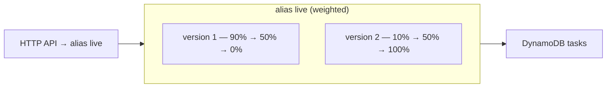

# Step 5 — Rolling Deployment (Weighted Lambda Alias)

**Goal:** ship version 2 by shifting traffic to it in steps — 10% → 50% → 100% — so a bad
release only affects a slice of requests and you can stop any time.

**Mechanism (native, no CodeDeploy):** identical to Project 1's rolling step, because it
happens entirely at the **Lambda alias** — which is *below* the API layer. The HTTP API keeps
calling `live`; we change what `live` resolves to. (This is why alias-level deploys are so
portable: the front door never knows.)



---

## 5.1 Make a Visible Change and Publish Version 2

Bump `APP_VERSION` to `2.0.0` in `src/app.py` (or make a real change), then publish:

```bash
REGION=us-east-1
cd src && zip function.zip app.py

aws lambda update-function-code --function-name tasks-api \
  --zip-file fileb://function.zip --region $REGION
aws lambda wait function-updated --function-name tasks-api --region $REGION

aws lambda update-function-configuration --function-name tasks-api \
  --environment "Variables={TABLE_NAME=tasks,APP_VERSION=2.0.0}" --region $REGION
aws lambda wait function-updated --function-name tasks-api --region $REGION

aws lambda publish-version --function-name tasks-api --region $REGION \
  --query 'Version' --output text          # prints: 2
```

> Keep **both** env vars when updating configuration — `update-function-configuration`
> replaces the whole `Variables` map, so omitting `TABLE_NAME` would break DynamoDB access.

---

## 5.2 Shift Traffic in Steps

```bash
# 10% to v2
aws lambda update-alias --function-name tasks-api --name live \
  --function-version 1 --routing-config '{"AdditionalVersionWeights":{"2":0.10}}' --region $REGION
```

Probe and watch the ~1-in-10 split:

```bash
API=https://abc123.execute-api.us-east-1.amazonaws.com
for i in $(seq 1 20); do curl -s $API/version; echo; done | sort | uniq -c
#  ~18  {"version":"1.0.0"}
#   ~2  {"version":"2.0.0"}
```

Then raise the weight and finish:

```bash
# 50% to v2
aws lambda update-alias --function-name tasks-api --name live \
  --function-version 1 --routing-config '{"AdditionalVersionWeights":{"2":0.50}}' --region $REGION

# 100% — v2 becomes primary, clear routing
aws lambda update-alias --function-name tasks-api --name live \
  --function-version 2 --routing-config '{}' --region $REGION
```

Console alternative: **Lambda → tasks-api → Aliases → live → Edit → Weighted alias**.

---

## 5.3 Rollback

```bash
aws lambda update-alias --function-name tasks-api --name live \
  --function-version 1 --routing-config '{}' --region $REGION
```

---

## Note: No Gateway Canary Here

In Project 1 (REST API) you could also do this *at the gateway* with a canary release. The
**HTTP API has no such feature** — so rolling, canary, and blue-green all live at the alias.
That's not a limitation in practice; alias-level deploys are the standard for serverless and
work behind any front door (HTTP API, REST API, ALB, Function URL).

---

## Checkpoint

- [ ] Version 2 published with `APP_VERSION=2.0.0` (and `TABLE_NAME` still set)
- [ ] Saw `/version` return a ~10/90 mix, then ~50/50
- [ ] After 100%, `/version` always returns `2.0.0`
- [ ] Rolled back to `1.0.0`; reset to `live → version 1` before the next step

---

**Next:** [Step 6 — Canary Deployment](./06-canary-deployment.md)
