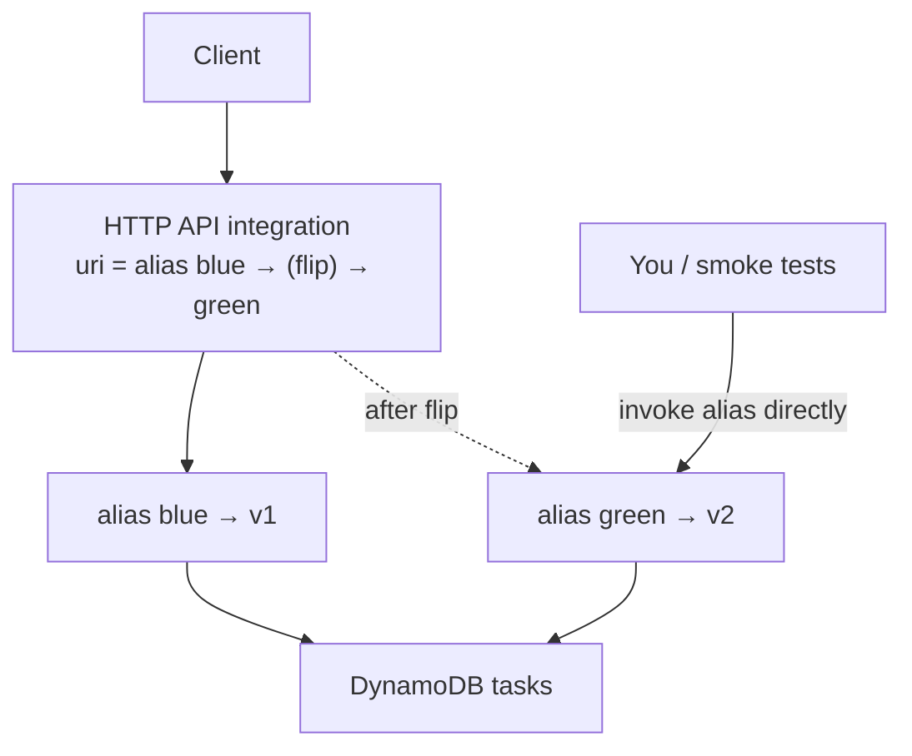

# Step 7 — Blue-Green Deployment (Repoint the Integration)

**Goal:** keep **blue** (v1) and **green** (v2) both fully deployed, serve all production
traffic from blue, test green out-of-band, then **switch the HTTP API integration** to green
in one atomic action — and switch back instantly if needed. No partial state: everyone is on
blue, or everyone is on green.

**Mechanism (native):** two aliases, `blue` (→ v1) and `green` (→ v2). The HTTP API
integration's **target URI** is what we flip. Project 1 flipped a *stage variable*; an HTTP
API has no stage variable indirection in the integration, so we update the **integration's
URI** directly — which is just as instant.



> Start clean: this step uses named `blue`/`green` aliases, so `live` is irrelevant here.
> Versions 1 and 2 must both exist (Steps 4 and 5).

---

## 7.1 Create the `blue` and `green` Aliases

```bash
REGION=us-east-1
ACCOUNT_ID=$(aws sts get-caller-identity --query Account --output text)
API_ID=<your-api-id>

aws lambda create-alias --function-name tasks-api --name blue  --function-version 1 --region $REGION
aws lambda create-alias --function-name tasks-api --name green --function-version 2 --region $REGION

# API Gateway needs invoke permission on BOTH aliases
for A in blue green; do
  aws lambda add-permission --function-name tasks-api --qualifier $A \
    --statement-id apigw-invoke-$A --action lambda:InvokeFunction \
    --principal apigateway.amazonaws.com \
    --source-arn "arn:aws:execute-api:$REGION:$ACCOUNT_ID:$API_ID/*/*" --region $REGION
done
```

---

## 7.2 Point the Integration at Blue

Find the integration id, then set its URI to the `blue` alias ARN:

```bash
INTEGRATION_ID=$(aws apigatewayv2 get-integrations --api-id $API_ID \
  --query 'Items[0].IntegrationId' --output text --region $REGION)
BLUE_ARN=$(aws lambda get-alias --function-name tasks-api --name blue \
  --query 'AliasArn' --output text --region $REGION)

aws apigatewayv2 update-integration --api-id $API_ID \
  --integration-id $INTEGRATION_ID --integration-uri $BLUE_ARN --region $REGION
```

> With `$default` auto-deploy on, integration changes go live immediately — no manual deploy.
> If you created multiple integrations (one per route), repeat for each `IntegrationId`.

---

## 7.3 Smoke-Test Green Without Touching Production

Green isn't wired to the API yet, so invoke the **alias directly** — same code path users
would get, zero production impact:

```bash
aws lambda invoke --function-name tasks-api --qualifier green \
  --payload '{"rawPath":"/version","requestContext":{"http":{"method":"GET","path":"/version"}}}' \
  --cli-binary-format raw-in-base64-out green-out.json --region $REGION && cat green-out.json
# body should contain "version":"2.0.0"

# meanwhile production (blue) is unaffected:
curl -s https://abc123.execute-api.us-east-1.amazonaws.com/version   # {"version":"1.0.0"}
```

---

## 7.4 The Flip

Repoint the integration from blue to green:

```bash
GREEN_ARN=$(aws lambda get-alias --function-name tasks-api --name green \
  --query 'AliasArn' --output text --region $REGION)

aws apigatewayv2 update-integration --api-id $API_ID \
  --integration-id $INTEGRATION_ID --integration-uri $GREEN_ARN --region $REGION

curl -s https://abc123.execute-api.us-east-1.amazonaws.com/version   # {"version":"2.0.0"}
```

Atomic cutover — effective on the next request.

---

## 7.5 Instant Rollback

```bash
aws apigatewayv2 update-integration --api-id $API_ID \
  --integration-id $INTEGRATION_ID --integration-uri $BLUE_ARN --region $REGION
```

Back on v1 immediately, because blue was never torn down.

> **One caution unique to stateful apps:** blue and green share the **same DynamoDB table**.
> If green's release changes the data *schema* (renames/repurposes an attribute), rolling back
> to blue may expose data blue can't read. Keep schema changes **backward-compatible** during a
> blue-green window — add new attributes, don't break old ones. (Project 1 didn't have this
> concern because its state was in-memory.)

---

## Choosing a Strategy — Recap

| Strategy | Exposure during deploy | Rollback | Best when |
|----------|------------------------|----------|-----------|
| **Rolling** (Step 5) | Growing % on v2 | Re-weight alias | Gradual, low-ceremony rollout |
| **Canary** (Step 6) | Small % held, metrics watched | Re-weight to v1 | You want to *measure* v2 before committing |
| **Blue-green** (this step) | 0% until flip, then 100% | Repoint integration | Clean cutover + fastest rollback; mind shared state |

---

## Checkpoint

- [ ] Aliases `blue`(→v1) and `green`(→v2) exist with API Gateway invoke permission
- [ ] Integration pointed at blue; production served v1
- [ ] Smoke-tested green via direct alias invoke — production unaffected
- [ ] Flipped the integration to green, then rolled back to blue
- [ ] You can explain the shared-DynamoDB caveat for blue-green

---

**Next:** [Step 8 — Cleanup](./08-cleanup.md)
