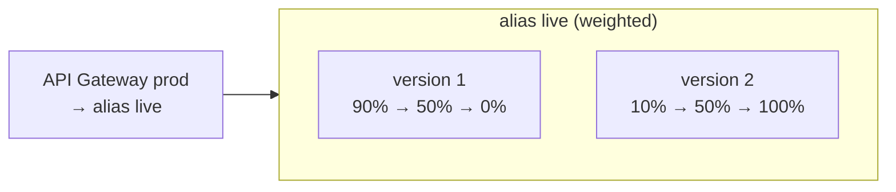

# Step 5 — Rolling Deployment (Weighted Lambda Alias)

**Goal:** ship version 2 of the code by shifting traffic to it *gradually* — 10%, then 50%,
then 100% — so a bad release hurts a slice of users, not all of them, and you can stop at any
step.

**Mechanism (native, no CodeDeploy):** a Lambda alias can split traffic between **two
versions** using a **routing config** (`AdditionalVersionWeights`). The alias `live` already
points at version 1; we publish version 2 and tell `live` to send a growing share to it. API
Gateway doesn't change at all — it still calls `live`.



---

## 5.1 Make a Visible Change and Publish Version 2

Edit `src/app.py` so the new release is identifiable, then bump the version env var. The
simplest visible change: set `APP_VERSION` to `2.0.0`.

```bash
REGION=us-east-1
cd src && zip function.zip app.py

# Update the function code ($LATEST) and its version env var
aws lambda update-function-code --function-name quotes-api \
  --zip-file fileb://function.zip --region $REGION
aws lambda wait function-updated --function-name quotes-api --region $REGION

aws lambda update-function-configuration --function-name quotes-api \
  --environment "Variables={APP_VERSION=2.0.0}" --region $REGION
aws lambda wait function-updated --function-name quotes-api --region $REGION

# Publish the new immutable snapshot as version 2
aws lambda publish-version --function-name quotes-api --region $REGION \
  --query 'Version' --output text          # prints: 2
```

> **Order matters.** Publish *after* both the code and config updates land (that's why we
> `wait`). A version freezes whatever `$LATEST` is at that instant.

---

## 5.2 Shift Traffic in Steps

Move the alias from "100% v1" to "10% v2", watch, then increase:

```bash
# 10% to v2
aws lambda update-alias --function-name quotes-api --name live \
  --function-version 1 \
  --routing-config '{"AdditionalVersionWeights":{"2":0.10}}' --region $REGION
```

`--function-version 1` is the **primary** (90%); `AdditionalVersionWeights {"2":0.10}` sends
10% to version 2. Now probe repeatedly and watch the version flip ~1 in 10 times:

```bash
API=https://abc123.execute-api.us-east-1.amazonaws.com/prod
for i in $(seq 1 20); do curl -s $API/version; echo; done | sort | uniq -c
#  ~18  {"version":"1.0.0"}
#   ~2  {"version":"2.0.0"}
```

Happy with the metrics? Increase the weight, then complete the rollout:

```bash
# 50% to v2
aws lambda update-alias --function-name quotes-api --name live \
  --function-version 1 --routing-config '{"AdditionalVersionWeights":{"2":0.50}}' --region $REGION

# 100% to v2 — clear the routing config and make v2 primary
aws lambda update-alias --function-name quotes-api --name live \
  --function-version 2 --routing-config '{}' --region $REGION
```

After the last command, `curl $API/version` always returns `2.0.0`.

> **Console alternative:** Lambda → `quotes-api` → **Aliases → live → Edit** → **Weighted
> alias** → add version 2 with weight 10/50/…, then set version 2 as primary at 100%.

---

## 5.3 Rollback

Rolling back is just shifting the other way — point `live` back at version 1:

```bash
aws lambda update-alias --function-name quotes-api --name live \
  --function-version 1 --routing-config '{}' --region $REGION
```

---

## When to Use Rolling

- You want a **gradual, observable** rollout but don't need fine control over *which* users
  hit the new version (it's random by request).
- You're comfortable watching Lambda metrics (Errors, Duration) between steps and bumping the
  weight by hand or on a schedule.
- Contrast with **canary** (next): canary keeps the new version on a *separate API path* with
  its own metrics, instead of blending it into the production alias.

---

## Checkpoint

- [ ] Version 2 is published with `APP_VERSION=2.0.0`
- [ ] You saw `/version` return a ~10/90 mix, then ~50/50
- [ ] After 100%, `/version` always returns `2.0.0`
- [ ] You rolled back to `1.0.0`, then forward again to leave it on… your choice (the next
      step starts from "v1 is live"). Reset with: `update-alias --name live --function-version 1 --routing-config '{}'`

---

**Next:** [Step 6 — Canary Deployment](./06-canary-deployment.md)
