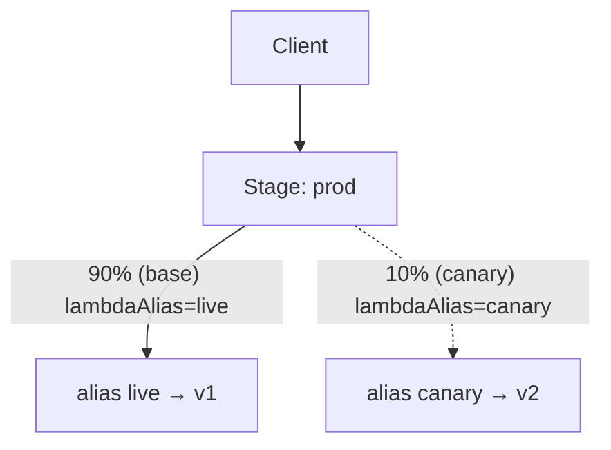

# Step 6 — Canary Deployment (API Gateway Native Canary Release)

**Goal:** the same gradual idea as rolling, but done at the **gateway layer** so the new
release gets its **own stage configuration and its own CloudWatch metrics**, cleanly separated
from production traffic. This is a feature **only the REST API has** — the reason we chose it
for this project.

**Mechanism (native):** API Gateway lets a stage carry a **canary**. You attach a percentage
of the stage's traffic to a *different deployment* and, crucially, you can **override stage
variables** for just the canary. We'll point the canary's `lambdaAlias` at a new `canary`
alias (→ version 2) while the base stage stays on `live` (→ version 1).



> **Start clean:** make sure Step 5 left you with `live → version 1` (run
> `aws lambda update-alias --function-name quotes-api --name live --function-version 1 --routing-config '{}'`).
> This step introduces v2 through a *separate* alias instead.

---

## 6.1 Create a `canary` Alias → Version 2

```bash
REGION=us-east-1
ACCOUNT_ID=$(aws sts get-caller-identity --query Account --output text)
API_ID=<your-api-id>

aws lambda create-alias --function-name quotes-api \
  --name canary --function-version 2 --region $REGION

# API Gateway needs explicit permission to invoke THIS alias too
aws lambda add-permission --function-name quotes-api --qualifier canary \
  --statement-id apigw-invoke-canary --action lambda:InvokeFunction \
  --principal apigateway.amazonaws.com \
  --source-arn "arn:aws:execute-api:$REGION:$ACCOUNT_ID:$API_ID/*/*" --region $REGION
```

---

## 6.2 Turn On the Canary (10% → version 2)

**Console:** API Gateway → your API → **Stages → prod → Canary** tab → **Create canary** →
**Percentage of traffic:** `10` → under **Stage variables override**, set `lambdaAlias =
canary` → Save.

**CLI:** a canary attaches to the stage; set its percentage and override the stage variable:

```bash
aws apigateway update-stage --rest-api-id $API_ID --stage-name prod --region $REGION \
  --patch-operations \
    op=replace,path=/canarySettings/percentTraffic,value=10 \
    op=replace,path=/canarySettings/stageVariableOverrides/lambdaAlias,value=canary
```

> If the canary doesn't exist yet, first create it on a fresh deployment with
> `--canary-settings percentTraffic=10`. The simplest reliable path here is the **Console
> Canary tab**, which creates and configures it in one screen.

---

## 6.3 Watch the Canary

```bash
API=https://abc123.execute-api.us-east-1.amazonaws.com/prod
for i in $(seq 1 20); do curl -s $API/version; echo; done | sort | uniq -c
#  ~18  {"version":"1.0.0"}   ← base, alias live → v1
#   ~2  {"version":"2.0.0"}   ← canary, alias canary → v2
```

In CloudWatch, the canary's requests show up under the same stage but you can compare error
rates before committing. Because the canary is its *own* config slice, you can dial it
10 → 25 → 50 by re-running the `percentTraffic` patch.

---

## 6.4 Promote or Abort

**Promote** — make the canary the new base (everyone gets v2) and remove the canary:

```bash
# Point the base alias at v2, then delete the canary settings
aws lambda update-alias --function-name quotes-api --name live \
  --function-version 2 --region $REGION

aws apigateway update-stage --rest-api-id $API_ID --stage-name prod --region $REGION \
  --patch-operations op=remove,path=/canarySettings
```

(Console: **Canary tab → Promote canary**, which copies the canary settings to the base stage,
then **Delete canary**.)

**Abort** — just delete the canary; base traffic was never affected:

```bash
aws apigateway update-stage --rest-api-id $API_ID --stage-name prod --region $REGION \
  --patch-operations op=remove,path=/canarySettings
```

---

## Rolling vs Canary — the distinction

| | Rolling (Step 5) | Canary (this step) |
|---|---|---|
| Where the split happens | Lambda alias | API Gateway stage |
| New version isolated? | No — blended into `live` | Yes — own settings + metrics slice |
| Per-request routing | Random | Random within canary % |
| Rollback | Re-weight the alias | Delete canary (base untouched) |
| Available on HTTP API? | Yes | **No (REST only)** |

---

## Checkpoint

- [ ] Alias `canary` → version 2 exists, with API Gateway invoke permission
- [ ] Canary on `prod` sends ~10% to v2 (you saw the mix on `/version`)
- [ ] You either **promoted** (base now v2, canary removed) or **aborted** (canary removed)
- [ ] Before the next step, set `live → version 1` again to start blue-green clean

---

**Next:** [Step 7 — Blue-Green Deployment](./07-blue-green-deployment.md)
