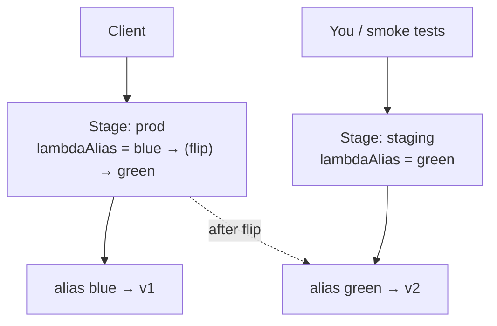

# Step 7 — Blue-Green Deployment (Instant Flip, Instant Rollback)

**Goal:** run the **old** version (blue) and the **new** version (green) fully deployed *at the
same time*, send all production traffic to blue, fully test green out-of-band, then **flip**
100% of traffic to green in one atomic action — and flip back just as fast if anything's wrong.

Blue-green trades the gradualness of rolling/canary for **speed and a clean rollback**: there's
no in-between state where some users are on the new version and some on the old. Either
everyone's on blue or everyone's on green.

**Mechanism (native):** two aliases — `blue` (→ v1) and `green` (→ v2) — and a separate
`staging` stage so you can exercise green with real HTTP before cutting over. The flip is a
one-line change to the **prod** stage variable: `lambdaAlias` goes from `blue` to `green`.



> **Start clean:** `live` no longer matters for this step — we use named `blue`/`green`
> aliases so each side is unambiguous. Make sure version 1 and version 2 both exist (Steps 4
> and 5).

---

## 7.1 Create the `blue` and `green` Aliases

```bash
REGION=us-east-1
ACCOUNT_ID=$(aws sts get-caller-identity --query Account --output text)
API_ID=<your-api-id>

aws lambda create-alias --function-name quotes-api --name blue  --function-version 1 --region $REGION
aws lambda create-alias --function-name quotes-api --name green --function-version 2 --region $REGION

# Grant API Gateway invoke permission on BOTH new aliases
for A in blue green; do
  aws lambda add-permission --function-name quotes-api --qualifier $A \
    --statement-id apigw-invoke-$A --action lambda:InvokeFunction \
    --principal apigateway.amazonaws.com \
    --source-arn "arn:aws:execute-api:$REGION:$ACCOUNT_ID:$API_ID/*/*" --region $REGION
done
```

---

## 7.2 Point prod at Blue; Stand Up a Staging Stage for Green

Set the production stage to **blue**, and create a second **staging** stage whose
`lambdaAlias` is **green**. Both stages share the same API definition — only the stage
variable differs.

```bash
# prod → blue
aws apigateway update-stage --rest-api-id $API_ID --stage-name prod --region $REGION \
  --patch-operations op=replace,path=/variables/lambdaAlias,value=blue

# create staging → green (a deployment + stage in one call)
aws apigateway create-deployment --rest-api-id $API_ID \
  --stage-name staging --variables lambdaAlias=green --region $REGION
```

Console: **Stages → prod → Stage variables** set `lambdaAlias=blue`; **Deploy API → New
stage `staging`**, then set its `lambdaAlias=green`.

---

## 7.3 Smoke-Test Green on Staging (No Production Impact)

```bash
PROD=https://abc123.execute-api.us-east-1.amazonaws.com/prod
STAGING=https://abc123.execute-api.us-east-1.amazonaws.com/staging

curl -s $PROD/version       # {"version":"1.0.0"}  ← blue, live traffic
curl -s $STAGING/version    # {"version":"2.0.0"}  ← green, you only
```

Run whatever you want against `staging` — it's the real green version, isolated from users.

---

## 7.4 The Flip

When green passes, switch prod's stage variable from `blue` to `green`:

```bash
aws apigateway update-stage --rest-api-id $API_ID --stage-name prod --region $REGION \
  --patch-operations op=replace,path=/variables/lambdaAlias,value=green

curl -s $PROD/version       # {"version":"2.0.0"}  ← everyone is on green now
```

That's the entire cutover — atomic, and it took effect on the next request. No redeploy of
the API was needed because only the *stage variable* changed.

---

## 7.5 Instant Rollback

Something looks wrong? Flip back. Same one-liner, `green` → `blue`:

```bash
aws apigateway update-stage --rest-api-id $API_ID --stage-name prod --region $REGION \
  --patch-operations op=replace,path=/variables/lambdaAlias,value=blue
```

This is blue-green's headline benefit: rollback is as cheap and fast as the deploy, because
the old version was never torn down.

---

## Choosing a Strategy — Recap

| Strategy | Exposure during deploy | Rollback | Best when |
|----------|------------------------|----------|-----------|
| **Rolling** (Step 5) | Growing % on new version | Re-weight alias | Gradual, low-ceremony rollout |
| **Canary** (Step 6) | Small % on isolated path + own metrics | Delete canary | You want to *measure* the new version before committing |
| **Blue-green** (this step) | 0% until flip, then 100% | One-line flip back | You need a clean cutover and the fastest possible rollback |

> In real life these combine: a **canary** that, once healthy, is **promoted** like a
> **blue-green** flip. You've now built both halves by hand — which is exactly what tools like
> CodeDeploy automate. We kept it native so you can see the moving parts.

---

## Checkpoint

- [ ] Aliases `blue` (→v1) and `green` (→v2) exist, both with API Gateway invoke permission
- [ ] `prod` started on blue; `staging` serves green
- [ ] Smoke-testing green on `staging` did not affect prod
- [ ] You flipped prod to green, then rolled back to blue
- [ ] You can explain when you'd pick rolling vs canary vs blue-green

---

**Next:** [Step 8 — Cleanup](./08-cleanup.md)
