# Architecture — AWS Architecture

## Technical Explanation

This document is the visual map of every architecture taught in the topic, one diagram per
design decision: the Global Infrastructure, the Shared Responsibility split, a basic web
app, a highly available multi-AZ design, a secure VPC, a serverless API, a storage-tier
decision flow, a monitoring loop, cost-model trade-offs, and the three end-to-end
projects. Each diagram is preceded by a sentence saying what it shows and followed by the
takeaway you need when you build it.

## Layman Explanation

Think of these as the floor plans and street maps for the city you are building on AWS:
where the buildings sit, how the roads connect them, which doors are locked, and what
happens when one neighbourhood loses power. Return to the relevant picture whenever a demo,
lab, or project asks you to wire something up.

---

## 1. AWS Global Infrastructure (Regions, AZs, Edge)

This flowchart shows how AWS's physical world nests: the globe holds Regions, a Region
holds Availability Zones, and Edge Locations sit close to users worldwide.

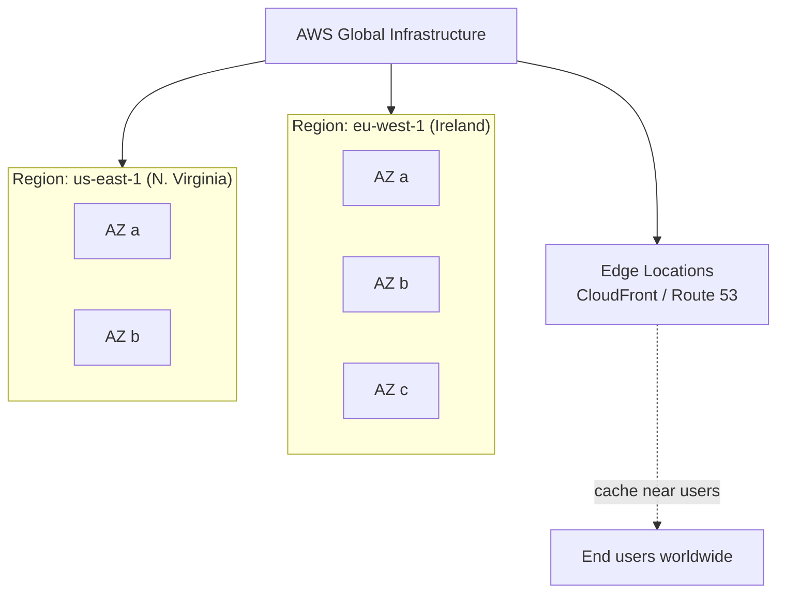

Takeaway: pick a **Region** for latency/compliance/price, spread across its **AZs** for
resilience, and use **Edge Locations** to get content close to users. Region → AZ → Edge is
the hierarchy behind almost every other decision.

## 2. Shared Responsibility Model

This flowchart splits security duties between AWS and you across service models.

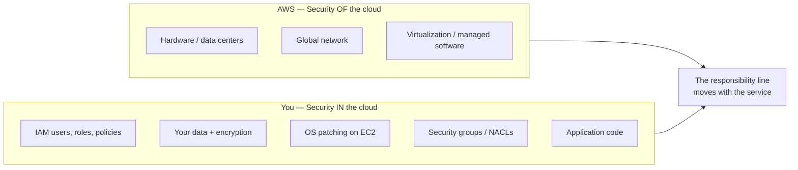

Takeaway: AWS secures the cloud; you secure what you put in it. The more managed the
service (Lambda/S3/DynamoDB), the less falls on you — but **IAM, data, and permissions are
always yours**.

## 3. Basic Web Application (Module 2)

This flowchart traces a request through the classic three-tier web app: User → Route 53 →
Load Balancer → EC2 → RDS.

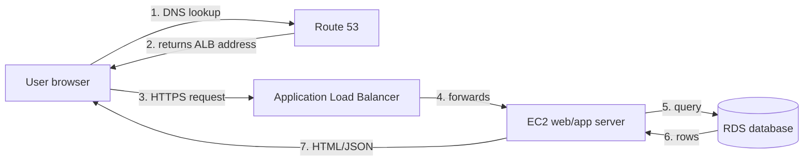

Takeaway: **DNS** finds the front door (Route 53), the **load balancer** is the front door,
**EC2** is the kitchen that does the work, and **RDS** is the pantry that holds the data.
Each tier has one job — that separation is what makes it scalable and secure.

## 4. Highly Available Architecture (Module 3)

This flowchart shows the same app made highly available across two Availability Zones with
an Auto Scaling Group and a Multi-AZ database.

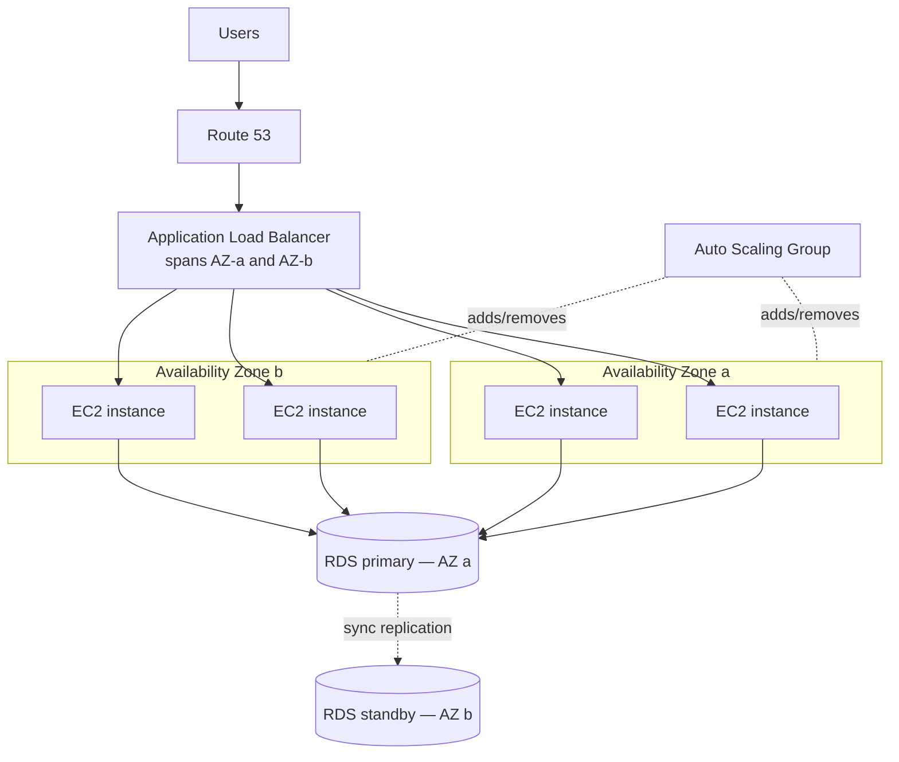

Takeaway: spread instances across **multiple AZs** behind the **ALB**, let the **Auto
Scaling Group** keep the right number running and replace failures, and run **RDS Multi-AZ**
so the database fails over to a standby. Lose an entire AZ and the site stays up.

## 5. Secure VPC Architecture (Module 4)

This flowchart shows network segmentation: public subnets for the load balancer, private
subnets for app and database, with security groups gating each hop.

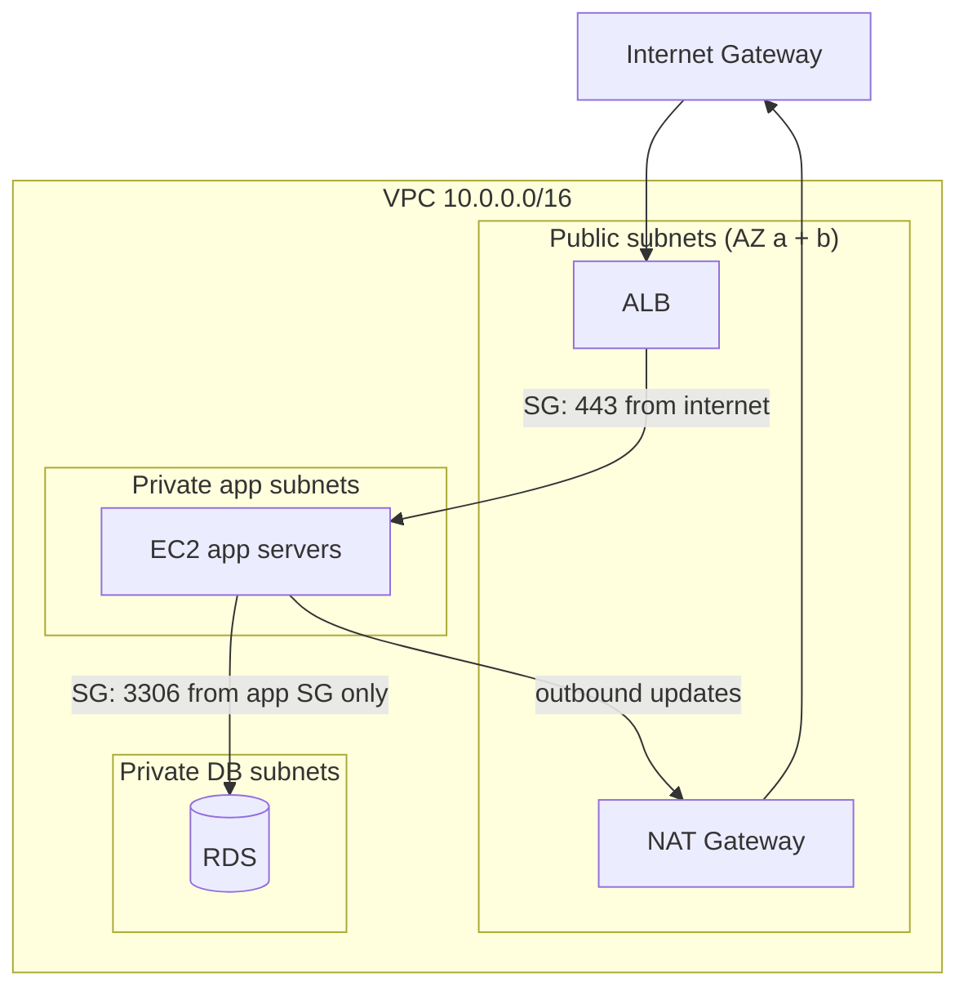

Takeaway: only the **ALB** is exposed to the internet; **EC2** and **RDS** live in
**private subnets**. **Security groups** allow exactly one hop each (internet→ALB→app→DB),
and outbound patches go through a **NAT Gateway**. This is defense in depth in one picture.

## 6. Serverless Architecture (Module 5)

This flowchart shows the event-driven serverless chain: API Gateway → Lambda → DynamoDB,
with CloudWatch observing.

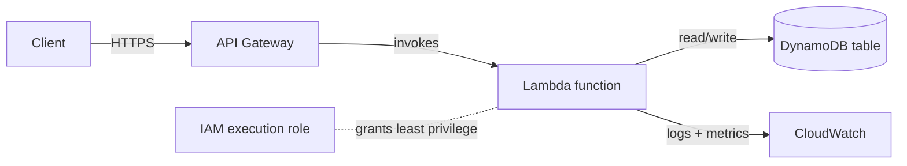

Takeaway: there are **no servers to manage**. API Gateway is the door, Lambda is code that
runs only on a request and scales automatically, DynamoDB stores data with no capacity
planning, and the **IAM execution role** gives Lambda just enough permission. You pay per
request, not per hour.

## 7. Storage Decision Flow (Module 6)

This flowchart helps choose between S3, EBS, EFS, and Glacier based on access pattern.

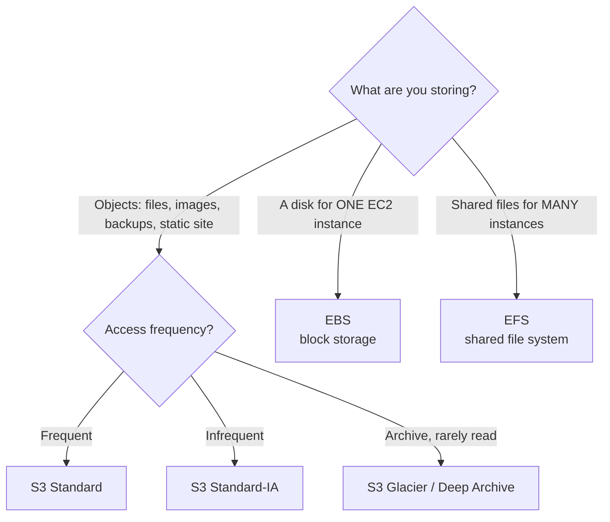

Takeaway: **S3** for objects (and pick the tier by how often you read them), **EBS** for a
single instance's disk, **EFS** for files shared across instances, **Glacier** for cheap
long-term archive. Matching the class to the access pattern is the biggest storage cost
lever.

## 8. Monitoring & Observability Loop (Module 7)

This sequence diagram shows the detect → alarm → notify → act loop using CloudWatch,
CloudTrail, and Config.

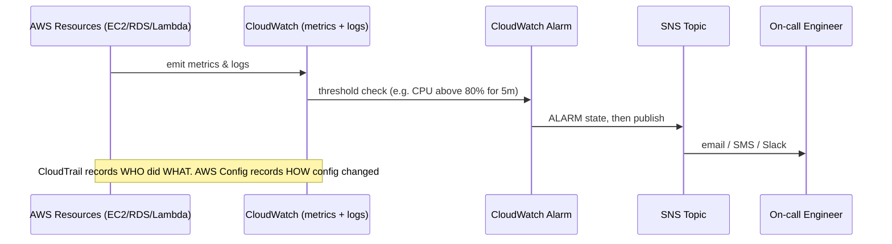

Takeaway: **CloudWatch** watches health and fires **alarms** through **SNS** to a human or
an automation; **CloudTrail** answers "who did this?" and **AWS Config** answers "what
changed and is it compliant?". Together they are see, alert, and audit.

## 9. Cost Model Trade-offs (Module 8)

This flowchart maps workload shape to the cheapest pricing model.

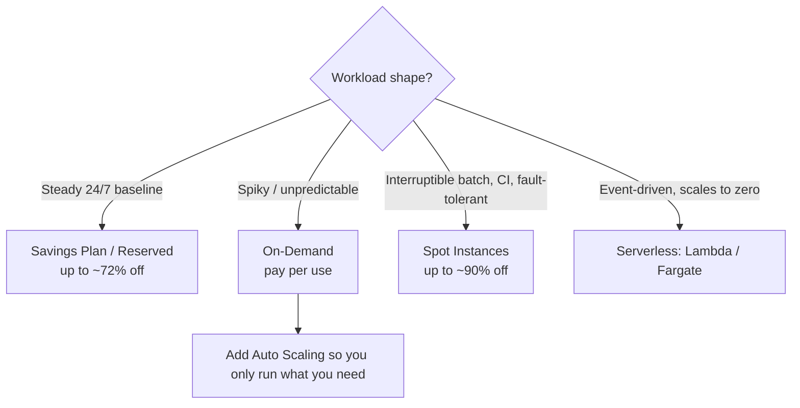

Takeaway: never pay On-Demand for everything. Cover the **steady baseline** with Savings
Plans/RIs, run **interruptible** work on Spot, let **spiky** work scale on-demand, and use
**serverless** when traffic is bursty. Mixing models is how big bills shrink.

## 10. Project 1 — Highly Available Web Application

This flowchart is the buildable architecture for the intermediate project: Route 53 → ALB →
Auto Scaling EC2 → RDS Multi-AZ.

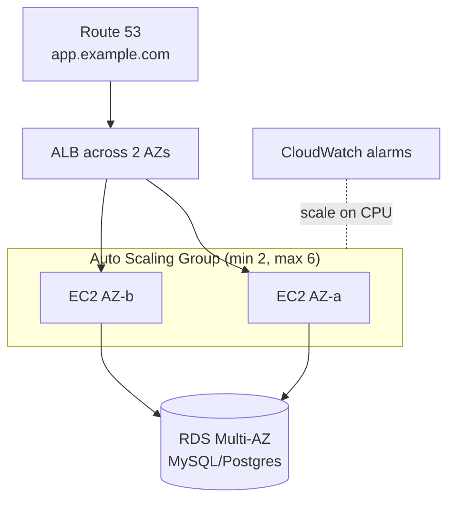

Takeaway: this is Diagram 4 made concrete and deployable — the reference HA web stack. It
survives an instance failure (ASG replaces it), an AZ failure (other AZ + RDS standby), and
a traffic spike (ASG scales out).

## 11. Project 2 — Serverless Employee Management System

This flowchart shows the advanced project: a CRUD API with API Gateway, Lambda per
operation, and a DynamoDB table.

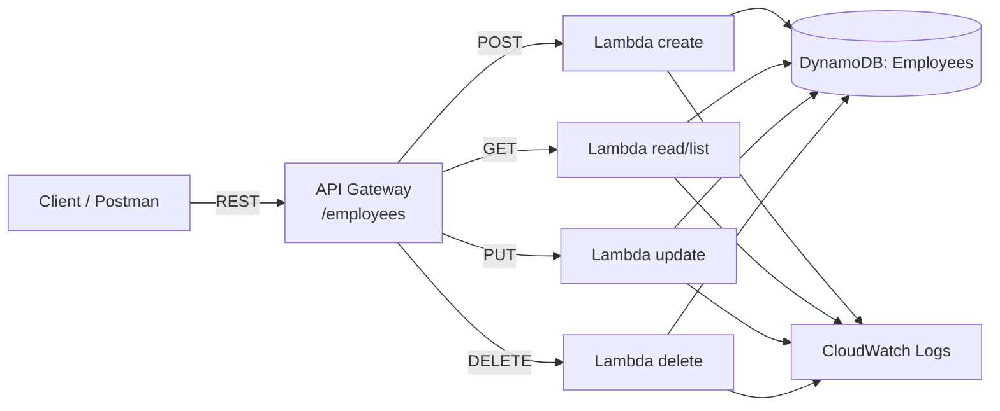

Takeaway: each HTTP method maps to a small Lambda over one DynamoDB table — full CRUD with
**no servers**, automatic scaling, and per-request billing. CloudWatch Logs capture every
invocation for debugging.

## 12. Project 3 — Static Website Hosting

This flowchart shows the beginner project: S3 origin, CloudFront CDN with HTTPS, fronted by
a Route 53 custom domain.

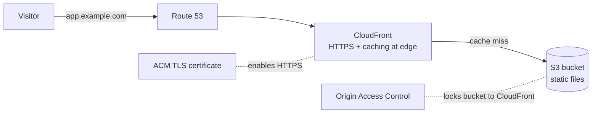

Takeaway: S3 stores the files cheaply, **CloudFront** serves them fast and over HTTPS from
edge caches, **ACM** provides the certificate, and **Origin Access Control** ensures
visitors can only reach the bucket *through* CloudFront. Cheap, global, and secure static
hosting.

## Real World Example

A SaaS company composes these diagrams into one platform: marketing site on Diagram 12
(S3+CloudFront), the application on Diagram 10 (HA web tier), background jobs and webhooks
on Diagram 6 (serverless), all inside Diagram 5 (secure VPC), watched by Diagram 8
(monitoring), and tuned by Diagram 9 (cost models). Every architecture in this topic is a
slice of that whole.

## Use Cases

- Diagrams 1–2: orientation and security baseline for any account.
- Diagrams 3–5: standard three-tier web apps from simple to secure-and-HA.
- Diagram 6: APIs, webhooks, and event processing.
- Diagrams 7–9: storage, observability, and cost decisions for any design.
- Diagrams 10–12: full buildable reference projects.

## Industry Relevance

Whiteboarding these exact pictures — "draw a highly available web app on AWS", "show me a
secure VPC", "design a serverless API" — is the core of AWS system-design interviews and
the Solutions Architect exam. Being able to draw the AZ spread, explain each security-group
hop, and justify the pricing model is precisely the skill these diagrams build.
