# Architecture Diagrams — Designing Architecture

## What
Every architecture discussed across the modules, drawn once: the thinking loop, the
requirements-to-decisions map, the patterns (Module 5), Kubernetes (Module 7), reliability
shapes (Module 8), scalability shapes (Module 9), security layering (Module 10), the five
demo projects (Module 13), plus Conway's Law, the simplicity spectrum, and idempotent
retries (Module 11 trade-offs).

## Why
Architecture is far easier to reason about as a picture. Each diagram has one sentence of
"what it shows" before it, the key takeaway after, then a short **Why it works this way**
list — quick pointers you can read aloud and explain.

> **Renderability note:** edge labels avoid colons, parentheses, and percent signs; database
> stores use the `[( )]` cylinder shape; subgraph titles are quoted.

---

## 1. The Architect's Thinking Loop

This flowchart shows the repeatable loop from Module 2.

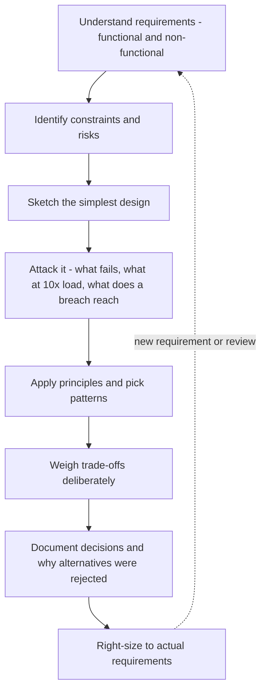

Takeaway: design is a loop, not a one-shot. You return to it as requirements change or a
review surfaces a weakness.

**Why it works this way:**
- A loop **bounds the cost of being wrong** — a mistake caught on the whiteboard costs an
  eraser; the same mistake caught in production costs a migration.
- So the loop front-loads the cheap iterations (sketch, attack, revise) *because* they
  happen before any expensive, hard-to-reverse build.
- The earlier the feedback, the cheaper the correction.

---

## 2. Requirements Drive Decisions

This flowchart shows how non-functional requirements push the design toward specific choices.

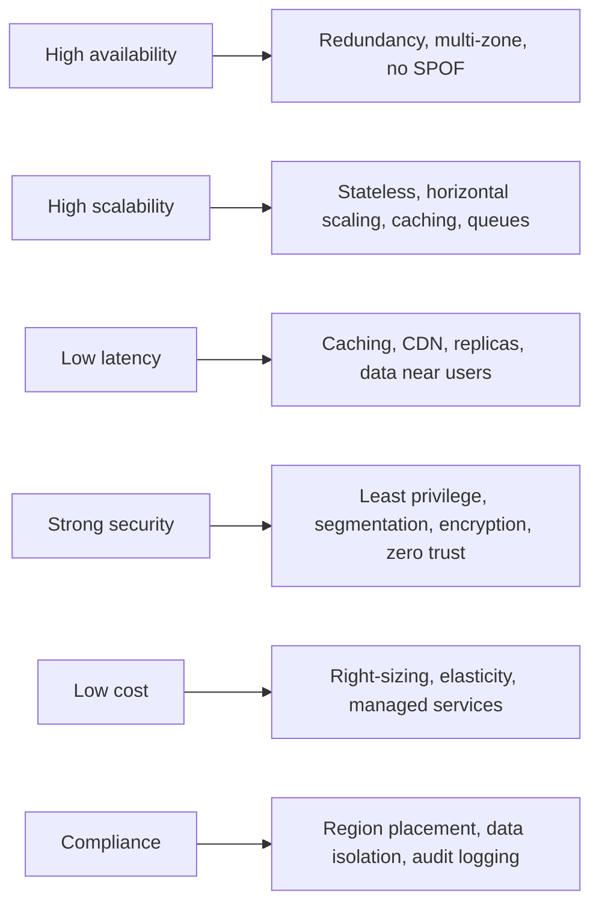

Takeaway: every requirement is a force on the blueprint. The architecture is the deliberate
balance you strike between competing forces.

**Why it works this way:**
- Functional requirements decide **what** the system does; the **non-functional**
  requirements (the "-ilities") decide its **shape**.
- Two apps with identical features but different NFRs end up with different architectures —
  *because* it is the NFRs, not the feature list, that force the structural choices.
- That is why an architect interrogates the NFRs first.

---

## 3. Monolith vs Microservices

This flowchart contrasts a single deployable unit with independent services owning their own
data.

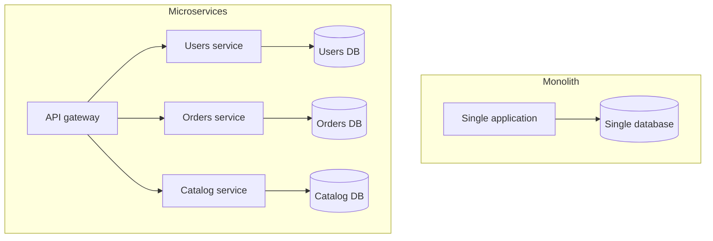

Takeaway: the monolith is simpler and faster to start; microservices buy independent
deploy/scale and fault isolation at the cost of distributed-systems complexity. Start simple;
earn microservices when requirements demand them.

**Why it works this way:**
- Microservices do not *remove* complexity — they **relocate** it from inside one codebase
  to the network *between* services.
- In exchange for independent deploys you take on network latency, partial failure, and
  distributed transactions — *because* calls that were function calls are now network calls.
- The complexity is conserved; you only choose where it lives, so split only when the
  benefit (team autonomy, divergent scaling) is worth importing the network's problems.

---

## 4. Layered and N-Tier

This flowchart shows logical layers and the same layers deployed as separate physical tiers.

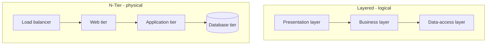

Takeaway: layering organises code by responsibility; N-tier deploys those responsibilities as
independently scalable tiers, the classic shape of a highly-available web app.

**Why it works this way:**
- Layering is a **logical** split (boundaries inside one process); tiers are a **physical**
  split (boundaries across machines).
- Only the physical split buys independent scaling and isolation — but it pays for them with
  **network hops** between tiers.
- So don't pay the network cost unless you actually need to scale the tiers separately.

---

## 5. Service-Oriented Architecture

This flowchart shows coarse-grained services integrated through an enterprise service bus.

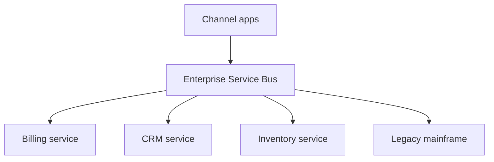

Takeaway: SOA reuses enterprise capabilities and integrates legacy systems, but the ESB can
become a bottleneck and single point of failure. Microservices push integration to the edges
instead of a central bus.

**Why it works this way:**
- The ESB centralises routing, transformation, and orchestration — which is *why* it becomes
  a bottleneck and a SPOF: everything flows through it, so it grows smart and fragile.
- Microservices invert this with **"smart endpoints, dumb pipes"** — the network just moves
  messages and the intelligence lives in the services.
- Centralised integration trades easy governance for a single shared chokepoint.

---

## 6. Event-Driven Architecture

This flowchart shows producers emitting events that many consumers react to asynchronously.

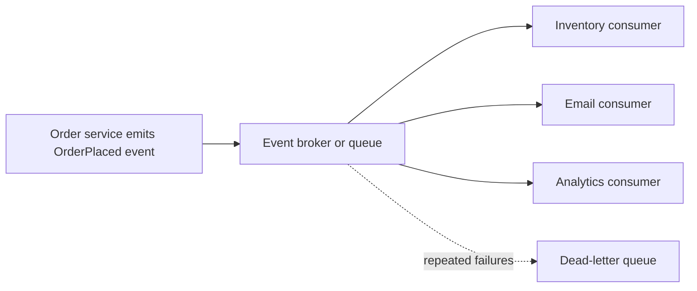

Takeaway: producers and consumers are decoupled; new consumers are added without touching
producers, and a spike is buffered by the broker. The cost is eventual consistency and harder
end-to-end tracing.

**Why it works this way:**
- Events **invert the dependency** — the producer does not know who consumes its events.
- That is the source of the benefit (add/remove/fail consumers without the producer caring)
  *and* the cost (no immediate answer, eventual consistency, harder tracing).
- Choose it when work can happen **later**, not when a caller needs an answer **now**.

---

## 7. Serverless Architecture

This flowchart shows a request handled by managed services with no servers to operate.

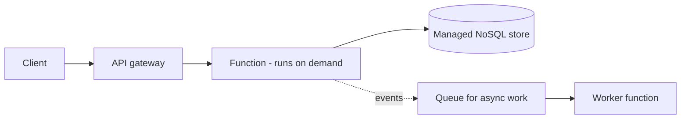

Takeaway: scales from zero to large automatically and bills per use; watch cold starts,
runtime limits, and cost at sustained high volume.

**Why it works this way:**
- You pay per **invocation**, not per **hour of uptime** — the economics invert from
  always-on compute.
- That is unbeatable for spiky or low traffic (idle costs nothing), but crosses a break-even
  point at high steady volume *because* a reserved server is cheaper once it is always busy.
- The same scale-to-zero that saves money causes **cold starts** — there is nothing running
  to serve the first request, so it waits for a runtime to spin up.

---

## 8. Kubernetes Architecture

This flowchart shows the control plane reconciling desired state onto worker nodes.

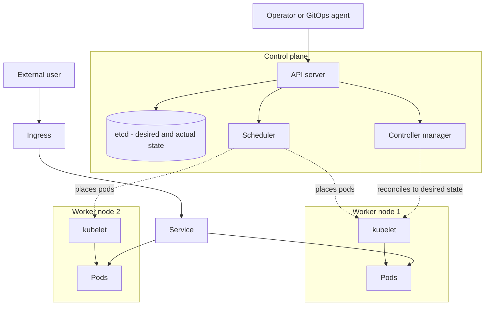

Takeaway: you declare desired state to the API server; controllers and the scheduler
relentlessly make the cluster match it, replacing failures automatically. This is the
thermostat model applied to whole systems.

**Why it works this way:**
- The single idea under all of Kubernetes is the **reconciliation loop**: observe actual
  state, compare to desired, act to close the gap, repeat forever.
- Self-healing, scaling, and rollouts are not separate features — they are all the **same
  loop** driving actual toward desired.
- Declarative systems survive disturbances that break an imperative script *because* the
  loop simply re-runs until reality matches the goal.

---

## 9. Reliability — SPOF vs Redundancy

This flowchart contrasts a single point of failure with a redundant design.

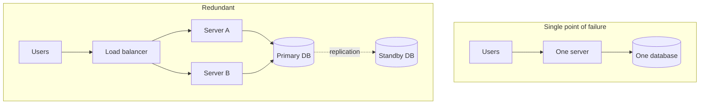

Takeaway: removing single points of failure means duplicating every critical component and
putting a health-checking load balancer in front, so losing one instance is invisible to
users.

**Why it works this way:**
- Redundancy buys reliability **only if the duplicates fail independently**.
- Two servers in the same rack, on the same power, or behind the same single database are
  *not* truly redundant — *because* a shared dependency re-introduces the SPOF you removed.
- So the real work is hunting **hidden shared dependencies** (power, network, AZ, the
  database) — availability is capped by the least-redundant link.

---

## 10. Active/Passive vs Active/Active

This flowchart contrasts a waiting standby with two simultaneously-serving nodes.

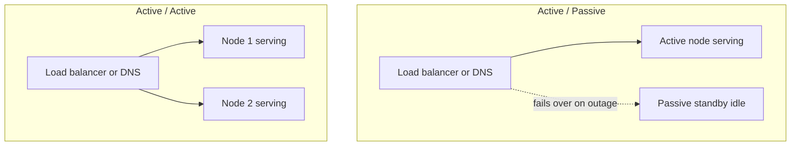

Takeaway: passive is cheaper and simpler but wastes the standby and recovers more slowly;
active/active uses all capacity and recovers near-instantly but must keep data consistent
across both.

**Why it works this way:**
- The hard part of active/active is **state consistency across the actives** — *because*
  once two nodes both accept writes, you hit the CAP trade-off (no perfect consistency *and*
  availability during a network partition).
- Active/passive sidesteps this by having **only one writer**, which is why it is simpler
  and cheaper.
- You pay for that simplicity with an idle standby and a slower, failover-shaped recovery.

---

## 11. Health Checks and Auto-Healing

This state diagram shows continuous reconciliation back to a healthy desired state.

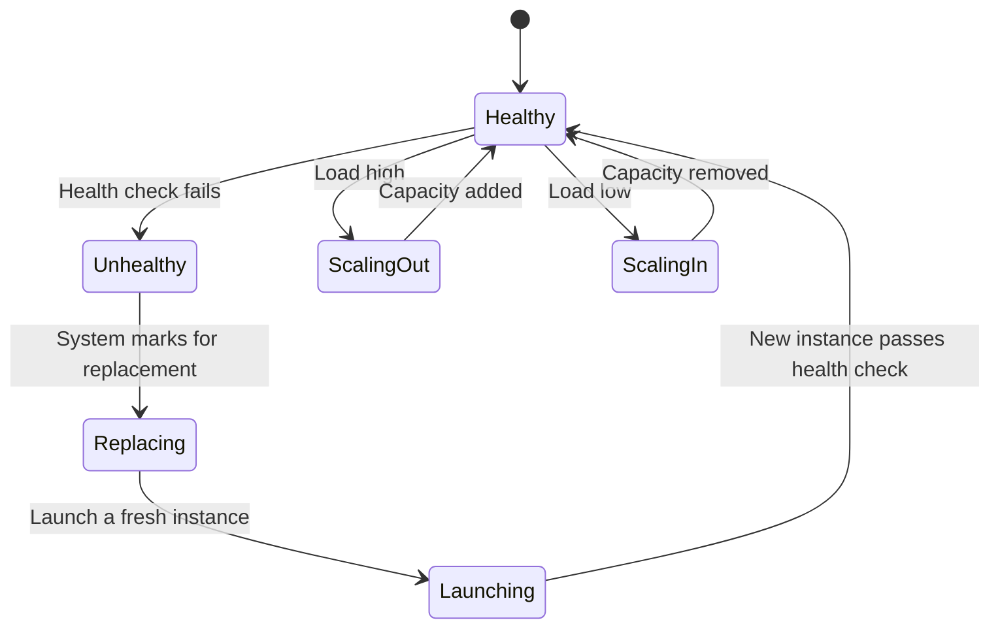

Takeaway: desired count is a contract the platform enforces - failures are replaced and
capacity tracks demand without human intervention.

**Why it works this way:**
- Healing and scaling are the **same mechanism**, not two features — both drive **actual
  count toward desired count**.
- A failed node drops actual below desired (so it replaces one); high load raises desired
  (so it adds some) — *because* both are just a gap for the same loop to close.
- Express operations as a desired-state contract and recovery + elasticity fall out for free.

---

## 12. The Disaster-Recovery Spectrum

This flowchart places the four DR strategies on one axis of cost versus recovery speed.

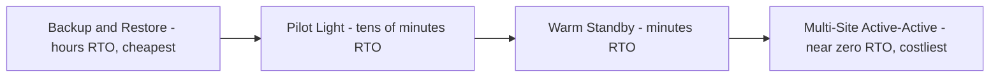

Takeaway: moving right buys faster recovery and less data loss by paying for more idle or
duplicated capacity. Choose the point that matches what an hour of downtime costs.

**Why it works this way:**
- Same **money-for-time** exchange as the reliability spectrum — each step right pre-pays to
  keep more of the recovery environment running.
- That speeds recovery *because* less must be built after disaster strikes.
- The deciding number is **cost-of-downtime per hour**, set by the business: buy speed until
  the next step costs more than the downtime it prevents, then stop.

---

## 13. RTO and RPO on a Timeline

This timeline shows where RPO and RTO sit relative to the moment of disaster.

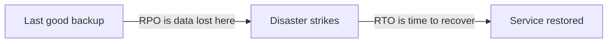

Takeaway: RPO looks backward from the disaster - how much data is lost. RTO looks forward -
how long until you are back. The DR strategy is chosen to meet both targets at acceptable
cost.

**Why it works this way:**
- RPO and RTO are **independent levers, funded separately** — so one can be tight while the
  other is loose.
- RPO is bounded by how often you create a recoverable point (backup/replication frequency).
- RTO is bounded by how fast you can recover (automation + how warm the standby is) — set
  each from what the specific data and downtime are worth.

---

## 14. Multi-Region Failover

This sequence shows DNS-based failover from a primary region to a secondary on health-check
failure.

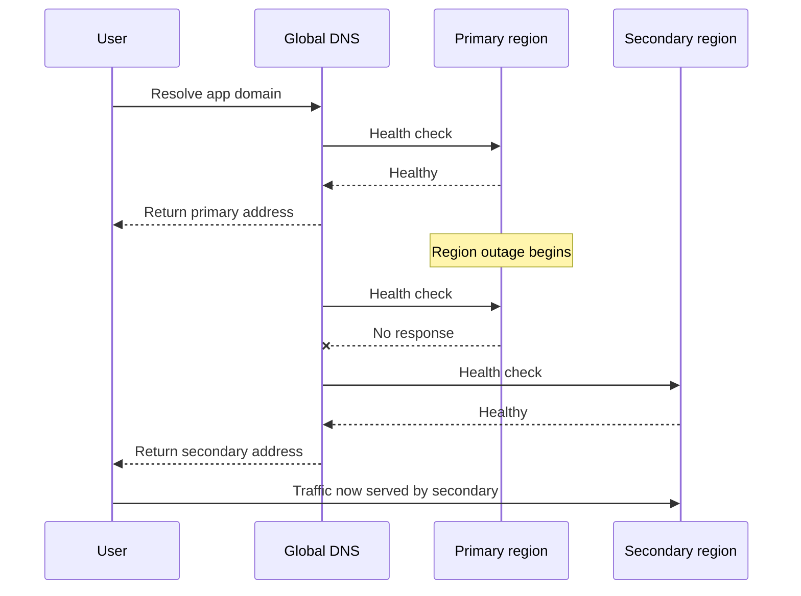

Takeaway: DNS health checks plus failover routing move users to the healthy region; recovery
speed depends on health-check interval, DNS TTL, and how warm the secondary is.

**Why it works this way:**
- Total failover time is the **sum of three delays**: detection (check interval × failed
  checks), DNS propagation (the record's TTL, which clients cache), and secondary warm-up.
- Shorter TTLs fail over faster but multiply DNS lookups — and clients that ignore TTLs fail
  over slowly regardless.
- DNS is a blunt failover tool: simple and global, but its caching is *why* region failover
  is rarely instant.

---

## 15. Scalability — Caching, Replicas, Sharding

This flowchart shows the ordered playbook for scaling the data tier.

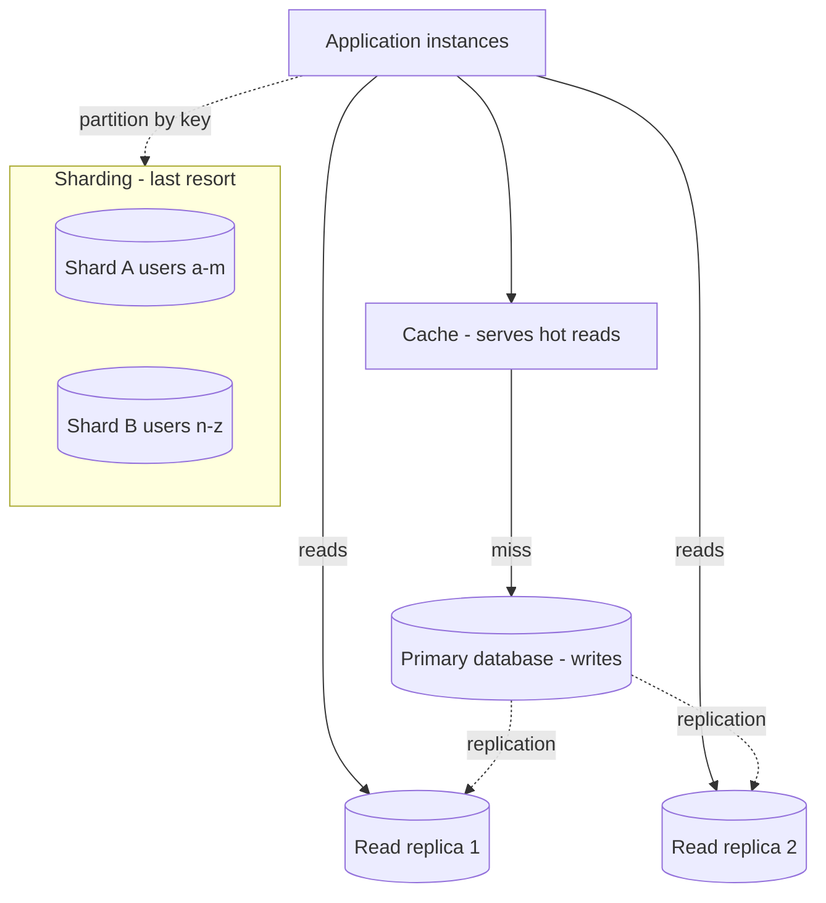

Takeaway: push work off the database in order - cache reads, then offload reads to replicas,
and only shard writes when truly necessary, because each step adds complexity.

**Why it works this way:**
- The order is dictated by **rising irreversibility**, not just rising cost.
- A cache is transparent and easy to remove; read replicas add replication lag (stale reads)
  but leave the data model intact; **sharding changes the data model itself** — cross-shard
  queries and rebalancing are hard to undo.
- So spend the reversible, low-commitment moves first and reach for the one-way door
  (sharding) only when nothing else is left.

---

## 16. Security — Defence in Depth

This flowchart shows independent security layers a request passes through.

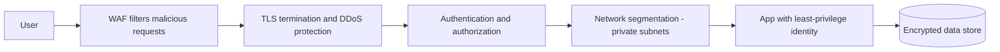

Takeaway: no single control is trusted to be enough; each layer contains the blast radius if
the one before it is breached. This is defence in depth plus zero trust.

**Why it works this way:**
- Independent layers **multiply** the attacker's work — to win they must defeat WAF *and*
  auth *and* segmentation *and* least privilege, not any one.
- The entire value rests on **independence** — *because* layers that share a weakness (one
  stolen admin credential that opens everything) fail together and collapse to a single layer.
- So design controls that fail for *different* reasons, and assume each one will eventually
  be breached.

---

## 17. Project 1 — Highly Available Web Application

This flowchart shows the beginner project: an N-tier, multi-zone, auto-healing web app.

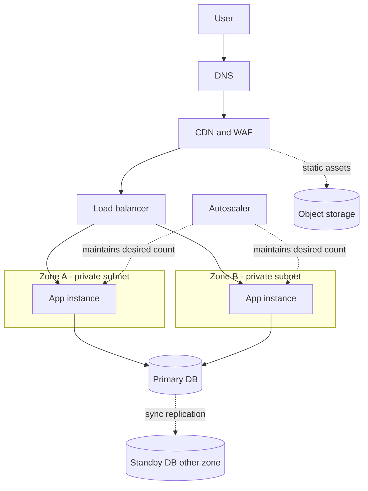

Takeaway: static assets are offloaded to a CDN/object store, the stateless app tier auto-heals
across zones, and the database survives a zone loss. This is the reliability baseline.

**Why it works this way:**
- This is the **simplest design with no single point of failure** — the deliberate floor for
  anything user-facing.
- Statelessness makes the app tier freely replaceable and scalable *because* any instance can
  serve any request; multi-zone makes a zone outage survivable; offloading static assets keeps
  the app tier small and cheap.
- Each choice removes one SPOF for minimal added complexity — which is why it is the baseline,
  not the ceiling.

---

## 18. Project 2 — Serverless Event-Processing Platform

This flowchart shows the intermediate project: ingest, buffer, process, and store, fully
serverless.

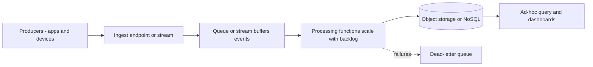

Takeaway: the queue/stream decouples bursty producers from processing, the functions scale to
the backlog and to zero when idle, and failures are captured rather than lost.

**Why it works this way:**
- The buffer lets producers and consumers run on **different speed curves** *because* it
  absorbs the spike — producers burst, the queue holds it, consumers drain at a steady rate.
- Pairing the buffer with scale-to-zero functions means cost tracks the **backlog** — nothing
  in, nothing billed.
- The dead-letter queue ensures a failure **isolates one message** instead of stalling the
  whole pipeline.

---

## 19. Project 3 — Microservices Platform on Kubernetes

This flowchart shows the advanced project: independent services on a cluster with shared
platform capabilities.

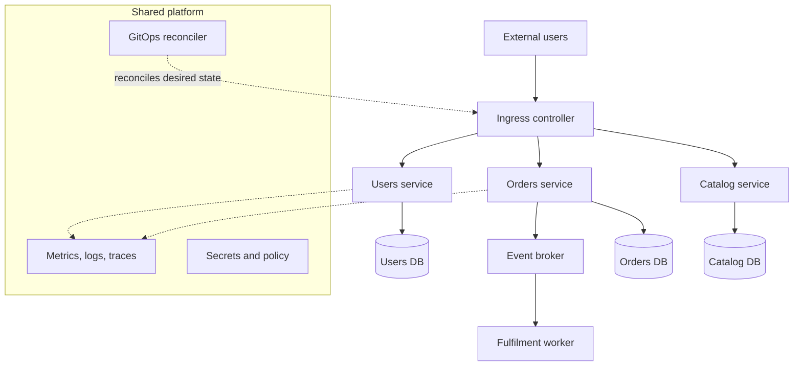

Takeaway: each service deploys and scales independently with its own data, the cluster
self-heals to desired state, and cross-cutting platform concerns are shared rather than
re-implemented per service.

**Why it works this way:**
- The design only pays off if **two things hold**.
- Each service must own its own data — *because* a shared database re-couples services and
  undoes the independence you split for.
- Cross-cutting concerns (observability, secrets, policy, GitOps) must come from the platform
  **once** — otherwise every team re-implements logging and tracing, the distributed-systems
  tax with none of the leverage. Microservices are an *organisational* technology as much as a
  technical one.

---

## 20. Project 4 — Multi-Region Disaster-Recovery Design

This flowchart shows the enterprise project: an active region and a recovery region with
replicated data and DNS failover.

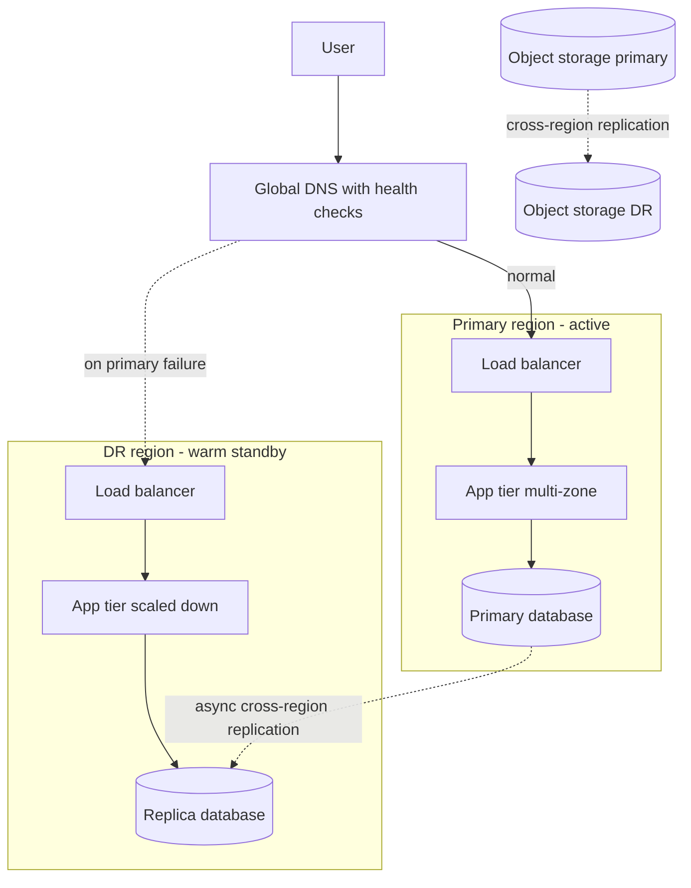

Takeaway: data replicates continuously to the DR region, a scaled-down stack stays warm there,
and DNS health checks shift traffic on a regional outage - meeting an aggressive RTO/RPO at
the cost of running a second footprint.

**Why it works this way:**
- The dominant cost and risk is the **data layer**, not the compute.
- App tiers are stateless and cheap to keep warm; the database must replicate cross-region,
  and *because* that replication is asynchronous, the few in-flight writes at the moment of
  failure set the **RPO floor**.
- This is why DR is fundamentally a **data-replication** problem — the warm app stack and DNS
  failover are the easy, well-understood parts.

---

## 21. Conway's Law — the org shape becomes the system shape

This flowchart shows how teams map onto the services they produce.

```mermaid
flowchart TB
    subgraph ORG ["Organisation"]
        T1[Team A]
        T2[Team B]
        T3[Team C]
    end
    subgraph SYS ["Resulting system"]
        S1[Service A]
        S2[Service B]
        S3[Service C]
    end
    T1 -.->|builds and owns| S1
    T2 -.->|builds and owns| S2
    T3 -.->|builds and owns| S3
```

Takeaway: a system tends to mirror the communication structure of the org that built it.

**Why it works this way:**
- Teams encode their **communication boundaries** into the interfaces they build — *because*
  it is far easier to design within a team than to coordinate across teams.
- This is why Amazon's small, autonomous "two-pizza teams" produce small, autonomous services.
- So design the team boundaries and the service boundaries together, not separately.

---

## 22. The Simplicity Spectrum — monolith to microservices

This flowchart places the structural choices on one axis from simplest to most complex.

```mermaid
flowchart LR
    M[Monolith - simplest, start here] --> MM[Modular monolith - hard internal boundaries]
    MM --> SVC[A few services - split what must scale or isolate]
    SVC --> MICRO[Full microservices - earn this at scale]
```

Takeaway: most teams should stop at a well-structured modular monolith; you earn full
microservices only when a concrete requirement forces it.

**Why it works this way:**
- A **modular monolith** gives most of the structure (hard internal boundaries) without the
  network tax — which is why Stack Overflow and Shopify run enormous traffic this way.
- You earn full microservices only when a concrete requirement forces it (Netflix scale).
- Don't copy Netflix's architecture with Stack Overflow's traffic — *because* you would pay
  the distributed-systems cost without the problem that justifies it.

---

## 23. Idempotent Retry — safe to repeat

This sequence shows an idempotency key making a retried payment harmless.

```mermaid
sequenceDiagram
    participant C as Client
    participant S as Payment service
    participant DB as Store
    C->>S: Charge 50 with idempotency key K
    S->>DB: Have we seen key K
    DB-->>S: No
    S->>DB: Record key K and charge once
    S-->>C: Success
    Note over C,S: Network blip - client retries
    C->>S: Charge 50 with idempotency key K
    S->>DB: Have we seen key K
    DB-->>S: Yes
    S-->>C: Return original result - no second charge
```

Takeaway: with an idempotency key, doing the same operation twice has the same effect as
once — so the client can safely retry on a network blip without double-charging.

**Why it works this way:**
- The key lets the server **recognise a repeat** — *because* it records the key on first use,
  a second request with the same key is detected and skipped.
- This is what lets reliability (retries) and correctness (exactly-once effect) coexist.
- Without it, a retry after a network blip would charge twice, since the client cannot tell a
  lost response from a failed request.

---
