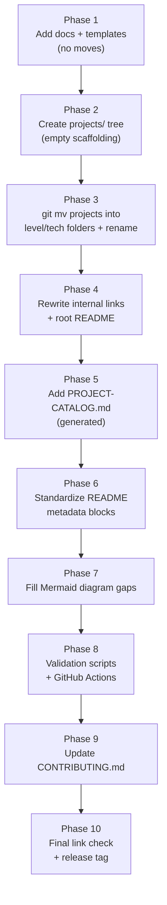

# Repo Migration Plan

How this repo moves from **26 flat folders at the root** to a **future-ready, project-specific
structure** — safely, without losing content or breaking links.

> **Status:** Phase 1 in progress (docs + templates). **No project folders have moved yet.**
> The mapping table below is the source of truth for the eventual move.

## Why reorganize at all

Today every project sits at the repo root. That works at 26 projects and breaks at 100+:

- No way to see a project's **level / cloud / domain** from the filesystem — only from README prose.
- Folder names don't carry a provider prefix, so `lambda-basics` and a future `gcp-functions-basics` don't sort or scan cleanly.
- The root `README.md` is the only catalog, hand-maintained.

The target structure encodes **level → cloud-or-technology → project** in the path itself, so
discovery scales and automation (catalog generation, structure validation) becomes possible.

```
projects/<level>/<cloud-or-technology>/<project-name>/
```

## The phases

We move in phases so nothing breaks mid-flight. Each phase is independently shippable.



| Phase | What happens | Destructive? | Done when |
|-------|--------------|--------------|-----------|
| 1 | Add `docs/`, `docs/templates/`, `CONTRIBUTING.md`, this plan | No | Docs merged (**current phase**) |
| 2 | Create the `projects/<level>/<tech>/` leaf dirs the 26 projects need (`scripts/phase3-move.sh`) | No | Folders exist (only the 8 needed; no empty future providers) |
| 3 | `git mv` each project + rename to provider-prefixed slug (`scripts/phase3-move.sh --apply`) | **Yes** | All 26 relocated; `git status` clean |
| 4 | Fix every cross-project / index link (mapping-driven rewrite) | Yes | Link checker passes |
| 5 | Generate `PROJECT-CATALOG.md` from metadata | No | Catalog builds |
| 6 | Add the YAML metadata block to each project README | No | Every README has metadata |
| 7 | Add any missing architecture / flow diagrams | No | Diagram standards met |
| 8 | Add `scripts/` validators + CI workflows | No | CI green |
| 9 | Refresh `CONTRIBUTING.md` for the new layout | No | Guide matches reality |
| 10 | Full link sweep + tag a release | No | Tag pushed |

> Migrate the `concepts/` directory and the stray root `send_message.py` during Phase 3 — see
> "Loose ends" below.

## Mapping table — current → new

`git mv` preserves history, so every move keeps its full commit log. Renames fold into the same
`git mv`.

| # | Current folder | New folder | Level | Cloud/Tech | Domain | Notes |
|---|----------------|------------|-------|------------|--------|-------|
| 1 | `lambda-basics` | `projects/beginner/aws/aws-lambda-basics` | beginner | aws | serverless | Lambda series #1 |
| 2 | `lambda-s3-event-processing` | `projects/beginner/aws/aws-lambda-s3-event-processing` | beginner | aws | serverless | Lambda series #2 |
| 3 | `lambda-layers` | `projects/beginner/aws/aws-lambda-layers` | beginner | aws | serverless | Lambda series #3 |
| 4 | `lambda-eventbridge-scheduled` | `projects/beginner/aws/aws-lambda-eventbridge-scheduled` | beginner | aws | serverless | Automation series #1 |
| 5 | `lambda-ec2-start-stop-scheduler` | `projects/beginner/aws/aws-lambda-ec2-start-stop-scheduler` | beginner | aws | cost-optimization | Automation series #2 |
| 6 | `lambda-s3-housekeeping` | `projects/beginner/aws/aws-lambda-s3-housekeeping` | beginner | aws | storage | Automation series #3 |
| 7 | `s3-cloudfront-static-website` | `projects/beginner/aws/aws-s3-cloudfront-static-website` | beginner | aws | storage | CDN/OAC |
| 8 | `sqs-sns-iam-messaging` | `projects/beginner/aws/aws-sqs-sns-messaging` | beginner | aws | messaging | Drop redundant `-iam` |
| 9 | `lambda-sqs-sns-trigger` | `projects/intermediate/aws/aws-lambda-sqs-sns-trigger` | intermediate | aws | messaging | Pipeline |
| 10 | `lambda-troubleshooting-monitoring` | `projects/intermediate/aws/aws-lambda-troubleshooting-monitoring` | intermediate | aws | observability | Lambda series #4 |
| 11 | `iam-roles-and-policies` | `projects/intermediate/aws/aws-iam-roles-and-policies` | intermediate | aws | security-iam | 6 role scenarios |
| 12 | `api-gateway-rest-lambda` | `projects/intermediate/aws/aws-api-gateway-rest-lambda` | intermediate | aws | serverless | API GW series #1 |
| 13 | `api-gateway-http-dynamodb-crud` | `projects/intermediate/aws/aws-api-gateway-dynamodb-crud` | intermediate | aws | serverless | API GW series #2; shorten slug |
| 14 | `serverless-monitored-webapp` | `projects/intermediate/aws/aws-serverless-monitored-webapp` | intermediate | aws | serverless | Web-app pair (serverless) |
| 15 | `aws-compute-rightsizing` | `projects/intermediate/aws/aws-compute-rightsizing` | intermediate | aws | cost-optimization | Already conforms |
| 16 | `ecs-fargate-basics` | `projects/intermediate/aws/aws-ecs-fargate-basics` | intermediate | aws | containers | ECS series #1 |
| 17 | `ecs-fargate-advanced` | `projects/advanced/aws/aws-ecs-fargate-advanced` | advanced | aws | containers | ECS series #2 |
| 18 | `ec2-vpc-monitored-webapp` | `projects/advanced/aws/aws-ec2-vpc-monitored-webapp` | advanced | aws | compute | Web-app pair (native) |
| 19 | `rds-disaster-recovery` | `projects/advanced/aws/aws-rds-disaster-recovery` | advanced | aws | disaster-recovery | Real cost |
| 20 | `monolith-to-serverless-migration` | `projects/advanced/aws/aws-monolith-to-serverless-migration` | advanced | aws | migration | Migration series #1 |
| 21 | `database-migration-dms` | `projects/advanced/aws/aws-database-migration-dms` | advanced | aws | migration | Migration series #3 |
| 22 | `monolith-to-microservices-eks` | `projects/advanced/kubernetes/eks-monolith-to-microservices` | advanced | kubernetes | migration | Migration series #2; K8s primary skill |
| 23 | `eks-projects/irsa-service-account-access` | `projects/advanced/kubernetes/eks-irsa-service-account-access` | advanced | kubernetes | security-iam | EKS; K8s primary skill |
| 24 | `k8s-optimization-and-recovery` | `projects/intermediate/kubernetes/k8s-optimization-and-recovery` | intermediate | kubernetes | sre | Local, $0 |
| 25 | `gcp-projects/gcp-vpc-firewall-basics` | `projects/beginner/gcp/gcp-vpc-firewall-basics` | beginner | gcp | networking | |
| 26 | `gcp-projects/gcp-http-lb-autoscaling` | `projects/intermediate/gcp/gcp-http-lb-autoscaling` | intermediate | gcp | networking | Real cost |

### Classification rules used above

- **Level** = operational complexity + blast radius, not topic. A single Lambda = beginner; a full
  VPC + ALB + Auto Scaling + CI/CD = advanced.
- **Put EKS/K8s projects under `kubernetes/`, not `aws/`** — the transferable skill is Kubernetes.
  This follows the "group by primary learning goal" rule. (A future Terraform-only AWS project would
  likewise sit under `terraform/`.)
- **Series can span levels.** ECS basics→intermediate, advanced→advanced. That's fine — the
  `PROJECT-CATALOG.md` "Series" grouping keeps the narrative intact even when the folders differ.

## Executing Phases 2–4

### The two kinds of links (why this isn't a blind find/replace)

When a project folder moves **as a whole unit**, the relative distance between its *own* files is
unchanged — so links inside a project survive. Only links that cross a project boundary break.

| Link type | Example | Survives the move? |
|-----------|---------|--------------------|
| **Intra-project** (README → its own `steps/`, `src/`, `troubleshooting.md`) | `steps/03-*.md` → `../src/app.py` | ✅ Yes — moves together |
| **Cross-project** (one project → another) | `.../README.md` → `../lambda-basics/README.md` | ❌ Breaks |
| **Root / group index** (root `README.md`, `gcp-projects/README.md`) → projects | `./lambda-basics/README.md` | ❌ Breaks |

A repo scan finds **~200 markdown links** referencing project paths. The intra-project ones are free;
the **cross-project + index ones are the real work of Phase 4.**

### Phases 2 + 3 — automated by `scripts/phase3-move.sh`

Phases 2 (create the tree) and 3 (`git mv` + rename) are scripted and **history-preserving**:

```bash
scripts/phase3-move.sh            # DRY RUN — prints every action, changes nothing
scripts/phase3-move.sh --apply    # performs the moves (requires a clean working tree)
```

The script performs **28** `git mv` operations — the 26 projects plus the two loose ends
(`concepts/` → `docs/basic-concepts-draft/`, `send_message.py` → its project's `scripts/`) — and
removes the two now-empty group-index READMEs. It refuses to run `--apply` on a dirty tree so the
move stays a clean, revertible PR.

### Depth shift is NOT uniform — this is the Phase 4 gotcha

Because projects start at different depths, the number of `../` levels each cross-project link needs
changes by a different amount. A single global search-and-replace **will not work**.

| Source location | Old depth | New depth | `../` shift |
|-----------------|-----------|-----------|-------------|
| Root projects (e.g. `lambda-basics/`) | 1 | 3 | **+2** |
| `gcp-projects/*`, `eks-projects/*` | 2 | 3 | **+1** |

And every cross-project **target** changed twice: it was **renamed** (`lambda-basics` →
`aws-lambda-basics`) *and* **relocated** (`projects/<level>/<tech>/`). Worked example:

```
# in aws-monolith-to-serverless-migration/README.md (now at projects/advanced/aws/…):
[lambda-basics](../lambda-basics/README.md)
# must become (target now at projects/beginner/aws/aws-lambda-basics/):
[lambda-basics](../../../beginner/aws/aws-lambda-basics/README.md)
```

### Phase 4 rewrite strategy

Deterministic, mapping-driven — not hand-editing 200 links:

1. Build an `oldname → newpath` map (27 entries) straight from the **mapping table above** plus
   `concepts` → `docs/basic-concepts-draft`.
2. For every markdown link whose path contains a mapped old folder name, recompute the relative path
   **from the source file's new location to the target's new location** (Python `os.path.relpath`).
3. Rewrite the root `README.md` (32 project links) into a short intro that points at
   `PROJECT-CATALOG.md`, and update `PROJECT-CATALOG.md`'s own links to the new paths.
4. Run the markdown link checker until clean **before** opening the PR.

**Run Phases 3 + 4 as one PR.** Committing the moves without the link fixes ships ~200 broken links
to `main`. Keep that PR pure (moves + link rewrites only, no content edits) so it reviews as
mechanical and reverts cleanly.

## Loose ends to resolve during the move

| Item | Today | Action |
|------|-------|--------|
| `concepts/` (4 files, ~1,500 lines of AWS-architecture theory) | Root dir, unlinked from README, undocumented in CLAUDE.md | Move to `docs/basic-concepts/`, **split and trim** into the short per-concept format (Phase 6/7). Not a project — belongs in `docs/`. |
| `send_message.py` (hardcoded account ID + queue URL) | Stray at repo root | Move into `projects/beginner/aws/aws-sqs-sns-messaging/scripts/` (or delete if superseded by that project's own scripts). Scrub the hardcoded account ID. |
| `eks-projects/README.md`, `gcp-projects/README.md` | Group index READMEs | Content folds into `PROJECT-CATALOG.md`; delete the standalone group READMEs after Phase 5. |
| Root `README.md` prose catalog | Hand-maintained tables | Becomes a short intro that links to `PROJECT-CATALOG.md` (Phase 4–5). |

## Rollback

Every phase is a separate PR. Phase 3 (the moves) is one PR containing only `git mv` + link fixes,
so a revert restores the old layout wholesale. Do **not** mix content edits into the move PR — keep
moves reviewable as pure renames.

## Not in scope yet (future phases, deliberately deferred)

Per the "don't implement everything now" direction, these are **planned but not created**:

- `docs/basic-concepts/*` (11 short concept docs) — Phase 6/7, seeded from the existing `concepts/`.
- `docs/cloud-comparison/*`, `docs/architecture-standards.md`, `docs/future-project-ideas.md`.
- The empty future-provider folders (`azure/`, `terraform/`, `ci-cd/`, `sre/`, `platform-engineering/`
  …) — **create these only when the first real project lands in them**, never as empty scaffolding.
- `scripts/` validators + GitHub Actions — Phase 8.
