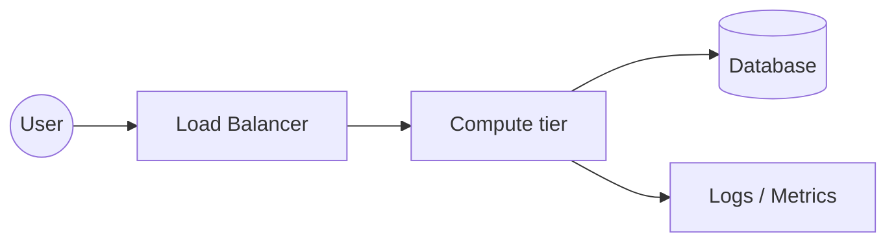
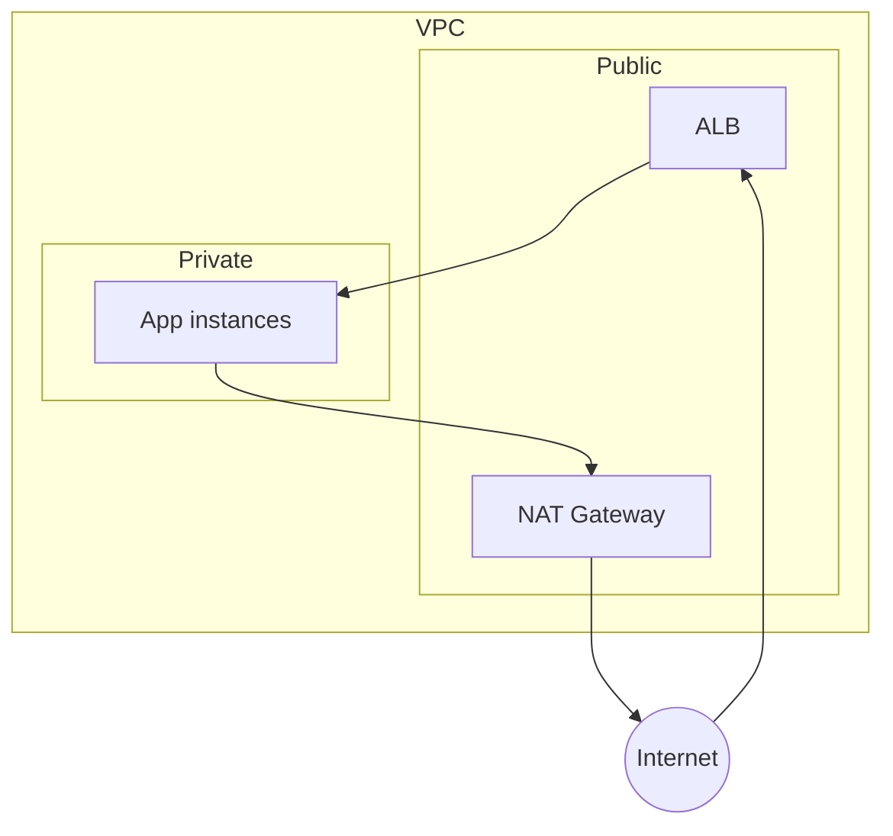
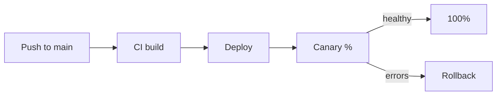
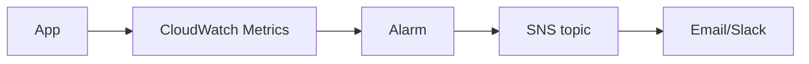
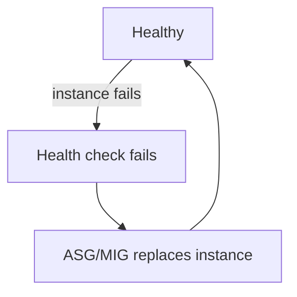
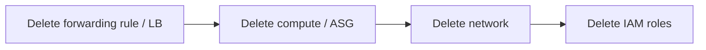

# Architecture Template

Where a project's Mermaid diagrams live when they're too detailed for the README. All diagrams stay
as **Mermaid code blocks inside Markdown** — no exported images, no `assets/`.

## Which diagrams to include (by level)

| Diagram | Beginner | Intermediate | Advanced |
|---------|:--------:|:------------:|:--------:|
| High-level architecture | ✅ | ✅ | ✅ |
| Request flow | ✅ | ✅ | ✅ |
| Network flow | — | ✅ | ✅ |
| Deployment flow | — | ✅ | ✅ |
| Monitoring flow | — | ✅ | ✅ |
| Security / IAM flow | if relevant | ✅ | ✅ |
| CI/CD flow | — | if relevant | ✅ |
| Failure / recovery flow | — | — | ✅ |
| Scaling flow | — | — | ✅ |
| Cost / cleanup flow | — | — | if relevant |

Each diagram gets **one sentence before** (what it shows) and **one takeaway after** (what to
remember when building it).

---

# Architecture — <Project Title>

## High-level architecture

What it shows: the major components and how traffic moves between them.

Takeaway: …

## Network flow

What it shows: subnets, gateways, and what can reach what.

Takeaway: …

## Deployment flow

What it shows: how a new version reaches production.

Takeaway: …

## Monitoring flow

What it shows: how signals become alerts.

Takeaway: …

## Failure / recovery flow (advanced)

What it shows: what happens when a component dies and how the system heals.

Takeaway: …

## Cleanup flow

What it shows: the safe teardown order (usually front-to-back).

Takeaway: delete in reverse-dependency order so nothing is left orphaned and billing stops.
