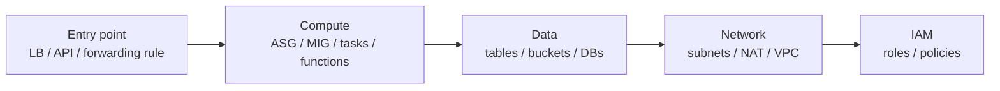

# Cleanup Template

Every cloud project **must** end in a cleanup step. Copy the section below into
`steps/NN-cleanup.md` (always the last-numbered step). The goal: **billing stops and no resource is
orphaned.**

---

<!-- ==== COPY FROM HERE ==== -->

# Step NN — Cleanup

> **⚠️ Do not skip this.** Leaving resources running incurs charges — some (NAT gateways, load
> balancers, EKS control planes, RDS instances, replication instances) have **no free tier** and
> bill **per hour** whether you use them or not.

## What you're deleting

A quick list so you know what "done" looks like.

- …
- …

## Teardown order

Delete in **reverse dependency order** (front-to-back): the thing traffic hits first goes last to be
created and first to be deleted. Deleting out of order leaves resources that refuse to delete because
something still references them.



## Console

1. …
2. …

## CLI

```bash
# Delete in order. Adjust names/regions to match what you created.
<command 1>
<command 2>
```

## Verify nothing is left

Confirm each resource type is gone (and check **all regions** you touched — cross-region copies are
a common surprise on the bill):

```bash
# examples — adapt to the services used
aws ec2 describe-instances --filters "Name=tag:Project,Values=<project>" --query 'Reservations[].Instances[].State.Name'
aws s3 ls | grep <project-prefix> || echo "no buckets left"
```

## Cleanup checklist

- [ ] Entry point (LB / API / forwarding rule) deleted
- [ ] Compute (instances / ASG / MIG / tasks / functions) deleted
- [ ] Data stores (tables / buckets / DBs / snapshots) deleted
- [ ] Network (NAT / subnets / VPC) deleted
- [ ] IAM roles/policies created for this project deleted
- [ ] **Checked every region used** (including cross-region copies)
- [ ] Billing/Cost Explorer shows charges stopping

<!-- ==== COPY TO HERE ==== -->
