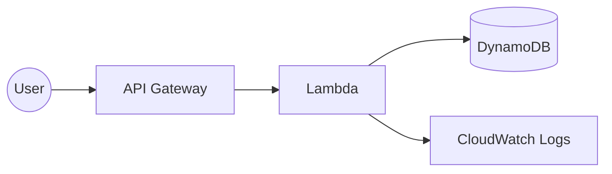
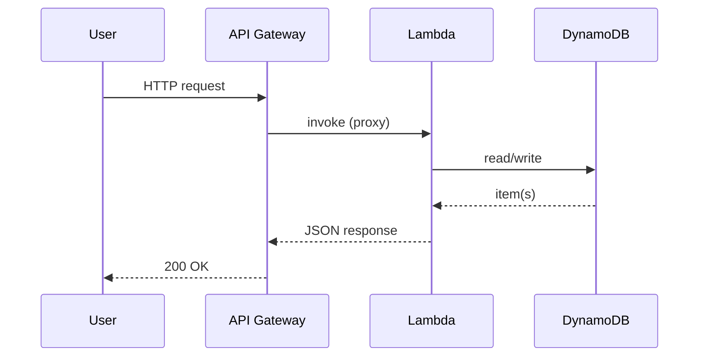
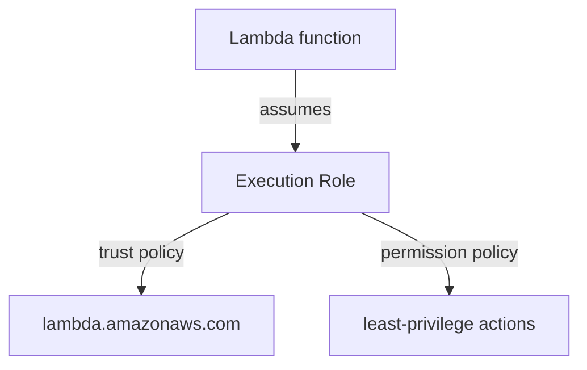

# Project README Template

Copy everything below the line into a new project's `README.md` and fill it in. Keep it
**project-focused** — link out to `docs/basic-concepts/` for deeper theory instead of explaining it
inline. Delete any section that genuinely doesn't apply (e.g. IAM flow for a project with no IAM).

---

<!-- ==== COPY FROM HERE ==== -->

# <Project Title>

```yaml
level: beginner            # beginner | intermediate | advanced
cloud: aws                 # aws | azure | gcp | multi-cloud | kubernetes | docker | terraform | ...
domain: serverless         # serverless | containers | networking | security-iam | storage | ...
technology:
  - lambda
  - iam
  - cloudwatch
estimated_time: 45-60 minutes
estimated_cost: free-tier  # free-tier | ~$X/hr | ~$X for the lab
deployment_type: console + cli
cleanup_required: true
status: ready              # ready | draft | needs-review
```

> **One-line pitch:** what this project builds and why someone would do it.

## Learning objectives

By the end you will be able to:

- …
- …

## Real-world use case

Where this pattern shows up in production, in one short paragraph. Use a plain-language example
before any jargon.

## What you'll build

A short bullet list of the concrete resources/outputs the user ends up with.

## Architecture



<!-- Beginner: one architecture + one request-flow diagram is enough.
     Intermediate+: add network / deployment / monitoring diagrams here or in architecture.md. -->

### Request flow



### Security / IAM flow (include when IAM is non-trivial)



## Prerequisites

Summarize here; link to `prerequisites.md` for the full list.

- Account + region, tools + versions, required permissions
- Prior projects, if this one builds on them

## Project structure

```
project-name/
├── README.md
├── steps/
├── src/
└── troubleshooting.md
```

## Steps

| # | Step | What you do |
|---|------|-------------|
| 1 | [Introduction](steps/01-introduction.md) | … |
| 2 | [Setup](steps/02-setup.md) | … |
| 3 | [Build](steps/03-build.md) | … |
| 4 | [Test](steps/04-test.md) | … |
| … | … | … |
| N | [Cleanup](steps/NN-cleanup.md) | Tear everything down |

## Validation checklist

- [ ] Resource X exists and is reachable
- [ ] Test request returns expected result
- [ ] Logs/metrics show up where expected

## 💰 Cost

| Resource | Cost | Free tier? |
|----------|------|-----------|
| … | … | … |

**Estimated total for this lab:** … · **⚠️ Left running:** …

## 🧹 Cleanup

> **⚠️ Do the cleanup step.** Leaving resources running incurs charges.

Cleanup is [Step NN](steps/NN-cleanup.md). Quick summary of what gets deleted: …

## Troubleshooting

See [troubleshooting.md](troubleshooting.md) — `Error → Cause → Fix`.

## Challenges

See [challenges.md](challenges.md) for extension tasks.

## What to try next

- Related project: [<name>](../<path>)
- Concept deep-dive: [<concept>](../../../docs/basic-concepts/<file>.md)

## References

See [references.md](references.md) for official docs.

<!-- ==== COPY TO HERE ==== -->
