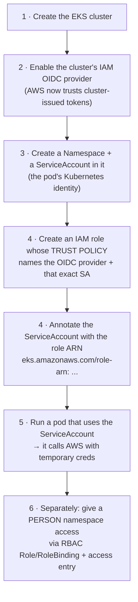
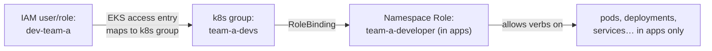

# IRSA — Give EKS Pods AWS Permissions with a Service Account (and Give People Namespace Access Safely)

## What You'll Build

You will take a fresh **Amazon EKS** cluster and wire up the single most important EKS security
pattern: **IRSA — IAM Roles for Service Accounts.** By the end, a pod running in a namespace will
call AWS (read an S3 bucket) using **temporary, automatically-rotated credentials** — with **no
access keys stored anywhere**.

Then you'll do the thing people *think* IRSA is for but isn't: **give a teammate access to one
namespace** (and only that namespace) using **Kubernetes RBAC + EKS access entries**. You'll see
exactly where IRSA stops and human access control begins — they are two different jobs.

By the end you will understand:

- What a **Namespace**, a **ServiceAccount**, **OIDC**, and **IRSA** actually are — in plain words
- **How IRSA works under the hood** — the token-projection flow, step by step
- How to create the cluster **OIDC provider**, the **IAM role**, its **trust policy**, and bind it
  to a ServiceAccount — both **CLI** and **Console**
- How to **scope a person to one namespace** with RBAC `Role` + `RoleBinding` + an **access entry**
- The difference between **"a pod's AWS access" (IRSA)** and **"a human's cluster access" (RBAC)**

> ⚠️ **This project runs a real EKS cluster — it is NOT free.** The EKS control plane costs
> **$0.10/hour (~$2.40/day)** plus EC2 worker nodes. Budget **$1–3** if you finish in one sitting
> and **delete the cluster the same day** (Step 7). A **$0 local note** is in
> [Appendix A](#appendix-a--what-you-can-practice-for-0). See **[costs.md](costs.md)**.

> **Beginner → Intermediate (EKS).** Helpful first:
> [iam-roles-and-policies](../../iam-roles-and-policies/README.md) (trust vs. permission policies,
> OIDC federation) and [k8s-optimization-and-recovery](../../k8s-optimization-and-recovery/README.md)
> (kubectl, namespaces, pods).

---

## First, the words — in plain English

Before any commands, here's every term this project uses. Read this once; the rest will click.

| Plain word | Technical term | What it really means |
|------------|----------------|----------------------|
| A labelled drawer in the cluster | **Namespace** | A folder that groups and isolates resources (pods, services, accounts). Lets you say "team A's stuff lives here." |
| A pod's ID badge | **ServiceAccount (SA)** | The *identity a pod runs as inside Kubernetes*. Every pod has one (even if you don't pick it — it uses `default`). |
| The cluster's passport office | **OIDC provider** | A trusted issuer that hands out signed identity tokens. EKS gives every cluster one. |
| A signed passport | **OIDC token / JWT** | A short-lived, tamper-proof token that says "I am ServiceAccount X in namespace Y of cluster Z." |
| "Let this badge use that AWS role" | **IRSA** | IAM Roles for Service Accounts — the bridge that lets a pod's ServiceAccount assume a real **IAM role** and get AWS permissions. |
| A person's cluster keycard | **RBAC (Role + RoleBinding)** | Kubernetes' own permission system for *who can run which `kubectl` verbs where*. This is how humans get scoped to a namespace. |
| "AWS, recognize this IAM user on my cluster" | **EKS access entry** | The modern way to map an **IAM** user/role to a **Kubernetes** identity (replaces the old `aws-auth` ConfigMap). |

> 🛠️ **One correction up front (you asked me to flag this):** **IRSA is for *pods*, not people.**
> It answers *"what AWS APIs may this workload call?"* To answer *"what may this **human** do in
> this namespace?"* you use **RBAC + access entries** (Step 6). This project does **both** and shows
> exactly where the line is. Mixing them up is the #1 IRSA misconception.

---

## What problem does each piece solve?

### What is a ServiceAccount, and what does it solve?

Every pod talks to the Kubernetes API *as some identity* — that identity is a **ServiceAccount**.
If you don't assign one, the pod silently uses the namespace's `default` SA. That's fine until the
pod also needs to talk to **AWS** (S3, DynamoDB, SQS…). A bare ServiceAccount has **zero AWS
permissions** — it only exists inside Kubernetes. IRSA is what gives that Kubernetes identity an
AWS identity too.

**It solves:** "This specific workload — and only this one — needs to read this S3 bucket. How do I
give *just that pod* AWS access without sharing keys with the whole node?"

### What is OIDC, and why is it the key to everything?

**OIDC = OpenID Connect**, an industry-standard identity protocol built on OAuth 2.0 (the same
family behind "Sign in with Google"). The idea: instead of handing out **passwords/keys**, a
trusted **issuer** hands out short-lived **signed tokens** that *prove who you are*. Anyone who
trusts the issuer can verify the token without ever holding a shared secret.

Every EKS cluster ships with its own **OIDC issuer URL**, e.g.:

```
https://oidc.eks.us-east-1.amazonaws.com/id/EXAMPLED539D4633E53DE1B716D3041E
```

When you "**enable the OIDC provider**," you register that issuer in **IAM** as an *OpenID Connect
identity provider*. From then on, **AWS trusts tokens signed by your cluster** — which is the whole
foundation IRSA stands on.

**Benefits of OIDC (why it beats stored keys):**

| Benefit | Why it matters |
|---------|----------------|
| **No long-lived secrets** | Nothing to leak. There's no access key sitting in a pod, image, or env var. |
| **Short-lived** | Tokens expire in minutes and rotate automatically. A stolen token is near-useless. |
| **Scoped to identity** | The token names the *exact* ServiceAccount + namespace; AWS can pin a role to just that. |
| **Standard & verifiable** | Signature-checked against the issuer; no shared password to manage or rotate. |
| **Auditable** | CloudTrail shows `AssumeRoleWithWebIdentity` with the SA in the request. |

### What is IRSA, and how does it tie it together?

**IRSA = IAM Roles for Service Accounts.** It connects two worlds:

- **Kubernetes side:** a **ServiceAccount** annotated with an IAM role ARN.
- **AWS side:** an **IAM role** whose **trust policy** says *"I trust the cluster's OIDC provider,
  and I only let the token whose subject is `system:serviceaccount:<namespace>:<sa>` assume me."*

When a pod that uses that ServiceAccount starts, EKS automatically injects an OIDC token into the
pod. The AWS SDK inside the pod trades that token for **temporary IAM credentials** via
`sts:AssumeRoleWithWebIdentity`. The pod now has exactly the permissions on that IAM role — no
keys, no node-wide credentials, no sharing.

**It solves:** least-privilege AWS access **per workload**, with zero stored secrets.

---

## How IRSA works — the flow (read this twice)

### The build order (what you create, and why that order)



**Why this order:** OIDC must exist **before** the role's trust policy can reference it. The
ServiceAccount must exist so you know its `namespace:name` to pin in the trust policy. The role must
exist before you can annotate the SA with its ARN. The pod comes last because it depends on all of
the above.

### What actually happens at runtime (the magic, unpacked)

```mermaid
sequenceDiagram
    participant Pod as Pod (uses SA s3-reader)
    participant Hook as EKS Pod Identity Webhook
    participant SDK as AWS SDK in the pod
    participant STS as AWS STS
    participant OIDC as Cluster OIDC provider (in IAM)
    participant Role as IAM role IrsaS3ReaderRole

    Pod->>Hook: Pod scheduled with annotated SA
    Hook-->>Pod: Inject projected OIDC token file +<br/>env AWS_ROLE_ARN, AWS_WEB_IDENTITY_TOKEN_FILE
    SDK->>STS: AssumeRoleWithWebIdentity(token, role ARN)
    STS->>OIDC: Is this token signature valid?
    STS->>STS: Does :aud = sts.amazonaws.com?<br/>Does :sub = system:serviceaccount:apps:s3-reader?
    STS-->>Role: All checks pass → mint credentials
    Role-->>SDK: Temporary AWS credentials (15 min – 1 hr)
    SDK->>STS: (later) calls S3 with those creds
    Note over Pod,Role: ❌ No access key was ever stored.<br/>Token auto-rotates; creds auto-refresh.
```

**Read it:** The pod never sees a permanent key. EKS injects a fresh signed token; the SDK swaps it
for short-lived credentials; STS only says yes because the **trust policy** pinned this exact
ServiceAccount. Change the namespace or SA name and the trade fails — that's the security.

---

## The two sample policies (the heart of IRSA)

### Trust policy — *who is allowed to assume the role*

This is what makes it IRSA. Note `Federated` (the OIDC provider, not a user), the
`AssumeRoleWithWebIdentity` action, and the two `Condition` claims:

```json
{
  "Version": "2012-10-17",
  "Statement": [
    {
      "Effect": "Allow",
      "Principal": {
        "Federated": "arn:aws:iam::<ACCOUNT_ID>:oidc-provider/oidc.eks.us-east-1.amazonaws.com/id/<OIDC_ID>"
      },
      "Action": "sts:AssumeRoleWithWebIdentity",
      "Condition": {
        "StringEquals": {
          "oidc.eks.us-east-1.amazonaws.com/id/<OIDC_ID>:aud": "sts.amazonaws.com",
          "oidc.eks.us-east-1.amazonaws.com/id/<OIDC_ID>:sub": "system:serviceaccount:apps:s3-reader"
        }
      }
    }
  ]
}
```

| Part | What it locks down |
|------|--------------------|
| `Federated: ...oidc-provider/...` | Only tokens from **your cluster's** OIDC issuer count |
| `Action: sts:AssumeRoleWithWebIdentity` | The "web identity" flavour of assuming a role (not plain `AssumeRole`) |
| `:aud = sts.amazonaws.com` | The token was minted *for AWS* |
| `:sub = system:serviceaccount:apps:s3-reader` | **Only** the `s3-reader` SA in the `apps` namespace may assume it — not `default`, not another namespace |

> ⚠️ **The `:sub` claim is the security.** Drop it and *any* ServiceAccount in the cluster could
> assume the role. Always pin `system:serviceaccount:<namespace>:<name>`.

### Permission policy — *what the role may do in AWS*

Plain least-privilege IAM, unchanged from any other role. Example: read one bucket.

```json
{
  "Version": "2012-10-17",
  "Statement": [
    {
      "Sid": "ReadOneBucket",
      "Effect": "Allow",
      "Action": ["s3:GetObject", "s3:ListBucket"],
      "Resource": [
        "arn:aws:s3:::irsa-demo-bucket-<ACCOUNT_ID>",
        "arn:aws:s3:::irsa-demo-bucket-<ACCOUNT_ID>/*"
      ]
    }
  ]
}
```

**Trust policy = *who can wear the badge*. Permission policy = *what the badge opens*.** Every IAM
role has both; IRSA only changes the *trust* side.

---

## Giving a person access to one namespace (this is NOT IRSA)

IRSA gives the **pod** AWS access. To let a **teammate** run `kubectl` in just the `apps` namespace,
you use two Kubernetes/EKS features:



**Read it:** An **access entry** says "AWS principal `dev-team-a` is a member of Kubernetes group
`team-a-devs`." A **RoleBinding** in the `apps` namespace grants that group a namespace-scoped
**Role**. Result: the teammate can manage `apps` and nothing else. Step 6 builds this.

| Question | Feature | Lives in |
|----------|---------|----------|
| What AWS APIs can this **pod** call? | **IRSA** (IAM role + trust on OIDC) | AWS IAM |
| What `kubectl` actions can this **person** do, and where? | **RBAC** `Role`/`RoleBinding` | Kubernetes |
| Which **AWS identity** is even allowed onto the cluster? | **EKS access entry** | EKS ↔ IAM |

---

## Real-world use case

A payments team runs a `receipts-worker` pod in the `apps` namespace. It must **read** invoice
files from one S3 bucket — nothing else. Two engineers maintain it and must be able to restart it,
read its logs, and edit its config — **but never touch other teams' namespaces**.

- **IRSA** gives `receipts-worker` read-only access to *exactly that bucket* with auto-rotating
  credentials — so even if the image leaks, there's no key to steal and no access to other buckets.
- **RBAC + access entry** lets those two engineers `kubectl` the `apps` namespace only.

That's this whole project, one-to-one with the steps.

---

## Project Structure

```
irsa-service-account-access/
├── README.md                       ← You are here (concepts + flow + policies)
├── policies/
│   ├── trust-policy.json           ← IRSA trust policy (OIDC, :sub/:aud) — template
│   └── permission-policy.json      ← least-privilege S3 read — template
├── manifests/
│   ├── 00-namespace.yaml           ← the apps namespace
│   ├── serviceaccount.yaml         ← the s3-reader SA (with role-arn annotation)
│   ├── test-pod.yaml               ← a pod that uses the SA and calls AWS
│   ├── rbac-role.yaml              ← namespace Role: team-a-developer
│   └── rbac-rolebinding.yaml       ← binds k8s group team-a-devs → the Role
├── steps/
│   ├── 01-create-cluster-and-namespace.md
│   ├── 02-enable-oidc-provider.md
│   ├── 03-create-service-account.md
│   ├── 04-create-irsa-role.md
│   ├── 05-deploy-and-verify-pod.md
│   ├── 06-grant-namespace-access-to-a-person.md
│   └── 07-cleanup.md               ← DELETE THE CLUSTER (cost-critical)
├── costs.md
├── troubleshooting.md
└── challenges.md
```

---

## Prerequisites

| Requirement | Details |
|-------------|---------|
| AWS account | EKS, EC2, IAM, STS, S3, CloudWatch |
| AWS CLI | 2.x, configured for **us-east-1** |
| `eksctl` | Creates the cluster + the OIDC provider ([install](https://eksctl.io/installation/)) |
| `kubectl` | Talks to the cluster |
| `jq` | Handy for reading JSON output (optional) |
| Region | **us-east-1** throughout |
| Recommended first | [iam-roles-and-policies](../../iam-roles-and-policies/README.md) (trust vs. permission, OIDC) |

---

## What You'll Learn Step by Step

| Step | File | Goal |
|------|------|------|
| 1 | `01-create-cluster-and-namespace.md` | Create `irsa-demo` with `eksctl`; create the `apps` namespace |
| 2 | `02-enable-oidc-provider.md` | Enable/register the cluster's **IAM OIDC provider** (CLI + Console) — *what & why* |
| 3 | `03-create-service-account.md` | Create the `s3-reader` **ServiceAccount** in `apps` |
| 4 | `04-create-irsa-role.md` | Write the **trust + permission** policies; create the role; **annotate** the SA |
| 5 | `05-deploy-and-verify-pod.md` | Run a pod as the SA; **prove** it assumes the role and reads S3 |
| 6 | `06-grant-namespace-access-to-a-person.md` | Scope a **teammate** to `apps` via **RBAC + access entry** |
| 7 | `07-cleanup.md` | **Delete the cluster**, role, OIDC provider, bucket |

Start with **Step 1 →** [`steps/01-create-cluster-and-namespace.md`](steps/01-create-cluster-and-namespace.md)

---

## Estimated Time

2 – 3 hours. Cluster creation (Step 1) alone is ~15–20 min while `eksctl` builds the control plane
and node group.

## Estimated Cost

| Service | Configuration | Cost |
|---------|--------------|------|
| **EKS control plane** | per cluster | **$0.10/hr (~$2.40/day)** — no free tier |
| **EC2 worker nodes** | 2× `t3.small` | ~$0.04/hr total |
| **S3** | 1 tiny bucket | ~$0 (free tier) |
| **STS / IAM / OIDC** | tokens & roles | **$0** |

**An afternoon ≈ $1–3.** The control plane bills **per hour whether or not you use it** — the single
most important reason to run **Step 7 (delete the cluster) the same day.** See **[costs.md](costs.md)**.

---

## Appendix A — What you can practice for $0

The **concepts** (ServiceAccount, RBAC `Role`/`RoleBinding`, namespace isolation) work identically
on a free local `kind`/`minikube` cluster — practise those on
[k8s-optimization-and-recovery](../../k8s-optimization-and-recovery/README.md). **But IRSA itself is
AWS-specific:** it needs a real EKS OIDC provider and AWS STS, so the IRSA half (Steps 2, 4, 5)
genuinely requires EKS. Do the free k8s lab first to get comfortable with `kubectl`, then spend the
$1–3 here for the AWS integration.

---

## What's Next

- Swap IRSA for **EKS Pod Identity** (the newer association-based alternative — no OIDC trust to
  hand-edit) and compare; see [challenges.md](challenges.md)
- Add a second SA/role pair so two workloads have **different** AWS permissions in the same namespace
- Front the namespace with **NetworkPolicies** so isolation is network-level too
- Wire **CloudTrail** to watch `AssumeRoleWithWebIdentity` and alert on unexpected subjects
