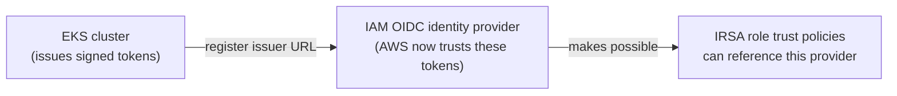

# Step 2 — Enable the Cluster's IAM OIDC Provider

This is the **foundation IRSA stands on.** Until you do this, AWS has no reason to trust a token your
cluster issues. After this step, AWS recognizes your cluster as a legitimate **identity issuer** — so
in Step 4 an IAM role can say *"I trust tokens from this cluster."*

---

## 2.1 What OIDC Is Doing Here (the why)

Every EKS cluster automatically publishes an **OIDC issuer URL** — a public endpoint that hands out
signed identity tokens and exposes the keys to verify them. Example:

```
https://oidc.eks.us-east-1.amazonaws.com/id/EXAMPLED539D4633E53DE1B716D3041E
```

"Enabling the OIDC provider" means: **register that issuer in IAM as an OpenID Connect identity
provider.** Think of it as AWS adding the cluster to its list of *passport offices it recognizes*.



> **Why is this a separate step?** Trust is opt-in. AWS won't accept cluster tokens just because the
> cluster exists — *you* must explicitly register the issuer once per cluster. Skipping this is the
> #1 cause of `Not authorized to perform sts:AssumeRoleWithWebIdentity` later.

---

## 2.2 Find Your Cluster's OIDC Issuer URL

```bash
aws eks describe-cluster \
  --name irsa-demo \
  --region us-east-1 \
  --query "cluster.identity.oidc.issuer" \
  --output text
```

Output looks like `https://oidc.eks.us-east-1.amazonaws.com/id/EXAMPLED539D4633E53DE1B716D3041E`.
The part after `id/` is your **OIDC ID** — you'll paste it into the trust policy in Step 4.

---

## 2.3 Register the Provider

### CLI (eksctl) — recommended one-liner

`eksctl` checks whether the provider exists and creates it if not:

```bash
eksctl utils associate-iam-oidc-provider \
  --cluster irsa-demo \
  --region us-east-1 \
  --approve
```

### CLI (raw aws) — the explicit way

If you want to see what eksctl does under the hood:

```bash
OIDC_URL=$(aws eks describe-cluster --name irsa-demo --region us-east-1 \
  --query "cluster.identity.oidc.issuer" --output text)

aws iam create-open-id-connect-provider \
  --url "$OIDC_URL" \
  --client-id-list sts.amazonaws.com
```

> The `client-id-list` value `sts.amazonaws.com` is the **audience** (`aud`) — it says "tokens from
> this issuer are meant to be traded in for AWS credentials." It must match what EKS puts in the
> token (it does, automatically).

### Console (alternative)

| Step | Action |
|------|--------|
| 1 | Copy the issuer URL from 2.2 |
| 2 | **IAM** → **Identity providers** → **Add provider** |
| 3 | Provider type: **OpenID Connect** |
| 4 | Provider URL: paste the issuer URL → **Get thumbprint** |
| 5 | Audience: `sts.amazonaws.com` |
| 6 | **Add provider** |

---

## 2.4 Verify the Provider Exists

```bash
aws iam list-open-id-connect-providers
```

You should see an ARN ending in your cluster's OIDC ID, e.g.:

```
arn:aws:iam::111122223333:oidc-provider/oidc.eks.us-east-1.amazonaws.com/id/EXAMPLED539D4633E53DE1B716D3041E
```

Save this ARN and the OIDC ID — Step 4's trust policy needs both.

---

## Checkpoint

- [ ] You can print the cluster's OIDC issuer URL
- [ ] `list-open-id-connect-providers` shows a provider whose ID matches the issuer
- [ ] You understand the audience is `sts.amazonaws.com`
- [ ] You've saved the OIDC ID / provider ARN for Step 4

---

**Next:** [Step 3 — Create the Service Account](./03-create-service-account.md)
