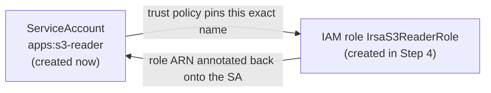

# Step 3 — Create the Service Account

The **ServiceAccount (SA)** is the pod's identity inside Kubernetes. Right now it has **zero AWS
permissions** — that's expected. In Step 4 you'll attach an IAM role to it; here you just create it
so its name (`apps:s3-reader`) exists to be referenced.

---

## 3.1 Why This Comes Before the Role

The IRSA trust policy in Step 4 pins the role to **one exact ServiceAccount** via the claim
`system:serviceaccount:apps:s3-reader`. So the SA's **namespace and name must be decided first** —
the role is built *around* this identity.



**Read it:** the SA and the role point at each other. The SA names the role (annotation); the role
names the SA (trust condition). Both must agree or STS says no.

---

## 3.2 Create the Service Account

### Manifest (recommended)

`manifests/serviceaccount.yaml` already has the annotation placeholder. You can create it now and
fill the real role ARN in Step 4 (it's harmless until then):

```bash
kubectl apply -f manifests/serviceaccount.yaml
kubectl -n apps get serviceaccount s3-reader -o yaml
```

### CLI one-liner (alternative)

```bash
kubectl create serviceaccount s3-reader --namespace apps
```

### Console (alternative)

EKS now has a built-in resource viewer:

| Step | Action |
|------|--------|
| 1 | **EKS** → cluster `irsa-demo` → **Resources** tab |
| 2 | **Service and networking** is for Services; for SAs use **Authentication → ServiceAccounts** (or just use the CLI) |
| 3 | You can *view* SAs here, but creating with annotations is far easier via the manifest above |

> The Console is great for *inspecting* the SA; creating it with the role annotation is cleaner in
> YAML, which is why the manifest path is primary.

---

## 3.3 Confirm It Has No AWS Power Yet

This is the important teaching moment. A plain SA is Kubernetes-only:

```bash
kubectl -n apps describe serviceaccount s3-reader
```

There's no AWS anything here yet — just a Kubernetes object. **IRSA (Step 4) is what turns this
Kubernetes identity into an AWS identity.** Until the role exists and the annotation points at it, a
pod using this SA can talk to the Kubernetes API but **cannot** call AWS.

---

## Checkpoint

- [ ] ServiceAccount `s3-reader` exists in namespace `apps`
- [ ] You understand its name+namespace will be hard-coded into the role's trust policy
- [ ] You understand it currently has **no** AWS permissions

---

**Next:** [Step 4 — Create the IRSA Role](./04-create-irsa-role.md)
