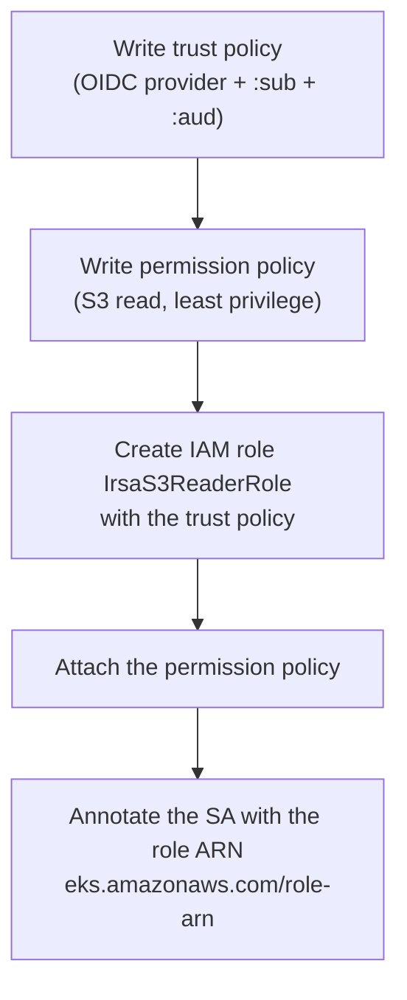

# Step 4 — Create the IRSA Role and Bind It to the Service Account

This is the heart of the project. You'll write the **trust policy** (who may assume the role), the
**permission policy** (what the role can do in AWS), create the role, and finally **annotate** the
ServiceAccount so the pod knows which role to assume.



---

## 4.1 Gather Your Values

```bash
ACCOUNT_ID=$(aws sts get-caller-identity --query Account --output text)
OIDC_ID=$(aws eks describe-cluster --name irsa-demo --region us-east-1 \
  --query "cluster.identity.oidc.issuer" --output text | cut -d/ -f5)

echo "Account: $ACCOUNT_ID"
echo "OIDC ID: $OIDC_ID"
```

Keep both handy — you'll substitute them into the policy files.

---

## 4.2 The Trust Policy — *who can assume the role*

This is what makes it **IRSA** rather than an ordinary role. Open `policies/trust-policy.json`:

```json
{
  "Version": "2012-10-17",
  "Statement": [
    {
      "Effect": "Allow",
      "Principal": {
        "Federated": "arn:aws:iam::<ACCOUNT_ID>:oidc-provider/oidc.eks.us-east-1.amazonaws.com/id/<OIDC_ID>"
      },
      "Action": "sts:AssumeRoleWithWebIdentity",
      "Condition": {
        "StringEquals": {
          "oidc.eks.us-east-1.amazonaws.com/id/<OIDC_ID>:aud": "sts.amazonaws.com",
          "oidc.eks.us-east-1.amazonaws.com/id/<OIDC_ID>:sub": "system:serviceaccount:apps:s3-reader"
        }
      }
    }
  ]
}
```

| Part | What it locks down |
|------|--------------------|
| `Federated: ...oidc-provider/...` | Only tokens from **your cluster's** OIDC issuer count |
| `Action: sts:AssumeRoleWithWebIdentity` | The "web identity" flavour — used by outside/federated identities, **not** plain `sts:AssumeRole` |
| `:aud = sts.amazonaws.com` | The token was minted *for AWS* |
| `:sub = system:serviceaccount:apps:s3-reader` | **Only** the `s3-reader` SA in `apps` may assume it |

> ⚠️ **The `:sub` claim is the security.** Without it, *any* ServiceAccount in the cluster could
> assume this role. Always pin `system:serviceaccount:<namespace>:<name>`.

Substitute your real values in place (creates a working copy):

```bash
sed -e "s/<ACCOUNT_ID>/$ACCOUNT_ID/g" -e "s/<OIDC_ID>/$OIDC_ID/g" \
  policies/trust-policy.json > /tmp/trust-policy.json
cat /tmp/trust-policy.json
```

---

## 4.3 The Permission Policy — *what the role may do*

This is ordinary least-privilege IAM. We'll let the role read one S3 bucket. First create the bucket
so it exists to read:

```bash
BUCKET="irsa-demo-bucket-$ACCOUNT_ID"
aws s3 mb "s3://$BUCKET" --region us-east-1
echo "hello from irsa" > /tmp/hello.txt
aws s3 cp /tmp/hello.txt "s3://$BUCKET/hello.txt"
```

Now substitute the bucket name into `policies/permission-policy.json`:

```bash
sed "s/<ACCOUNT_ID>/$ACCOUNT_ID/g" \
  policies/permission-policy.json > /tmp/permission-policy.json
cat /tmp/permission-policy.json
```

| Permission | Service | Why It's Needed |
|------------|---------|-----------------|
| `s3:ListBucket` | S3 | List objects in the demo bucket |
| `s3:GetObject` | S3 | Read the object contents |

---

## 4.4 Create the Role and Attach the Policy

### CLI (raw aws) — the explicit way

```bash
aws iam create-role \
  --role-name IrsaS3ReaderRole \
  --assume-role-policy-document file:///tmp/trust-policy.json

aws iam put-role-policy \
  --role-name IrsaS3ReaderRole \
  --policy-name IrsaS3ReadAccess \
  --policy-document file:///tmp/permission-policy.json
```

### CLI (eksctl) — the all-in-one shortcut

`eksctl` can create the role *and* the ServiceAccount *and* the annotation in one command, building
the trust policy for you. (If you use this, you can skip the manual SA from Step 3 — eksctl makes it.)

```bash
eksctl create iamserviceaccount \
  --name s3-reader \
  --namespace apps \
  --cluster irsa-demo \
  --region us-east-1 \
  --attach-policy-arn arn:aws:iam::aws:policy/AmazonS3ReadOnlyAccess \
  --approve
```

> **Which should you use?** Do the **raw aws** path once to *understand* the trust policy — that's the
> learning. In real life, `eksctl create iamserviceaccount` is the convenient production path because
> it can't get the `:sub` wrong. We continue below assuming the **raw aws** path.

### Console (alternative)

| Step | Action |
|------|--------|
| 1 | **IAM** → **Roles** → **Create role** |
| 2 | Trusted entity type: **Web identity** |
| 3 | Identity provider: select your cluster's `oidc.eks...` provider |
| 4 | Audience: `sts.amazonaws.com` |
| 5 | Create, then **edit the trust policy** to add the `:sub` condition (the wizard sets `:aud` but you must add `:sub` by hand) |
| 6 | Attach a permission policy (the S3 read JSON from 4.3) |

> ⚠️ **Console gotcha:** the Web-identity wizard pins `:aud` but **not** `:sub`. You must add the
> `:sub` condition manually or the role is assumable by every SA in the cluster.

---

## 4.5 Annotate the Service Account with the Role ARN

This is the link from the Kubernetes side back to AWS:

```bash
kubectl annotate serviceaccount s3-reader -n apps \
  eks.amazonaws.com/role-arn=arn:aws:iam::$ACCOUNT_ID:role/IrsaS3ReaderRole \
  --overwrite

kubectl -n apps get serviceaccount s3-reader -o yaml | grep -A1 annotations
```

(Or edit `manifests/serviceaccount.yaml`, replace `<ACCOUNT_ID>`, and re-apply it.)

> **Why annotate?** When a pod using this SA starts, the EKS webhook reads this annotation to know
> *which role* to inject credentials for. No annotation = no IRSA injection = no AWS access.

---

## Checkpoint

- [ ] Role `IrsaS3ReaderRole` exists with a trust policy naming your OIDC provider
- [ ] The trust policy's `:sub` is `system:serviceaccount:apps:s3-reader`
- [ ] The role has an S3 read permission policy
- [ ] The `s3-reader` SA is annotated with the role ARN
- [ ] The demo bucket exists and has `hello.txt`

---

**Next:** [Step 5 — Deploy and Verify the Pod](./05-deploy-and-verify-pod.md)
