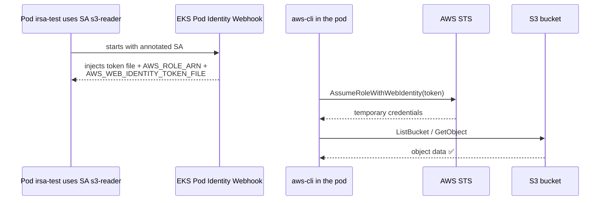

# Step 5 — Deploy a Pod and Prove IRSA Works

Time to see the magic. You'll run a pod **as** the `s3-reader` ServiceAccount and watch it call AWS
with **temporary, auto-injected credentials** — no keys anywhere.

---

## 5.1 What's About to Happen (the runtime flow)



---

## 5.2 Deploy the Test Pod

```bash
kubectl apply -f manifests/test-pod.yaml
kubectl -n apps get pod irsa-test -w     # wait for Running, then Ctrl-C
```

---

## 5.3 Confirm the Credentials Were Injected

Look at the environment variables the webhook added — *you never set these*:

```bash
kubectl -n apps exec irsa-test -- env | grep AWS
```

Expected:

```
AWS_ROLE_ARN=arn:aws:iam::<ACCOUNT_ID>:role/IrsaS3ReaderRole
AWS_WEB_IDENTITY_TOKEN_FILE=/var/run/secrets/eks.amazonaws.com/serviceaccount/token
AWS_DEFAULT_REGION=us-east-1
AWS_REGION=us-east-1
```

> **What you're seeing:** the webhook saw the SA annotation and projected a signed OIDC token into
> the pod plus the env vars the AWS SDK looks for. The SDK does the `AssumeRoleWithWebIdentity` swap
> automatically the first time you call any AWS API.

---

## 5.4 Prove the Identity Is the Role

```bash
kubectl -n apps exec irsa-test -- aws sts get-caller-identity
```

The `Arn` should be an **assumed-role** ARN, *not* a user or a node role:

```
"Arn": "arn:aws:sts::<ACCOUNT_ID>:assumed-role/IrsaS3ReaderRole/botocore-session-..."
```

That `assumed-role/IrsaS3ReaderRole` is proof the pod is running with the IRSA role.

---

## 5.5 Prove the Permissions Work — and the Boundary Holds

The role may read the demo bucket:

```bash
kubectl -n apps exec irsa-test -- aws s3 ls s3://irsa-demo-bucket-<ACCOUNT_ID>/
kubectl -n apps exec irsa-test -- aws s3 cp s3://irsa-demo-bucket-<ACCOUNT_ID>/hello.txt -
```

Now prove **least privilege** — it may *not* do something the policy doesn't grant (e.g. list all
buckets, or write):

```bash
kubectl -n apps exec irsa-test -- aws s3 ls           # ✅/❌ depends — ListAllMyBuckets is NOT granted → AccessDenied
kubectl -n apps exec irsa-test -- aws s3 cp - s3://irsa-demo-bucket-<ACCOUNT_ID>/nope.txt <<< "x"   # ❌ PutObject not granted → AccessDenied
```

Seeing `AccessDenied` here is a **success** — it proves the role grants *only* what its permission
policy allows.

---

## 5.6 (Optional) Prove a Different SA Gets Nothing

Run a throwaway pod on the `default` SA and watch it fail — because the trust policy's `:sub` only
allows `apps:s3-reader`:

```bash
kubectl -n apps run no-irsa --image=amazon/aws-cli:latest --restart=Never -- sleep 600
kubectl -n apps exec no-irsa -- aws sts get-caller-identity   # uses node role or fails — NOT IrsaS3ReaderRole
kubectl -n apps delete pod no-irsa
```

This is the whole point: **only the named ServiceAccount** can assume the role.

---

## Checkpoint

- [ ] `irsa-test` pod is `Running`
- [ ] `env | grep AWS` shows the injected `AWS_ROLE_ARN` and token file
- [ ] `get-caller-identity` shows `assumed-role/IrsaS3ReaderRole`
- [ ] The pod can read the demo bucket
- [ ] The pod is **denied** actions outside its policy (least privilege confirmed)

---

**Next:** [Step 6 — Grant a Person Namespace Access](./06-grant-namespace-access-to-a-person.md)
