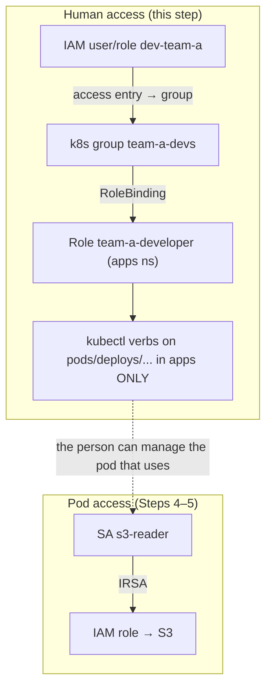

# Step 6 — Grant a Person Access to the Namespace (RBAC + Access Entry)

## Read this first — the correction

You asked to "provide access to someone for a namespace **using the IRSA role**." Here's the gentle
fix, because the terms blur a lot:

> 🛠️ **IRSA does not give *people* access to anything.** IRSA gives a **pod** (a workload) AWS API
> permissions. To give a **human/teammate** access to a Kubernetes namespace you use two *different*
> features: **Kubernetes RBAC** (`Role` + `RoleBinding`) and an **EKS access entry** (the IAM↔
> Kubernetes mapping). The IRSA role from Steps 4–5 stays exactly as it is — it's the pod's AWS
> identity, not a person's keycard.

| You want to grant… | Use | Why not IRSA |
|--------------------|-----|--------------|
| A **pod** access to **AWS APIs** | **IRSA** (Steps 4–5) | That's what IRSA is for |
| A **person** access to a **namespace** | **RBAC + access entry** (this step) | IRSA has no concept of human `kubectl` permissions |

How they relate in one picture:



**Read it:** the engineer (left) manages workloads in `apps` via RBAC. Those workloads (right) reach
AWS via IRSA. Two systems, one namespace, cleanly separated.

---

## 6.1 The Two Halves of Human Access

1. **Authentication — "who is this IAM identity, in Kubernetes terms?"** → an **EKS access entry**
   maps an IAM user/role ARN to a Kubernetes **group** (e.g. `team-a-devs`).
2. **Authorization — "what may that group do, and where?"** → a namespace-scoped **RBAC `Role`** plus
   a **`RoleBinding`** that binds the group to the Role.

Both are required: an access entry with no RBAC = the person can authenticate but can do nothing; RBAC
with no access entry = the person can't even reach the cluster.

---

## 6.2 Create the Namespace-Scoped RBAC

A `Role` is **namespace-scoped** — it can only grant power inside `apps`. Apply both manifests:

```bash
kubectl apply -f manifests/rbac-role.yaml
kubectl apply -f manifests/rbac-rolebinding.yaml

kubectl -n apps get role,rolebinding
```

- `rbac-role.yaml` — defines `team-a-developer`: get/list/watch/create/update/delete on pods,
  services, configmaps, deployments **in `apps`**.
- `rbac-rolebinding.yaml` — binds the Kubernetes **group `team-a-devs`** to that Role.

> **Role vs ClusterRole:** a `Role` + `RoleBinding` is confined to one namespace — exactly what you
> want. A `ClusterRole` + `ClusterRoleBinding` would grant it cluster-wide, which would defeat the
> isolation. Use the namespaced pair here.

---

## 6.3 Map the IAM Identity to the Kubernetes Group (Access Entry)

Pick the IAM principal to grant — an IAM **role** is best practice (the person assumes it), but an
IAM **user** works for the lab. Get its ARN:

```bash
# example: an IAM user named dev-team-a
PRINCIPAL_ARN=$(aws iam get-user --user-name dev-team-a --query 'User.Arn' --output text)
echo "$PRINCIPAL_ARN"
```

### CLI (modern — EKS access entries)

```bash
aws eks create-access-entry \
  --cluster-name irsa-demo \
  --region us-east-1 \
  --principal-arn "$PRINCIPAL_ARN" \
  --kubernetes-groups team-a-devs \
  --type STANDARD
```

This says: "when `dev-team-a` talks to the cluster, treat them as a member of the Kubernetes group
`team-a-devs`." The RoleBinding from 6.2 then grants that group its namespace powers.

### Console (alternative)

| Step | Action |
|------|--------|
| 1 | **EKS** → cluster `irsa-demo` → **Access** tab |
| 2 | **Create access entry** |
| 3 | IAM principal ARN: paste `dev-team-a`'s ARN |
| 4 | Type: **Standard** |
| 5 | Add Kubernetes group: `team-a-devs` |
| 6 | **Create** (do **not** attach a cluster-admin access *policy* — RBAC does the scoping) |

### Legacy note — `aws-auth` ConfigMap

Older clusters (before access entries) mapped identities by editing the `aws-auth` ConfigMap in
`kube-system`. Access entries are the supported modern replacement — prefer them. If you're on an
older cluster:

```bash
kubectl edit configmap aws-auth -n kube-system
# add under mapUsers:
#   - userarn: arn:aws:iam::<ACCOUNT_ID>:user/dev-team-a
#     username: dev-team-a
#     groups: [ team-a-devs ]
```

---

## 6.4 Verify the Scoping

Have the teammate (or simulate with `--as`) check what they can do. Kubernetes ships
`auth can-i` for exactly this:

```bash
# allowed inside apps:
kubectl auth can-i list pods -n apps --as=dev-team-a --as-group=team-a-devs        # yes
# denied outside apps:
kubectl auth can-i list pods -n kube-system --as=dev-team-a --as-group=team-a-devs  # no
# denied cluster-scoped:
kubectl auth can-i get nodes --as=dev-team-a --as-group=team-a-devs                 # no
```

A real test: have the teammate run `aws eks update-kubeconfig --name irsa-demo` then
`kubectl get pods -n apps` (works) and `kubectl get pods -n kube-system` (Forbidden).

---

## Checkpoint

- [ ] `Role team-a-developer` and its `RoleBinding` exist in `apps`
- [ ] An access entry maps the IAM principal to group `team-a-devs`
- [ ] `kubectl auth can-i list pods -n apps` → **yes** for the group
- [ ] `kubectl auth can-i list pods -n kube-system` → **no**
- [ ] You can clearly explain why this is **RBAC**, not IRSA

---

**Next:** [Step 7 — Cleanup](./07-cleanup.md)
