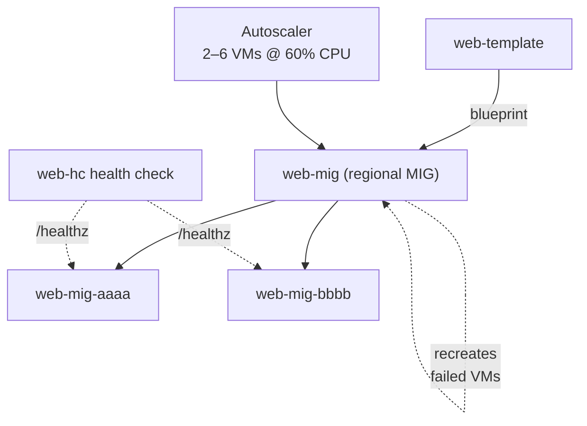

# Step 4 — Managed Instance Group (MIG) + Autoscaling

A **Managed Instance Group (MIG)** runs and maintains a set of identical VMs from your template. It
gives you three superpowers you can't get from standalone VMs:

- **Autoscaling** — add/remove VMs automatically based on CPU (or other signals).
- **Autohealing** — if a VM fails a health check, the MIG recreates it.
- **Load-balancer integration** — the MIG registers its VMs as the LB's backends automatically.

---

## 4.1 First, a Health Check for Autohealing

The MIG needs a way to know a VM is *actually* serving, not just powered on. You'll create a health
check that hits `/healthz` (from the Flask app).

### gcloud CLI

```bash
gcloud compute health-checks create http web-hc \
  --port=80 \
  --request-path=/healthz \
  --check-interval=10s \
  --timeout=5s \
  --healthy-threshold=2 \
  --unhealthy-threshold=3
```

### Console

**☰ → Compute Engine → Health checks → Create health check**: name `web-hc`, protocol **HTTP**, port
`80`, request path `/healthz`, check interval `10s`.

> **Note:** This health check is used for **autohealing** (MIG recreates bad VMs). In Step 5 you'll
> create a *second* health check the **load balancer** uses to decide where to send traffic. Two
> different jobs, two health checks — a common point of confusion.

---

## 4.2 Create the Regional MIG

A **regional** MIG spreads VMs across multiple zones in `us-east1` for resilience — better than a
single-zone group.

### Console

1. **☰ → Compute Engine → Instance groups → Create instance group.**
2. Choose **New managed instance group (stateless)**.

   | Field | Value |
   |-------|-------|
   | Name | `web-mig` |
   | Instance template | `web-template` |
   | Location | **Multiple zones** (region `us-east1`) |
   | Autohealing → Health check | `web-hc` |
   | Initial delay | `120` seconds (give the startup script time to install Flask) |

3. Under **Autoscaling**: mode **On**, **minimum** `2`, **maximum** `6`, target **CPU utilization**
   `60%`.
4. Click **Create**.

### gcloud CLI (Alternative)

```bash
# 1. Create the regional MIG with 2 VMs to start, wired to the health check
gcloud compute instance-groups managed create web-mig \
  --template=web-template \
  --size=2 \
  --region=us-east1 \
  --health-check=web-hc \
  --initial-delay=120

# 2. Name the port so the load balancer knows where to send traffic
gcloud compute instance-groups managed set-named-ports web-mig \
  --region=us-east1 \
  --named-ports=http:80

# 3. Turn on autoscaling: 2–6 VMs, scale on 60% CPU
gcloud compute instance-groups managed set-autoscaling web-mig \
  --region=us-east1 \
  --min-num-replicas=2 \
  --max-num-replicas=6 \
  --target-cpu-utilization=0.60 \
  --cool-down-period=60
```

> **`--initial-delay=120`** stops the MIG from killing a brand-new VM before its startup script has
> finished installing Flask. Without it, autohealing can loop forever recreating "unhealthy" VMs.

> **Named port `http:80`** is how the load-balancer backend service (Step 5) locates the port to send
> traffic to. Skip it and the LB has nowhere to deliver requests.

---

## 4.3 Watch the VMs Come Up

```bash
gcloud compute instance-groups managed list-instances web-mig --region=us-east1
```

Wait a couple of minutes. You want to see 2 instances with `STATUS: RUNNING` and eventually
`HEALTH_STATE: HEALTHY`. The names look like `web-mig-xxxx`.

---

## 4.4 What You Just Built



---

## Checkpoint

- [ ] Health check `web-hc` exists (HTTP :80 `/healthz`)
- [ ] `web-mig` is a **regional** MIG in `us-east1` running **2** VMs
- [ ] The MIG has a **named port** `http:80`
- [ ] Autoscaling is on: min 2, max 6, target 60% CPU
- [ ] Instances reach `HEALTH_STATE: HEALTHY`

---

**Next:** [Step 5 — HTTP Load Balancer](./05-load-balancer.md)
