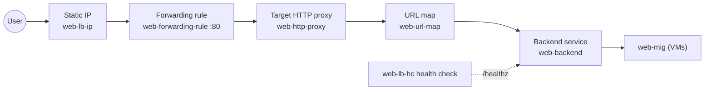

# Step 5 — Global HTTP Load Balancer

Now the front door. A Google Cloud **external Application Load Balancer** is assembled from several
pieces that connect like a chain. It looks like a lot, but each piece has one job — follow the chain
and it makes sense.

---

## 5.1 The Load Balancer Chain



| Piece | Job |
|-------|-----|
| **Static IP** | The stable public address users hit |
| **Forwarding rule** | Binds the IP + port :80 to the proxy |
| **Target HTTP proxy** | Terminates HTTP and hands the request to the URL map |
| **URL map** | Routing rules (here: send everything to one backend) |
| **Backend service** | The pool config: which MIG, which port, which health check, balancing mode |
| **Health check** | Tells the backend service which VMs can receive traffic |

We'll build it **backend-first** (health check → backend service → URL map → proxy → forwarding
rule), because each piece references the one before it.

---

## 5.2 Reserve a Static IP

### gcloud CLI

```bash
gcloud compute addresses create web-lb-ip \
  --global \
  --ip-version=IPV4
```

### Console

**☰ → VPC network → IP addresses → Reserve external static address**: name `web-lb-ip`, type
**Global**. (Global is required for the global Application LB.)

---

## 5.3 Load-Balancer Health Check

```bash
gcloud compute health-checks create http web-lb-hc \
  --port=80 \
  --request-path=/healthz
```

> This is the **second** health check (separate from `web-hc` in Step 4). This one decides which VMs
> the **load balancer** sends traffic to.

---

## 5.4 Backend Service (+ attach the MIG)

```bash
# Create the backend service and wire in the health check
gcloud compute backend-services create web-backend \
  --protocol=HTTP \
  --port-name=http \
  --health-checks=web-lb-hc \
  --global

# Attach the MIG as a backend, balancing on CPU utilization
gcloud compute backend-services add-backend web-backend \
  --instance-group=web-mig \
  --instance-group-region=us-east1 \
  --balancing-mode=UTILIZATION \
  --max-utilization=0.80 \
  --global
```

- `--port-name=http` matches the **named port** you set on the MIG in Step 4 — this is the link that
  routes traffic to port 80 on the VMs.
- `--balancing-mode=UTILIZATION` → the LB spreads load by CPU, complementing the autoscaler.

---

## 5.5 URL Map, Proxy, and Forwarding Rule

```bash
# URL map — send all paths to the one backend
gcloud compute url-maps create web-url-map \
  --default-service=web-backend

# Target HTTP proxy — points at the URL map
gcloud compute target-http-proxies create web-http-proxy \
  --url-map=web-url-map

# Global forwarding rule — binds the static IP + port 80 to the proxy
gcloud compute forwarding-rules create web-forwarding-rule \
  --global \
  --address=web-lb-ip \
  --target-http-proxy=web-http-proxy \
  --ports=80
```

### Console (Alternative for the whole LB)

The Console bundles all of 5.3–5.5 into one wizard: **☰ → Network services → Load balancing → Create
load balancer → Application Load Balancer (HTTP/S) → Public facing (external) → Global**. Then:

1. **Frontend:** protocol HTTP, port 80, IP address `web-lb-ip`.
2. **Backend:** create a backend service → backend type **Instance group** → select `web-mig`, port
   name `http`, balancing mode **Utilization**; create health check `web-lb-hc` (HTTP :80
   `/healthz`).
3. **Routing rules:** leave as "simple host and path rule" (all traffic → the backend).
4. Name it `web-url-map` and **Create**.

---

## 5.6 Get the Address and Test

```bash
gcloud compute addresses describe web-lb-ip --global --format='value(address)'
```

Copy that IP and hit it (it can take **3–7 minutes** after creation for the LB to become reachable
and backends to pass health checks):

```bash
curl http://<LB_IP>/
```

Expected — and run it a few times to see it alternate:

```
Hello from web-mig-aaaa
Hello from web-mig-bbbb
```

🎉 Two different hostnames = the load balancer is spreading traffic across your MIG.

> Getting `502 Server Error`? The backends aren't healthy **yet** (wait) or the
> `web-allow-health-check` firewall rule from Step 2 is missing. See
> [troubleshooting.md](../troubleshooting.md).

---

## Checkpoint

- [ ] Static IP `web-lb-ip` reserved (global)
- [ ] Backend service `web-backend` has `web-mig` attached and health check `web-lb-hc`
- [ ] URL map, target proxy, and forwarding rule (:80) all exist
- [ ] `curl http://<LB_IP>/` returns `Hello from web-mig-...`
- [ ] Repeated curls show **different** hostnames

---

**Next:** [Step 6 — Test Autoscaling & Self-Healing](./06-test-and-scale.md)
