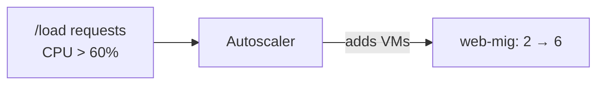

# Step 6 — Test Autoscaling & Self-Healing

Your load balancer works. Now prove the two features that make this architecture *elastic and
resilient*: the MIG **scales out** under load and **heals itself** when a VM dies. This is the payoff
step.

---

## 6.1 Watch the Group (Keep This Open)

In one terminal, watch the instance list refresh every few seconds. On Linux/macOS:

```bash
watch -n 5 'gcloud compute instance-groups managed list-instances web-mig --region=us-east1'
```

No `watch`? Just re-run this every so often:

```bash
gcloud compute instance-groups managed list-instances web-mig --region=us-east1
```

You should currently see **2** instances (the autoscaler minimum).

---

## 6.2 Generate Load → Scale Out

The Flask app has a `/load` route that pegs a VM's CPU for 15 seconds. Hammer it through the load
balancer from a second terminal so CPU climbs above the 60% target and the autoscaler adds VMs.

Simple loop (Linux/macOS):

```bash
LB_IP=$(gcloud compute addresses describe web-lb-ip --global --format='value(address)')

# Fire 200 CPU-burning requests, 20 at a time, in the background
for i in $(seq 1 200); do
  curl -s "http://${LB_IP}/load" > /dev/null &
  if (( i % 20 == 0 )); then wait; fi
done
```

Prefer Python? This does the same and is easy to read:

```python
# save as loadtest.py — run: python3 loadtest.py <LB_IP>
import sys, urllib.request
from concurrent.futures import ThreadPoolExecutor

url = f"http://{sys.argv[1]}/load"

def hit(_):
    try:
        urllib.request.urlopen(url, timeout=30).read()
    except Exception as e:
        print("err", e)

with ThreadPoolExecutor(max_workers=20) as pool:
    list(pool.map(hit, range(200)))
print("done")
```

Within **2–4 minutes**, the watch window should show the group grow from 2 toward **6** instances.
You can also see it in the Console under **Compute Engine → Instance groups → web-mig →** the
autoscaler graph.



---

## 6.3 Watch It Scale Back In

Stop sending load. The autoscaler waits out a **stabilization period** (~10 minutes, to avoid
flapping) and then removes VMs back down to the minimum of **2**. You don't need to watch the whole
thing — just confirm the count starts dropping after load stops.

> Scale-**out** is fast (protect availability); scale-**in** is deliberately slow (avoid thrashing).

---

## 6.4 Test Self-Healing — Delete a VM

The MIG's job is to keep the desired number of VMs running. Delete one and watch it come back.

```bash
# Grab one instance name from the group
VM=$(gcloud compute instance-groups managed list-instances web-mig \
  --region=us-east1 --format='value(instance)' | head -n1)

# Delete it out from under the MIG
gcloud compute instances delete "$VM" --zone=us-east1-b --quiet
```

In the watch window you'll see the count dip, then the MIG **recreate** a replacement (a new
`web-mig-xxxx` name) to restore the target size. Meanwhile, `curl http://<LB_IP>/` keeps working —
the LB simply stops routing to the missing VM. **Zero manual intervention.**

> This is *autohealing driven by desired-state*: you declared "I want N healthy VMs," and the MIG
> continuously makes reality match.

---

## 6.5 What You Just Proved

| Behavior | What triggered it | Who acted |
|----------|-------------------|-----------|
| **Scale out** | CPU > 60% from `/load` | Autoscaler added VMs |
| **Scale in** | Load stopped | Autoscaler removed VMs after stabilization |
| **Self-healing** | You deleted a VM | MIG recreated it to hold desired size |
| **No downtime** | Throughout | Load balancer routed only to healthy VMs |

---

## Checkpoint

- [ ] Under load, `web-mig` grew above 2 instances (toward 6)
- [ ] After load stopped, it scaled back toward 2
- [ ] Deleting a VM caused the MIG to recreate a replacement
- [ ] `curl http://<LB_IP>/` kept returning `Hello from ...` the whole time

---

**Next:** [Step 7 — Cleanup](./07-cleanup.md) ⚠️ **Don't skip — this project has running VMs and a
load balancer.**
