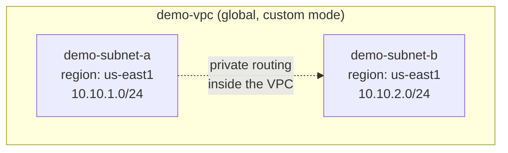

# Step 2 — Create a Custom VPC & Subnets

A **VPC (Virtual Private Cloud)** is your private, software-defined network on Google Cloud. It's
where your VMs get their internal IP addresses and talk to each other. In this step you'll build a
**custom-mode** VPC with two subnets you control.

---

## 2.1 Auto Mode vs. Custom Mode (Why We Pick Custom)

Every new Google Cloud project comes with a `default` network. There are two kinds of VPC:

| Mode | What it does | Good for |
|------|--------------|----------|
| **Auto mode** | Google **automatically** creates one subnet in *every* region with preset IP ranges. | Quick demos; you don't care about IP planning. |
| **Custom mode** | *You* decide which regions get subnets and exactly what IP range each uses. | Real networks — you're in control. This is what we build. |

> **Key GCP fact:** Unlike AWS, a **VPC network in GCP is global** — it spans all regions. Only the
> **subnets** are regional. So one VPC can hold a subnet in `us-east1` and another in `europe-west1`
> and they route to each other privately with no peering.

We use **custom mode** so nothing is created behind your back and you can see every piece.

---

## 2.2 What You're Building



Two subnets in the **same region** (`us-east1`) but with **different IP ranges**. That's enough to
show that VMs on different subnets of one VPC can still reach each other privately.

---

## 2.3 Console — Create the VPC and Subnets

1. In the [Cloud Console](https://console.cloud.google.com/), open **☰ → VPC network → VPC networks**.
2. Click **Create VPC network**.
3. Fill in the top of the form:

   | Field | Value |
   |-------|-------|
   | Name | `demo-vpc` |
   | Subnet creation mode | **Custom** |

4. Under **New subnet**, add the first subnet:

   | Field | Value |
   |-------|-------|
   | Name | `demo-subnet-a` |
   | Region | `us-east1` |
   | IPv4 range | `10.10.1.0/24` |

5. Click **+ Add subnet** and add the second:

   | Field | Value |
   |-------|-------|
   | Name | `demo-subnet-b` |
   | Region | `us-east1` |
   | IPv4 range | `10.10.2.0/24` |

6. Leave everything else at defaults and click **Create**.

---

## 2.4 gcloud CLI (Alternative)

```bash
# 1. Create the VPC in custom (manual) subnet mode
gcloud compute networks create demo-vpc \
  --subnet-mode=custom

# 2. First subnet — 10.10.1.0/24 in us-east1
gcloud compute networks subnets create demo-subnet-a \
  --network=demo-vpc \
  --region=us-east1 \
  --range=10.10.1.0/24

# 3. Second subnet — 10.10.2.0/24 in us-east1
gcloud compute networks subnets create demo-subnet-b \
  --network=demo-vpc \
  --region=us-east1 \
  --range=10.10.2.0/24
```

Verify:

```bash
gcloud compute networks subnets list --filter="network:demo-vpc"
```

Expected output (columns trimmed):

```
NAME            REGION    NETWORK   RANGE
demo-subnet-a   us-east1  demo-vpc  10.10.1.0/24
demo-subnet-b   us-east1  demo-vpc  10.10.2.0/24
```

---

## 2.5 What About Routing?

You didn't create any routes — and you don't need to. Every VPC automatically gets:

| Implied route | What it does |
|---------------|--------------|
| **Subnet routes** | Traffic to any subnet range in the VPC is delivered privately. This is why `demo-subnet-a` and `demo-subnet-b` can already reach each other. |
| **Default route** (`0.0.0.0/0`) | Sends anything not local toward the internet gateway (used only if a VM has an external IP). |

Routing is handled for you; **firewall rules** (next step) decide what's actually *allowed*.

---

## Checkpoint

- [ ] `demo-vpc` appears under VPC networks with **Subnet creation mode: Custom**
- [ ] `demo-subnet-a` (`10.10.1.0/24`) and `demo-subnet-b` (`10.10.2.0/24`) both exist in `us-east1`
- [ ] You can explain why a VPC is *global* but a subnet is *regional*

---

**Next:** [Step 3 — Firewall Rules](./03-firewall-rules.md)
