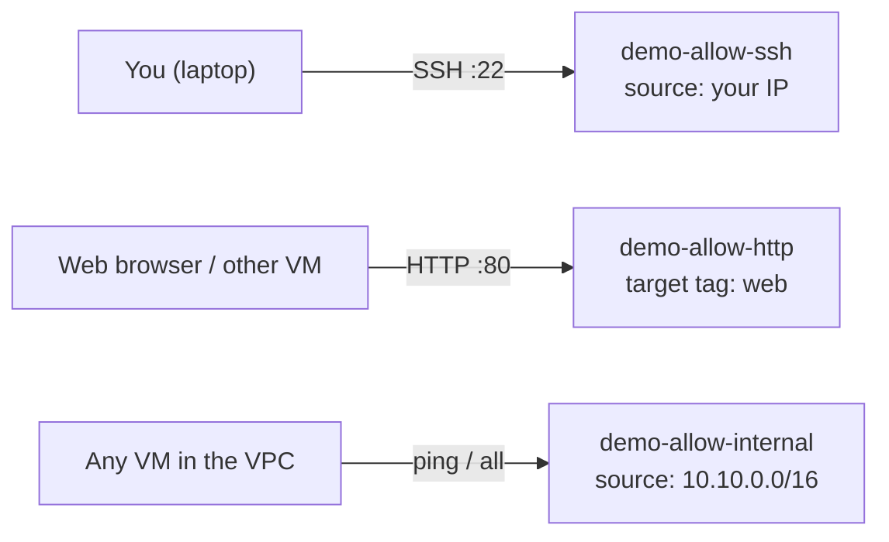

# Step 3 — Firewall Rules

Right now your `demo-vpc` is locked down. A **custom-mode VPC has no firewall rules**, and GCP's
default behavior is **deny all ingress**. Before any VM can be reached — even by you over SSH — you
must **explicitly allow** the traffic. This step creates three rules.

---

## 3.1 How GCP Firewall Rules Work

| Concept | What it means |
|---------|---------------|
| **Direction** | `ingress` (into a VM) or `egress` (out of a VM). We only touch ingress here. |
| **Default ingress** | **Denied.** Nothing gets in until a rule allows it. |
| **Default egress** | **Allowed.** VMs can reach out by default. |
| **Priority** | 0–65535, **lower wins**. Default is 1000. A `deny` at priority 900 beats an `allow` at 1000. |
| **Target** | Which VMs the rule applies to — all VMs, or only those with a specific **network tag**. |
| **Source** | Who the traffic is allowed *from* — an IP range (`0.0.0.0/0` = anywhere) or a source tag. |

> **Network tags** are just labels you attach to a VM (e.g. `web`). A firewall rule that targets the
> tag `web` applies only to VMs carrying that tag. This is how you say "open port 80 on the web
> servers, but not on everything."

Two **implied rules** always exist and can't be deleted: *deny all ingress* and *allow all egress*.
Your rules sit in front of the implied deny.

---

## 3.2 The Three Rules You'll Create



| Rule | Allows | From (source) | To (target) |
|------|--------|---------------|-------------|
| `demo-allow-ssh` | TCP 22 (SSH) | your public IP only | all VMs in the VPC |
| `demo-allow-internal` | ICMP (ping) + all TCP/UDP | `10.10.0.0/16` (inside the VPC) | all VMs in the VPC |
| `demo-allow-http` | TCP 80 (web) | anywhere (`0.0.0.0/0`) | VMs tagged `web` only |

---

## 3.3 Console — Create the Rules

Open **☰ → VPC network → Firewall** → **Create firewall rule** for each.

### Rule 1 — `demo-allow-ssh`

| Field | Value |
|-------|-------|
| Name | `demo-allow-ssh` |
| Network | `demo-vpc` |
| Direction | Ingress |
| Action | Allow |
| Targets | All instances in the network |
| Source IPv4 ranges | *your public IP* + `/32` (e.g. `203.0.113.7/32`) |
| Protocols and ports | TCP `22` |

> **Find your IP:** open [ifconfig.me](https://ifconfig.me) or run `curl -s ifconfig.me`. Using your
> own IP instead of `0.0.0.0/0` means the whole internet can't knock on your SSH port.

### Rule 2 — `demo-allow-internal`

| Field | Value |
|-------|-------|
| Name | `demo-allow-internal` |
| Network | `demo-vpc` |
| Direction | Ingress |
| Action | Allow |
| Targets | All instances in the network |
| Source IPv4 ranges | `10.10.0.0/16` |
| Protocols and ports | Check **Other** → `icmp`; also allow `tcp` and `udp` (all ports) |

### Rule 3 — `demo-allow-http`

| Field | Value |
|-------|-------|
| Name | `demo-allow-http` |
| Network | `demo-vpc` |
| Direction | Ingress |
| Action | Allow |
| Targets | **Specified target tags** → `web` |
| Source IPv4 ranges | `0.0.0.0/0` |
| Protocols and ports | TCP `80` |

---

## 3.4 gcloud CLI (Alternative)

```bash
# 1. SSH from your IP only. Replace with YOUR public IP (curl -s ifconfig.me).
export MY_IP="$(curl -s ifconfig.me)"

gcloud compute firewall-rules create demo-allow-ssh \
  --network=demo-vpc \
  --direction=INGRESS \
  --action=ALLOW \
  --rules=tcp:22 \
  --source-ranges="${MY_IP}/32"

# 2. Allow all traffic *between* VMs inside the VPC (so ping works)
gcloud compute firewall-rules create demo-allow-internal \
  --network=demo-vpc \
  --direction=INGRESS \
  --action=ALLOW \
  --rules=icmp,tcp,udp \
  --source-ranges=10.10.0.0/16

# 3. Allow HTTP from anywhere, but ONLY to VMs tagged `web`
gcloud compute firewall-rules create demo-allow-http \
  --network=demo-vpc \
  --direction=INGRESS \
  --action=ALLOW \
  --rules=tcp:80 \
  --source-ranges=0.0.0.0/0 \
  --target-tags=web
```

Verify:

```bash
gcloud compute firewall-rules list --filter="network:demo-vpc"
```

---

## 3.5 Why Least Privilege Here Matters

- **SSH is pinned to your IP**, not the whole internet — the single most common way beginners expose
  a VM is `--source-ranges=0.0.0.0/0` on port 22. Don't.
- **HTTP is scoped by tag**, so only VMs you *intend* to be web servers answer on port 80. A database
  VM in the same network stays closed.
- **Internal traffic** is limited to the VPC's own `10.10.0.0/16` range — no outside source can use it.

---

## Checkpoint

- [ ] Three rules exist on `demo-vpc`: `demo-allow-ssh`, `demo-allow-internal`, `demo-allow-http`
- [ ] `demo-allow-ssh` source is **your IP**, not `0.0.0.0/0`
- [ ] `demo-allow-http` targets the tag `web`
- [ ] You can explain the difference between the **implied deny** and your **allow** rules

---

**Next:** [Step 4 — Launch Two VMs](./04-launch-vms.md)
