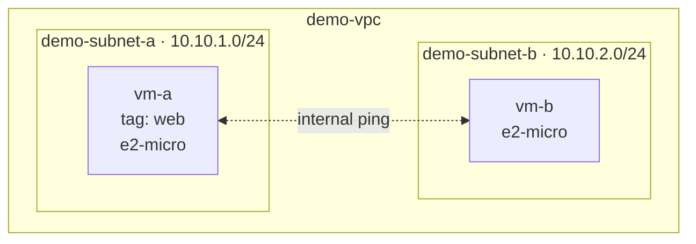

# Step 4 — Launch Two VMs

Now you'll put two **Compute Engine VMs** onto your network — one in each subnet — so you have
something to connect to and test with. `vm-a` will be your **web server** (tagged `web`); `vm-b`
will be a plain VM used to test internal connectivity.

---

## 4.1 What You're Launching



| VM | Subnet | Machine type | Network tag | External IP? |
|----|--------|--------------|-------------|--------------|
| `vm-a` | `demo-subnet-a` | `e2-micro` | `web` | Yes (to reach the web page) |
| `vm-b` | `demo-subnet-b` | `e2-micro` | *(none)* | Yes (so you can SSH to it) |

> **`e2-micro`** is Google Cloud's smallest general-purpose machine and is covered by the
> [free tier](../costs.md) in `us-east1`. Perfect for a lab.

---

## 4.2 Console — Create the VMs

Open **☰ → Compute Engine → VM instances** → **Create instance**. Do this twice.

### VM 1 — `vm-a`

| Section | Field | Value |
|---------|-------|-------|
| — | Name | `vm-a` |
| — | Region / Zone | `us-east1` / `us-east1-b` |
| Machine configuration | Series / Type | E2 / `e2-micro` |
| Networking | Network tags | `web` |
| Networking → Network interfaces | Network | `demo-vpc` |
| | Subnetwork | `demo-subnet-a` |

Leave the boot disk at the default (Debian). Click **Create**.

### VM 2 — `vm-b`

| Section | Field | Value |
|---------|-------|-------|
| — | Name | `vm-b` |
| — | Region / Zone | `us-east1` / `us-east1-b` |
| Machine configuration | Series / Type | E2 / `e2-micro` |
| Networking → Network interfaces | Network | `demo-vpc` |
| | Subnetwork | `demo-subnet-b` |

No network tag for `vm-b`. Click **Create**.

---

## 4.3 gcloud CLI (Alternative)

```bash
# vm-a — the web server (tagged `web`, in subnet A)
gcloud compute instances create vm-a \
  --zone=us-east1-b \
  --machine-type=e2-micro \
  --network=demo-vpc \
  --subnet=demo-subnet-a \
  --tags=web

# vm-b — a plain VM in subnet B
gcloud compute instances create vm-b \
  --zone=us-east1-b \
  --machine-type=e2-micro \
  --network=demo-vpc \
  --subnet=demo-subnet-b
```

List them and note the IP columns:

```bash
gcloud compute instances list
```

Expected output (trimmed):

```
NAME   ZONE        MACHINE_TYPE  INTERNAL_IP  EXTERNAL_IP     STATUS
vm-a   us-east1-b  e2-micro      10.10.1.2    34.xx.xx.xx     RUNNING
vm-b   us-east1-b  e2-micro      10.10.2.2    34.yy.yy.yy     RUNNING
```

---

## 4.4 Internal vs. External IP — The Core Idea

Each VM has **two** addresses, and knowing which is which is the whole point of this lab:

| Address | Example | Reachable from | Used for |
|---------|---------|----------------|----------|
| **Internal IP** | `10.10.1.2` | Only inside `demo-vpc` | VM-to-VM private traffic (never leaves Google's network) |
| **External IP** | `34.x.x.x` | The public internet | SSH from your laptop, serving a public web page |

Notice `vm-a` got `10.10.1.2` (from subnet A's `10.10.1.0/24`) and `vm-b` got `10.10.2.2` (from
subnet B's `10.10.2.0/24`). The IP tells you which subnet the VM lives in.

> `.1` in each range is reserved as the subnet gateway, so the first usable VM address is `.2`.

---

## Checkpoint

- [ ] `vm-a` and `vm-b` both show **STATUS: RUNNING**
- [ ] `vm-a`'s internal IP starts with `10.10.1.` and `vm-b`'s with `10.10.2.`
- [ ] `vm-a` carries the network tag `web`; `vm-b` does not
- [ ] You can point to each VM's **internal** and **external** IP and say what each is for

---

**Next:** [Step 5 — Test Connectivity](./05-test-connectivity.md)
