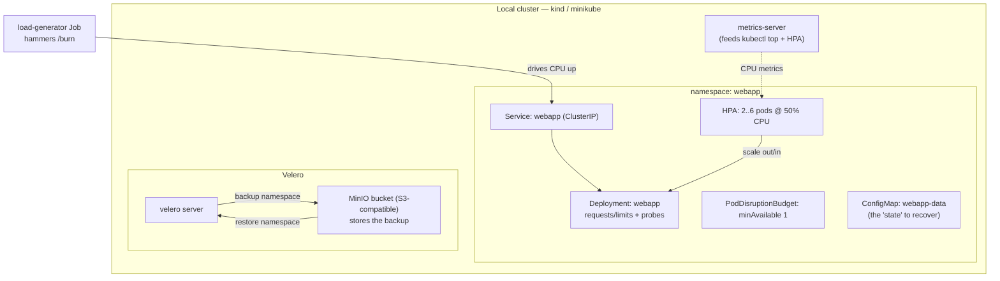

# Kubernetes Optimization & Recovery — Right-Size, Autoscale, Back Up, Restore

**Optimization & Recovery Series — Project 3 of 3**

## What You'll Build

The same two themes from Projects 1 and 2 — **optimization** and **recovery** — applied to a
containerized app on a **local Kubernetes cluster** (kind or minikube, your choice). No cloud bill:
everything runs on your laptop, and Velero backs up to a local MinIO bucket that mimics S3.

You'll deploy a small Flask app, **right-size it** with resource requests/limits, **autoscale it**
under load with an HPA, make it **self-heal** with probes and a PodDisruptionBudget, then **back
up the whole namespace with Velero, delete it (simulated disaster), and restore it.**

By the end you will understand:

- **Requests vs limits** and the **QoS classes** they produce (and why "no limits" is a trap)
- **Horizontal Pod Autoscaler (HPA)** scaling on CPU — the Kubernetes analog of EC2 rightsizing
- `kubectl top` to *see* real usage and right-size from data, not guesses
- **Self-healing**: liveness/readiness probes and a **PodDisruptionBudget**
- **Velero** backup & restore of a namespace to object storage (MinIO ≈ S3)
- The Kubernetes mapping of RPO/RTO: how fresh your last backup is vs how fast you restore

This completes the series: Project 1 optimized **EC2**, Project 2 recovered **RDS**, and this one
does **both** on **Kubernetes**.

---

## Architecture



---

## Key Concepts

| Concept | What it means |
|---------|--------------|
| **Request** | Guaranteed CPU/memory the scheduler reserves for a pod |
| **Limit** | Hard ceiling; exceed CPU → throttled, exceed memory → **OOMKilled** |
| **QoS class** | `Guaranteed` / `Burstable` / `BestEffort`, derived from requests vs limits |
| **HPA** | Adds/removes pod replicas to hold a target metric (here: 50% CPU) |
| **metrics-server** | Cluster add-on that supplies `kubectl top` and HPA their numbers |
| **Probes** | `readiness` gates traffic; `liveness` restarts a hung container |
| **PodDisruptionBudget** | Floor on available pods during *voluntary* disruptions |
| **Velero** | Backs up Kubernetes objects (+ volumes) to object storage and restores them |

---

## Optimization vs Recovery in This Project

| Half | What you do | Steps |
|------|-------------|-------|
| **Optimization** | requests/limits, `kubectl top`, HPA scale-out under load | 3, 4 |
| **Recovery** | probes + PDB self-healing, Velero backup → delete → restore | 5, 6 |

---

## Project Structure

```
k8s-optimization-and-recovery/
├── README.md                         ← You are here
├── Dockerfile                        ← python:3.12-slim + Flask app
├── src/
│   └── app.py                        ← /, /healthz, /burn, /data
├── k8s/
│   ├── namespace.yaml
│   ├── configmap.yaml                ← the "state" to back up & restore
│   ├── deployment.yaml               ← requests/limits + probes + volume
│   ├── service.yaml
│   ├── hpa.yaml                      ← 2..6 replicas @ 50% CPU
│   ├── pdb.yaml                      ← minAvailable 1
│   └── load-generator.yaml           ← Job that drives CPU for the HPA demo
├── steps/
│   ├── 01-setup-cluster.md           ← Install kind/minikube + metrics-server
│   ├── 02-deploy-app.md              ← Build image, deploy, reach the service
│   ├── 03-requests-limits.md         ← Right-size with requests/limits + QoS
│   ├── 04-autoscaling-hpa.md         ← Load test, watch the HPA scale
│   ├── 05-resilience-probes-pdb.md   ← Self-healing + disruption budget
│   ├── 06-backup-restore-velero.md   ← Velero + MinIO: back up, destroy, restore
│   └── 07-cleanup.md                 ← Delete the cluster
├── costs.md
├── troubleshooting.md
└── challenges.md
```

---

## Prerequisites

| Requirement | Details |
|-------------|---------|
| Docker | Running locally (`docker ps` works) |
| kind **or** minikube | `kind` (needs Docker) or `minikube` — either works |
| kubectl | `kubectl version --client` returns a version |
| Velero CLI | Installed in Step 6 ([velero.io](https://velero.io)) |
| Helm (optional) | Easiest way to install MinIO; manifests provided as fallback |
| Region | **N/A — this runs entirely on your laptop** |

> Unlike the rest of this repo, this project is **not** on AWS and costs **$0** — it's local
> Kubernetes. The concepts (rightsizing, autoscaling, backup/restore to S3-style storage) map
> directly to **Amazon EKS**; see [Challenge 7](challenges.md) to lift it there.

---

## What You'll Learn Step by Step

| Step | File | Goal |
|------|------|------|
| 1 | `01-setup-cluster.md` | Create a local cluster + metrics-server |
| 2 | `02-deploy-app.md` | Build the image, deploy, hit the service |
| 3 | `03-requests-limits.md` | Set requests/limits, read `kubectl top`, see QoS |
| 4 | `04-autoscaling-hpa.md` | Apply the HPA, generate load, watch it scale |
| 5 | `05-resilience-probes-pdb.md` | Kill a pod, drain a node, watch self-healing |
| 6 | `06-backup-restore-velero.md` | Back up the namespace, delete it, restore it |
| 7 | `07-cleanup.md` | Tear the cluster down |

Start with **Step 1 →** [`steps/01-setup-cluster.md`](steps/01-setup-cluster.md)

---

## Estimated Time

75 – 100 minutes.

## Estimated Cost

**$0.00** — everything runs in Docker on your machine. The only "cost" is local CPU/RAM
(≈2 vCPU / 2–4 GB is plenty). See [costs.md](costs.md).

---

## What's Next

You've now done optimization and recovery on **EC2**, **RDS**, and **Kubernetes**. Natural
follow-ons in this repo:

- [ECS Fargate Advanced](../ecs-fargate-advanced/README.md) — autoscaling containers the AWS-native
  (non-Kubernetes) way
- [Challenge 7](challenges.md) — port this whole project to **Amazon EKS** with Velero backing up
  to a real **S3** bucket
