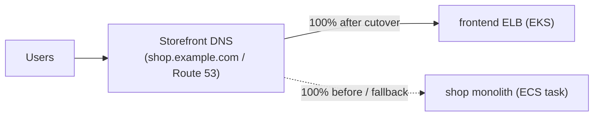

# Step 5 — Frontend & Strangler Cutover

The `frontend` is the storefront and the new front door — the only service exposed outside the
cluster. Deploy it, get its public ELB hostname, verify it serves the same shop the monolith
did, then perform the **strangler cutover**: point real traffic at EKS and retire the monolith.

---

## 5.1 Deploy the Frontend

```bash
kubectl apply -f k8s/03-frontend.yaml
kubectl -n shop rollout status deploy/frontend
```

The `frontend` Service is `type: LoadBalancer`, so EKS asks AWS for an **ELB**. Get its
hostname (it takes a minute to provision):

```bash
kubectl -n shop get svc frontend \
  -o jsonpath='{.status.loadBalancer.ingress[0].hostname}'; echo
```

Open `http://<that-hostname>/` — you should see the storefront, with the book list **fetched
live from the catalog service** (frontend → catalog DNS call). Place an order through it:

```bash
FE=http://<elb-hostname>
curl -s $FE/                                  # storefront HTML (calls catalog)
curl -s -X POST $FE/checkout -H 'content-type: application/json' \
  -d '{"book_id":"b1","qty":1}'              # frontend → orders → catalog
```

---

## 5.2 Verify Parity with the Monolith

The cutover is only safe if the new path behaves like the old one. Compare:

| Check | Monolith (`shop-monolith`) | EKS (`frontend` ELB) |
|-------|----------------------------|----------------------|
| Storefront lists 3 books | ✅ | ✅ (via catalog) |
| Order valid book | 201 | 201 (via orders→catalog) |
| Order bad book | 400 | 400 |

When the table matches, the microservices reproduce the monolith's contract.

---

## 5.3 The Strangler Cutover



How you flip traffic depends on your front door:

- **Route 53 / custom domain:** change the `shop.example.com` record from the monolith's
  endpoint to the `frontend` ELB hostname. Use a **weighted** record to shift 10% → 50% → 100%
  gradually and watch error rates between steps (gradual strangler).
- **No custom domain (lab):** the "cutover" is simply that you now hand users the **ELB
  hostname** instead of the monolith URL. Announce the new URL, confirm traffic arrives
  (`kubectl -n shop logs -l app=frontend`), and stop directing anyone to the monolith.

> **Why gradual beats big-bang:** if the EKS path has a problem you only discover under real
> load, a weighted cutover limits the blast radius to 10% of users and lets you roll the weight
> back instantly. That control is the entire reason to strangle rather than switch.

---

## Checkpoint

- [ ] `frontend` is `Available`; its ELB hostname resolves and serves the storefront
- [ ] The storefront lists books fetched live from `catalog`
- [ ] `POST /checkout` creates an order through `frontend → orders → catalog`
- [ ] Parity with the monolith confirmed
- [ ] Traffic is (or can be) pointed at the EKS frontend; monolith is now redundant

---

**Next:** [Step 6 — Scaling & Resilience](./06-scale-and-resilience.md)
