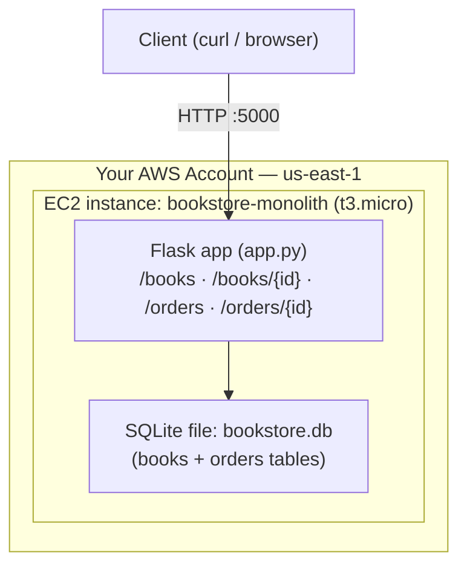
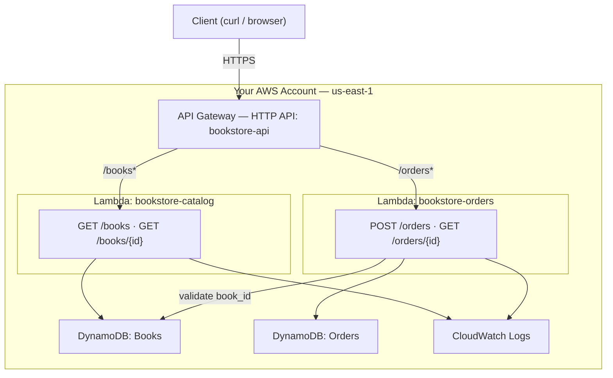
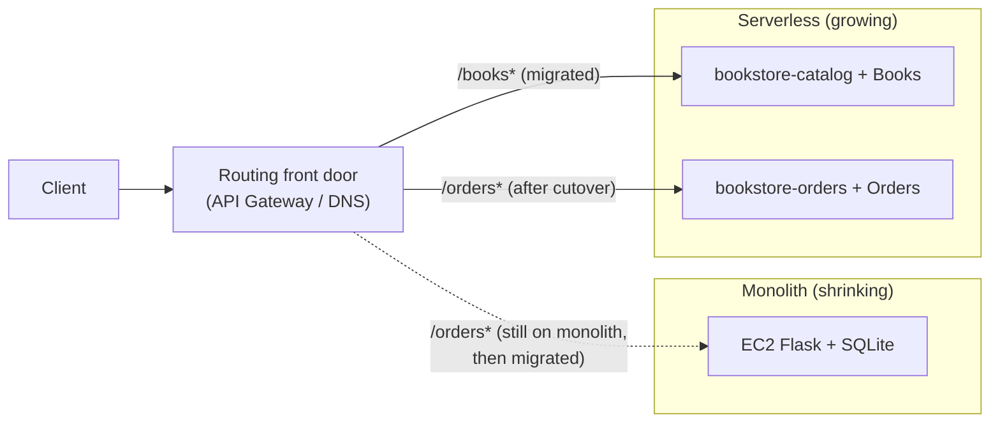

# Monolith → Serverless Migration (EC2 Flask → API Gateway + Lambda + DynamoDB)

## What You'll Build

You start with a **bookstore monolith**: one Flask app on a single **EC2** instance, talking
to a local **SQLite** file. It serves the whole product — catalog *and* orders — from one
process. Then you migrate it, **one route at a time**, to a **serverless** architecture:
**API Gateway (HTTP API)** in front of two domain **Lambda** functions
(`bookstore-catalog`, `bookstore-orders`) backed by **DynamoDB** tables (`Books`, `Orders`).

You won't do a risky big-bang rewrite. You'll apply the **Strangler Fig pattern**: stand the
serverless slices up *beside* the monolith, move traffic route-by-route, and only switch off
the EC2 box once nothing depends on it.

By the end you will understand:

- What "monolith" actually costs you (one deploy unit, one scaling knob, one blast radius)
- How to carve a monolith along **domain boundaries** (catalog vs orders)
- How API Gateway + Lambda + DynamoDB replaces "EC2 + Flask + SQLite" piece by piece
- The **Strangler Fig** migration pattern and how to execute it with zero big-bang cutover
- Which **6 R's** migration strategy this is and *why*

> **Intermediate.** Helpful first: [lambda-basics](../lambda-basics/README.md),
> [api-gateway-http-dynamodb-crud](../api-gateway-http-dynamodb-crud/README.md), and
> [ec2-vpc-monitored-webapp](../ec2-vpc-monitored-webapp/README.md). This project assumes you
> can create a Lambda and a DynamoDB table; it focuses on the *migration*, not the basics.

---

## Architecture

### Before — the monolith (Step 1)



**Read it:** *Everything* is in one box. Catalog reads and order writes share a process, a
deploy, a CPU, and a database file. If orders traffic spikes, catalog slows too. If the box
dies, the whole store is offline and the SQLite data is at risk.

### After — strangled into serverless (Steps 5–7)



**Read it:** The HTTP API is the new front door. Each **domain** is now its own function with
its own table, its own IAM role, its own scaling, its own deploy. Catalog can be hammered
without touching orders. There are no servers to patch and an idle store costs ~$0.

### The migration itself — Strangler Fig (Step 6)



**Read it:** A routing layer points each path at *either* the old monolith or the new
serverless slice. You migrate `/books*` first, watch it, then migrate `/orders*`. The
monolith shrinks until it serves nothing — then you delete it. No moment where "the whole app
is rewritten and we flip the switch and pray."

---

## Why the serverless architecture is better here

| Dimension | Monolith on EC2 | Serverless (API GW + Lambda + DynamoDB) |
|-----------|-----------------|------------------------------------------|
| **Scaling** | Scale the whole box even if only orders is hot | Each function scales **independently**, per-request |
| **Cost at idle** | Pay for the instance 24/7 | **~$0** — pay per request only |
| **Blast radius** | One bug/crash takes down catalog *and* orders | A bad deploy hits **one** function only |
| **Deploys** | Redeploy the whole app | Deploy one function without touching the other |
| **Ops burden** | Patch OS, manage the server, back up SQLite | No servers; DynamoDB is managed + durable |
| **Durability** | SQLite on one disk = single point of loss | DynamoDB replicates across AZs automatically |
| **Least privilege** | One process can touch everything | Each function's role is scoped to **its** table |

This isn't "serverless is always better" — it's that *this* workload (spiky, read-heavy
catalog + independent orders, small team, cost-sensitive) is a textbook fit for it. The
[concepts notes](../concepts/concepts.md) on scalability, cost optimization, and blast radius
are exactly what you're optimizing.

---

## What type of migration is this?

In AWS's **6 R's** framework (Rehost, Replatform, Repurchase, **Refactor/Re-architect**,
Retire, Retain), this is a **Refactor / Re-architect**:

- You are **changing the architecture**, not just moving the same app to new infrastructure.
  A lift-and-shift (Rehost) would copy the Flask app onto a bigger EC2. A Replatform would
  swap SQLite for RDS but keep the monolith. Here you **decompose** the app into functions
  and swap the runtime model entirely — that's Refactor.
- Trigger: you want **cloud-native** benefits (independent scaling, per-request cost, managed
  data) that the monolith's shape can't deliver.

> Compare with **Project 3 (DMS)**, which is a **Replatform** — same MySQL, new managed home —
> and **Project 2 (EKS)**, which is also a **Refactor** but toward containers/Kubernetes.

---

## Principles applied

| Principle | Where you see it in this project |
|-----------|----------------------------------|
| **Strangler Fig pattern** | Route-by-route cutover (Step 6); monolith shrinks, never a big-bang |
| **Single Responsibility / bounded contexts** | Catalog and Orders become separate functions + tables |
| **Database-per-service** | `Books` and `Orders` are separate DynamoDB tables, each owned by one function |
| **Least privilege** | Each function's IAM role is scoped to only the table(s) it needs |
| **Stateless compute** | Lambdas hold no state; all state lives in DynamoDB |
| **Twelve-Factor (config in env)** | Table names / version via environment variables |
| **Backward compatibility during migration** | Old and new serve the *same* contract so the front door can switch safely |

---

## Application

`src/monolith/app.py` is the **before** — run it on EC2 (or your laptop). `src/catalog/` and
`src/orders/` are the **after** — two Lambda handlers. Validate the serverless logic locally,
no AWS needed (DynamoDB is faked in the test):

```bash
cd src
python3 test_handlers.py      # 7 checks, no pytest required
```

---

## Project Structure

```
monolith-to-serverless-migration/
├── README.md                          ← You are here
├── src/
│   ├── monolith/app.py                ← the "before": Flask + SQLite monolith
│   ├── catalog/handler.py             ← the "after": bookstore-catalog Lambda
│   ├── orders/handler.py              ← the "after": bookstore-orders Lambda
│   └── test_handlers.py               ← local validation (fake DynamoDB)
├── steps/
│   ├── 01-run-the-monolith.md         ← Deploy the monolith on EC2; feel its limits
│   ├── 02-dynamodb-tables.md          ← Create Books + Orders tables; migrate the data
│   ├── 03-iam-roles.md                ← Per-function least-privilege roles
│   ├── 04-catalog-lambda.md           ← Build + test bookstore-catalog
│   ├── 05-orders-lambda.md            ← Build + test bookstore-orders
│   ├── 06-http-api-strangler.md       ← HTTP API front door; cut over route-by-route
│   ├── 07-decommission-monolith.md    ← Verify, then retire the EC2 box
│   └── 08-cleanup.md                  ← Tear everything down
├── costs.md
├── troubleshooting.md
└── challenges.md
```

---

## Prerequisites

| Requirement | Details |
|-------------|---------|
| AWS account | Console + CLI for EC2, Lambda, API Gateway, DynamoDB, IAM, CloudWatch |
| AWS CLI | `aws --version` → 2.x, configured for **us-east-1** |
| Python 3.12+ | To run `test_handlers.py` and the monolith locally |
| Key pair / SSH or SSM | To reach the EC2 monolith in Step 1 |
| Region | All steps use **us-east-1** |

---

## What You'll Learn Step by Step

| Step | File | Goal |
|------|------|------|
| 1 | `01-run-the-monolith.md` | Stand up the Flask monolith on EC2 and name its limits |
| 2 | `02-dynamodb-tables.md` | Create `Books`/`Orders`; export the SQLite data into them |
| 3 | `03-iam-roles.md` | One least-privilege execution role per function |
| 4 | `04-catalog-lambda.md` | `bookstore-catalog` for `GET /books*` |
| 5 | `05-orders-lambda.md` | `bookstore-orders` for `POST /orders`, `GET /orders/{id}` |
| 6 | `06-http-api-strangler.md` | HTTP API front door; migrate `/books*` then `/orders*` |
| 7 | `07-decommission-monolith.md` | Confirm nothing uses EC2, then stop/terminate it |
| 8 | `08-cleanup.md` | Delete API, functions, tables, roles, EC2, logs |

Start with **Step 1 →** [`steps/01-run-the-monolith.md`](steps/01-run-the-monolith.md)

---

## Estimated Time

3 – 4 hours. The monolith + data migration (1–2) is ~1 hour; the serverless build and
strangler cutover (3–7) are the rest.

## Estimated Cost

| Service | Configuration | Cost | Notes |
|---------|--------------|------|-------|
| **EC2** | 1× `t3.micro`, a few hours | **~$0.01–0.10** | Free tier covers 750 hrs/mo for 12 mo; **terminate in Step 7/8** |
| **Lambda** | Hundreds of short invokes | **~$0 (free tier)** | 1M requests + 400k GB-s/mo always free |
| **API Gateway (HTTP)** | A few hundred requests | **~$0 (free tier)** | $1.00 / M after the free 1M/mo (12 mo) |
| **DynamoDB (on-demand)** | A few hundred reads/writes | **~$0 (free tier)** | Idle table has no hourly charge |
| **CloudWatch** | Function logs | **~$0** | Within free tier at workshop scale |

**Typical session cost: well under $0.25**, almost all from the EC2 hours. The only thing
that bills while idle is the **EC2 instance** — that's the whole point, and why Step 7 retires
it. See **[costs.md](costs.md)**.

---

## What's Next

- Add a third slice (`bookstore-reviews`) and strangle it the same way
- Put the front door behind a **custom domain** + Route 53 weighted records for the cutover
- Add a **DynamoDB Stream** on `Orders` to fan out fulfilment events (true event-driven)
- Re-do the whole thing in **AWS SAM** so the serverless half is one `sam deploy`
