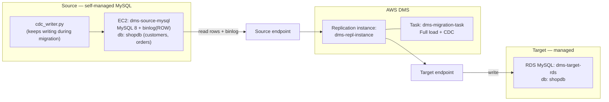
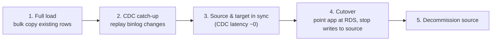

# Database Migration with AWS DMS (Self-Managed MySQL → Amazon RDS)

```yaml
level: advanced
cloud: aws
domain: migration
technology:
  - dms
  - rds
  - ec2
  - vpc
  - iam
estimated_time: 3 hours
estimated_cost: hourly
deployment_type: console + cli
cleanup_required: true
status: ready
```

## What You'll Build

You migrate a live **MySQL** database from a **self-managed server** (MySQL on an EC2 instance,
standing in for an on-prem or EC2-hosted DB) to **Amazon RDS for MySQL** — with **near-zero
downtime** — using the **AWS Database Migration Service (DMS)**.

The trick that makes it near-zero-downtime is **full load + CDC**: DMS first bulk-copies the
existing rows (full load), then **keeps replaying changes** from the source's binary log
(Change Data Capture) so the source can stay *open for business* the entire time. You only take
a brief cutover once the target has caught up.

By the end you will understand:

- The DMS building blocks: **replication instance**, **endpoints**, **migration task**
- **Full load** vs **CDC** vs **full load + CDC**, and when to use each
- Why the source needs **binary logging (ROW format)** for CDC to work
- How to **validate** the migration (row counts, checksums, DMS data validation)
- How to **cut over** safely and what **RPO/RTO** mean in practice
- Which **6 R's** strategy this is (**Replatform**) and which principles apply

> **Intermediate.** Helpful first: [rds-disaster-recovery](../aws-rds-disaster-recovery/README.md)
> (RDS, PyMySQL, RPO/RTO) and [ec2-vpc-monitored-webapp](../aws-ec2-vpc-monitored-webapp/README.md)
> (VPC, security groups). This project has **real cost** (two DBs + a replication instance run
> concurrently) — finish in one sitting and clean up.

---

## Architecture



**Read it:** DMS sits in the middle. The **source endpoint** tells it how to read from the
self-managed MySQL (including its binlog for CDC); the **target endpoint** tells it how to write
to RDS. The **replication instance** is the compute that runs the **task**. The task does a
**full load** of existing rows, then switches to **CDC**, streaming every new change (like the
orders `cdc_writer.py` keeps inserting) into RDS until you cut over.

### The migration timeline



---

## Why migrating to RDS is beneficial

| Dimension | Self-managed MySQL on EC2 | Amazon RDS for MySQL |
|-----------|----------------------------|----------------------|
| **Patching / upgrades** | You do it, on your maintenance window | Managed, one-click / scheduled |
| **Backups** | You script `mysqldump` + storage | Automated backups + PITR built in |
| **High availability** | You build replication yourself | **Multi-AZ** failover option, managed |
| **Monitoring** | You install agents | CloudWatch + Performance Insights built in |
| **Scaling storage** | Resize disks manually | Storage autoscaling |
| **Read scaling** | Build replicas by hand | Managed **read replicas** |
| **Ops burden** | High (DBA owns the box) | Low (AWS owns the box; you own the data) |

You keep the **same engine** (MySQL) and **same data/schema** — you just stop running the
database server yourself. That's the appeal: less undifferentiated heavy lifting, more managed
durability and HA. See the [concepts notes](../../../../docs/basic-concepts-draft/concepts.md) on high availability and
operational excellence.

---

## What type of migration is this?

In AWS's **6 R's**, this is a **Replatform** ("lift, tinker, and shift"):

- You **move** the workload to a managed platform (RDS) and make a *small* optimizing change
  (hand the server management to AWS) — but you **don't re-architect** the data model or the
  app's data access. Same MySQL, same schema, same queries.
- It's also a **homogeneous** migration: source engine (MySQL) = target engine (MySQL), so **no
  schema conversion** is needed. (A **heterogeneous** migration — e.g. MySQL → PostgreSQL or
  Oracle → Aurora — would also need the **AWS Schema Conversion Tool (SCT)**; that's
  [Challenge 5](challenges.md).)

> Contrast with the two **Refactor** projects:
> [serverless](../aws-monolith-to-serverless-migration/README.md) and
> [microservices](../../kubernetes/eks-monolith-to-microservices/README.md). Those change the architecture;
> this one changes the *operating model* of the same database.

---

## Principles applied

| Principle | Where you see it |
|-----------|------------------|
| **Minimal-downtime migration (full load + CDC)** | Source stays live; CDC streams changes until cutover (Steps 5–6) |
| **Change Data Capture** | Source binlog (ROW format) replayed into the target |
| **Pre-migration validation** | Test both endpoint connections before running the task (Step 4) |
| **Data parity / RPO** | Row counts + checksums + DMS data validation prove no data loss (Step 6) |
| **Reversible cutover** | Keep the source intact until the target is verified; cut over, then retire |
| **Least privilege / network isolation** | DMS reaches each DB only via scoped security groups |
| **Idempotent re-runnable seed** | `INSERT IGNORE` seed so re-running doesn't duplicate |

---

## Application (helper scripts)

These Python helpers (PyMySQL) give you data to migrate and proof that it migrated:

| Script | Run against | Purpose |
|--------|-------------|---------|
| `src/db_seed.py` | **source** | Create `shopdb` + seed customers/orders; print the RPO marker counts |
| `src/cdc_writer.py` | **source** | Keep inserting orders during migration to demonstrate CDC |
| `src/db_verify.py` | **source & target** | Row counts + `CHECKSUM TABLE` to prove parity |

```bash
pip install -r src/requirements.txt
```

> These are *helpers*, not an automation framework — the migration itself you drive by hand
> through the DMS console/CLI so you learn each moving part.

---

## Project Structure

```
database-migration-dms/
├── README.md                          ← You are here
├── src/
│   ├── db_seed.py                     ← seed the source MySQL
│   ├── cdc_writer.py                  ← live writes during migration (CDC demo)
│   ├── db_verify.py                   ← parity check (source vs target)
│   └── requirements.txt
├── steps/
│   ├── 01-source-mysql.md            ← EC2 MySQL + binlog(ROW) + user + seed
│   ├── 02-target-rds.md              ← create the empty RDS MySQL target
│   ├── 03-replication-instance.md    ← DMS subnet group + replication instance
│   ├── 04-endpoints.md               ← source/target endpoints + test connections
│   ├── 05-migration-task.md          ← full load + CDC task; start + monitor
│   ├── 06-validate-and-cutover.md    ← validation, CDC catch-up, cutover
│   └── 07-cleanup.md                 ← tear down (two-region/two-DB cost warning)
├── costs.md
├── troubleshooting.md
└── challenges.md
```

---

## Prerequisites

| Requirement | Details |
|-------------|---------|
| AWS account | DMS, RDS, EC2, VPC, IAM, CloudWatch |
| AWS CLI | 2.x, configured for **us-east-1** |
| Python 3.12+ + PyMySQL | Run the seed/verify/CDC scripts |
| A VPC with ≥2 subnets | DMS subnet group + RDS need multi-AZ subnets (default VPC is fine) |
| Region | **us-east-1** |
| Recommended first | [rds-disaster-recovery](../aws-rds-disaster-recovery/README.md) |

---

## What You'll Learn Step by Step

| Step | File | Goal |
|------|------|------|
| 1 | `01-source-mysql.md` | Stand up self-managed MySQL on EC2, enable binlog, seed `shopdb` |
| 2 | `02-target-rds.md` | Create the empty RDS MySQL target |
| 3 | `03-replication-instance.md` | DMS subnet group + replication instance |
| 4 | `04-endpoints.md` | Source + target endpoints; **test connections** (the #1 gotcha) |
| 5 | `05-migration-task.md` | Create + start a **full load + CDC** task; watch full load then CDC |
| 6 | `06-validate-and-cutover.md` | Prove parity, run CDC writes, cut over to RDS |
| 7 | `07-cleanup.md` | Delete task, endpoints, replication instance, RDS, EC2 |

Start with **Step 1 →** [`steps/01-source-mysql.md`](steps/01-source-mysql.md)

---

## Estimated Time

3 – 4 hours. The replication instance and RDS each take ~10 min to provision; the task's full
load is seconds at this data size, and you'll spend the rest watching CDC and validating.

## Estimated Cost ⚠️ (this one bills while running)

| Service | Configuration | Cost |
|---------|--------------|------|
| **EC2** (source MySQL) | 1× `t3.micro` | ~$0.01/hr (free-tier eligible) |
| **RDS MySQL** (target) | `db.t3.micro`, single-AZ | ~$0.017/hr (free-tier eligible 12 mo) |
| **DMS replication instance** | `dms.t3.micro` | ~$0.018/hr — **no free tier** |
| **Storage / IO / CloudWatch** | small | ~$0 at lab scale |

**Three things run at once** (source EC2 + target RDS + replication instance), so the meter
runs ~**$0.05/hr** combined. An afternoon ≈ **$0.20–0.50**. The **replication instance has no
free tier** — delete it as soon as cutover is verified. See **[costs.md](costs.md)**.

---

## What's Next

- Turn on **DMS data validation** and read the validation report (Step 6 / Challenge 1)
- Migrate **MySQL → PostgreSQL** with the **Schema Conversion Tool** (heterogeneous, Challenge 5)
- Make the target **Multi-AZ** and practice a managed failover
- Drive the whole task with **Boto3** instead of the console (Challenge 4)
