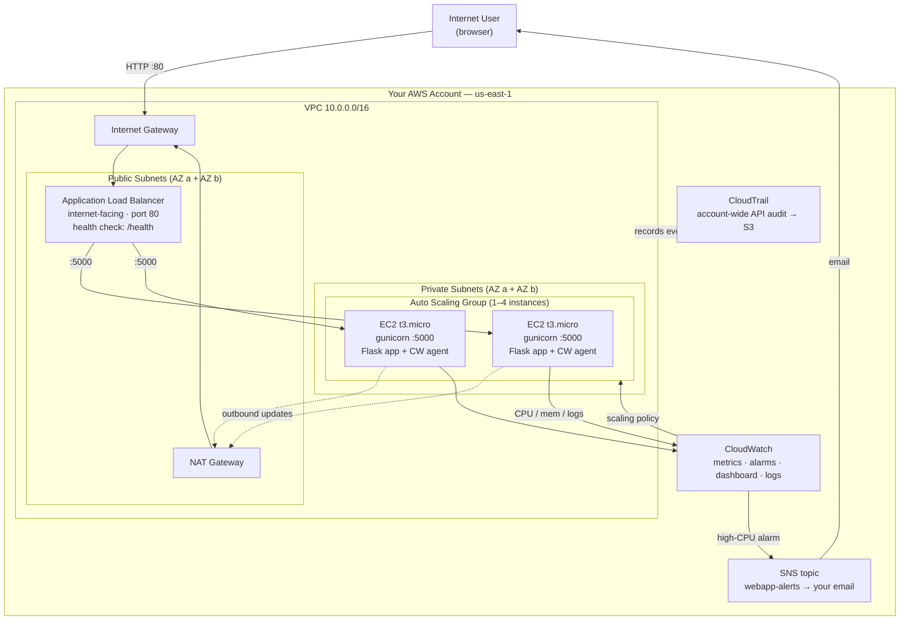

# EC2 + VPC Monitored Web App — A Full Cloud Network on Native AWS

```yaml
level: advanced
cloud: aws
domain: compute
technology:
  - ec2
  - vpc
  - alb
  - auto-scaling
  - cloudwatch
  - sns
  - cloudtrail
  - iam
  - ssm
  - github-actions
estimated_time: 3-4 hours
estimated_cost: hourly
deployment_type: console + cli
cleanup_required: true
status: ready
```

## What You'll Build

You will deploy a simple Python **Flask** web app onto **Amazon EC2** instances inside
a **custom VPC**, put an **Application Load Balancer (ALB)** in front of them, scale
them with an **Auto Scaling Group (ASG)**, and wrap the whole thing in **observability**:
**CloudWatch** metrics/alarms/dashboards, **SNS** email alerts, and a **CloudTrail**
audit trail of every API call in the account. Finally you'll wire up a **GitHub Actions**
workflow that deploys new code with zero SSH.

This is the "native AWS" half of a pair. The companion project,
[serverless-monitored-webapp](../../../intermediate/aws/aws-serverless-monitored-webapp/README.md), runs the **same
application** with **API Gateway + Lambda** so you can compare the two architectures
service-for-service.

By the end you will understand:

- How to design a VPC with public **and** private subnets, an Internet Gateway, and a NAT Gateway
- Why the web tier lives in private subnets while only the ALB is internet-facing
- How to bootstrap an instance automatically with a **user-data** script and run the app as a `systemd` service
- How an **Auto Scaling Group** keeps N healthy instances and replaces failures
- How the **ALB** health-checks instances and load-balances traffic across AZs
- How to collect CPU (built-in) and **memory/disk** (CloudWatch agent) metrics
- How to alarm on high CPU and get an **SNS email** — and trigger scaling from the same signal
- How **CloudTrail** records who did what, when, and from where
- How to automate the entire monitoring stack with **Boto3**
- How to ship code with a **GitHub Actions → OIDC → SSM** pipeline (no keys, no SSH) — where **OIDC (OpenID Connect)** lets GitHub authenticate to AWS with short-lived tokens instead of stored keys

---

## Architecture



The user only ever reaches the **ALB** in the public subnets. The EC2 instances sit in
**private subnets** with no public IP — they reach the internet (for package/code
updates) outbound-only through the **NAT Gateway**. Every instance streams metrics and
logs to **CloudWatch**; a high-CPU alarm both **emails you via SNS** and tells the **ASG**
to scale out. **CloudTrail** quietly records every AWS API call for audit.

---

## Services Used

| Service | Role in This Project | Why It's Needed |
|---------|---------------------|-----------------|
| **Amazon VPC** | Custom network: 2 public + 2 private subnets, IGW, NAT | Isolates the app; lets only the ALB face the internet |
| **Amazon EC2** | Runs the Flask app via gunicorn + systemd | The compute tier you manage |
| **Auto Scaling Group** | Keeps 1–4 healthy instances, replaces failures | Resilience + elasticity |
| **Application Load Balancer** | Distributes traffic, health-checks `/health` | Single DNS endpoint, multi-AZ HA |
| **Amazon CloudWatch** | Metrics, alarms, dashboard, log groups | The observability backbone |
| **CloudWatch Agent** | Memory + disk metrics, app log shipping | EC2 doesn't report memory by default |
| **Amazon SNS** | Email alerts when alarms fire | Humans need to be told something broke |
| **AWS CloudTrail** | Account-wide API audit trail to S3 | Security/forensics: who changed what |
| **AWS IAM** | Instance profile + GitHub OIDC deploy role | Least-privilege everywhere |
| **AWS Systems Manager (SSM)** | Run Command deploys, no-SSH access | Push code without opening port 22 |
| **GitHub Actions** | CI/CD pipeline to deploy on push | Repeatable, auditable deployments |

---

## Application

A tiny Flask app (`src/app.py`) with four endpoints — identical to the serverless version:

| Endpoint | Purpose |
|----------|---------|
| `GET /` | Service metadata (name, instance id, version, region) |
| `GET /health` | Health check the **ALB** polls; returns uptime |
| `GET /api/info` | Python version, platform, instance id |
| `GET /api/load?seconds=N` | Burns CPU for N seconds (0–10) to **deliberately trip the CPU alarm** |

> `/api/load` is the star of the monitoring demo: hit it a few times in parallel and
> watch the CloudWatch alarm fire, the SNS email land, and the ASG scale out.

Validate it on your laptop before you ever touch AWS:

```bash
cd src
pip install -r requirements.txt
python test_app.py      # 5 quick checks, no pytest required
python app.py           # then open http://localhost:5000/
```

---

## Project Structure

```
ec2-vpc-monitored-webapp/
├── README.md                          ← You are here
├── src/
│   ├── app.py                         ← Flask app (4 endpoints)
│   ├── requirements.txt               ← flask + gunicorn
│   └── test_app.py                    ← local validation (run before deploying)
├── scripts/
│   ├── user-data.sh                   ← EC2 first-boot bootstrap (automation)
│   ├── cloudwatch-agent-config.json   ← memory/disk metrics + log shipping
│   └── setup_monitoring.py            ← Boto3: SNS topic, CPU alarm, dashboard
├── .github/workflows/
│   └── deploy.yml                     ← Sample CI/CD pipeline (copy to your app repo)
├── steps/
│   ├── 01-vpc-networking.md           ← VPC, subnets, IGW, NAT, route tables
│   ├── 02-security-groups.md          ← alb-sg and ec2-sg (least privilege)
│   ├── 03-iam-roles.md                ← Instance profile + GitHub OIDC role (trust relationship dissected)
│   ├── 04-launch-ec2.md              ← Launch template + user-data bootstrap
│   ├── 05-application-load-balancer.md← ALB, target group, listener, health check
│   ├── 06-auto-scaling-group.md       ← ASG across 2 AZs + scaling policy
│   ├── 07-cloudwatch-monitoring.md    ← Agent, metrics, alarm, dashboard
│   ├── 08-sns-alerts.md               ← SNS topic + email + alarm wiring
│   ├── 09-cloudtrail-audit.md         ← Account trail to S3, read the events
│   ├── 10-github-actions-deploy.md    ← OIDC role + SSM deploy pipeline
│   └── 11-cleanup.md                  ← Tear down in dependency order
├── costs.md                           ← Service-by-service cost breakdown
├── troubleshooting.md                 ← Error → Cause → Fix
└── challenges.md                      ← 7 extension challenges
```

---

## Prerequisites

| Requirement | Details |
|-------------|---------|
| AWS account | Console + CLI access with EC2, VPC, ELB, IAM, CloudWatch, SNS, CloudTrail permissions |
| AWS CLI | `aws --version` → 2.x, configured for **us-east-1** |
| Python 3.12+ | To run the app and `test_app.py` locally |
| (Optional) GitHub repo | To try the CI/CD pipeline in Step 10 |
| Region | All steps use **us-east-1** |

---

## What You'll Learn Step by Step

| Step | File | Goal |
|------|------|------|
| 1 | `01-vpc-networking.md` | VPC, 2 public + 2 private subnets, IGW, NAT, route tables |
| 2 | `02-security-groups.md` | `alb-sg` (80 from world) and `ec2-sg` (5000 from ALB only) |
| 3 | `03-iam-roles.md` | EC2 instance profile **and** GitHub OIDC deploy role — with the OIDC trust relationship explained field by field |
| 4 | `04-launch-ec2.md` | Launch template with user-data; verify the app boots |
| 5 | `05-application-load-balancer.md` | ALB + target group + `/health` check |
| 6 | `06-auto-scaling-group.md` | ASG 1–4 instances across both AZs + target-tracking policy |
| 7 | `07-cloudwatch-monitoring.md` | CloudWatch agent, high-CPU alarm, dashboard (Console + Boto3) |
| 8 | `08-sns-alerts.md` | SNS topic, email subscription, wire alarm → email |
| 9 | `09-cloudtrail-audit.md` | Account-wide trail to S3; query who launched the instances |
| 10 | `10-github-actions-deploy.md` | GitHub OIDC role + SSM Run Command deploy pipeline |
| 11 | `11-cleanup.md` | Delete everything in the right order |

Start with **Step 1 →** [`steps/01-vpc-networking.md`](steps/01-vpc-networking.md)

---

## Estimated Time

3 – 4 hours for a first-time learner.

## Estimated Cost

| Service | Configuration | Cost per Hour | Notes |
|---------|--------------|---------------|-------|
| **EC2** | 2 × t3.micro | **~$0.021/hr** | Free tier: 750 hrs/mo of t2/t3.micro for 12 months |
| **NAT Gateway** | 1 NAT | **~$0.045/hr** | ⚠️ The biggest cost — plus data processing |
| **Application Load Balancer** | 1 ALB | **~$0.0225/hr** | Fixed charge even at zero traffic |
| **CloudWatch** | Custom metrics + alarms + dashboard | **~$0.01/hr** | First 10 metrics/alarms + 3 dashboards free |
| **SNS** | Email notifications | **Free** | First 1,000 email notifications/month free |
| **CloudTrail** | First management-events trail | **Free** | One trail of management events is free |
| **VPC, IAM, ASG, SSM** | Control plane | **Free** | No charge |

**Typical session cost (4 hours): ~$0.40**
**If left running 24 hours: ~$2.30** ⚠️

> ⚠️ The **NAT Gateway (~$32/month)** and **ALB (~$16/month)** are the costs that bite if
> you forget them. Always finish with [Step 11 — Cleanup](steps/11-cleanup.md). For a
> full breakdown and a cheaper "no NAT" variant, see **[costs.md](costs.md)**.

---

## What's Next

- Run the **[serverless companion](../../../intermediate/aws/aws-serverless-monitored-webapp/README.md)** and compare cost, ops burden, and scaling behaviour
- Add **HTTPS** to the ALB with an ACM certificate
- Add an **RDS** database in the private subnets
- Turn the manual steps into **Terraform** or **CloudFormation**
