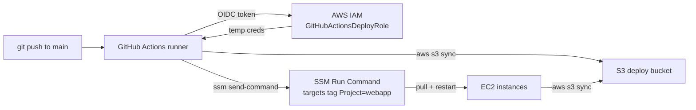

# Step 10 — Deploy with GitHub Actions (OIDC + SSM)

The final piece is **automation of deployment**. Instead of SSHing into servers, a GitHub
Actions workflow assumes an AWS role via **OIDC** (no stored keys), validates the app, and
rolls the new code out to every instance with **SSM Run Command** (no open SSH port).

The sample workflow is `.github/workflows/deploy.yml`. This step creates the AWS side it
needs.

---

## 10.1 The Pipeline at a Glance



No long-lived `AWS_ACCESS_KEY_ID` lives in GitHub. The runner gets **short-lived**
credentials by proving its identity to AWS with an OIDC token — exactly the federation
pattern from the [iam-roles-and-policies](../../../../intermediate/aws/aws-iam-roles-and-policies/README.md) project.

---

## 10.2 The OIDC Provider and Deploy Role (already created in Step 3)

You created both the **GitHub OIDC identity provider** and the
**`GitHubActionsDeployRole`** (with its trust relationship dissected field by field) back
in [Step 3 — IAM](./03-iam-roles.md#34-role-2--the-github-oidc-deploy-role). If you skipped
those sections, do them now — the workflow can't authenticate without them.

Quick recap of the trust relationship you built:

- **Principal** = the OIDC provider `token.actions.githubusercontent.com`
- **Action** = `sts:AssumeRoleWithWebIdentity`
- **Condition** pins `aud` = `sts.amazonaws.com` (`StringEquals`) **and** `sub` =
  `repo:ORG/REPO:ref:refs/heads/main` (`StringLike`) — the latter is what stops any other
  repo from assuming the role.

---

## 10.3 Attach the Deploy Role's Permission Policy

Trust says *who*; now grant *what*. Attach a **least-privilege** permission policy to
`GitHubActionsDeployRole` — only what the deploy needs:

| Permission | Why It's Needed |
|------------|-----------------|
| `s3:PutObject`, `s3:ListBucket` on the deploy bucket | Upload the new app artifact |
| `ssm:SendCommand` | Trigger the rollout on the instances |
| `ssm:GetCommandInvocation`, `ssm:ListCommandInvocations` | Poll the deploy result |

```bash
# Scope every Resource to the specific bucket/document — never "*". Full JSON: challenges.md.
aws iam put-role-policy --role-name GitHubActionsDeployRole \
  --policy-name webapp-deploy --policy-document file://deploy-permissions.json
```

> Also create the S3 deploy bucket (e.g. `webapp-deploy-<account-id>`) and grant the
> **instance role** (`WebAppInstanceRole`) `s3:GetObject` on it, so instances can pull the
> artifact during `aws s3 sync`.

---

## 10.4 Wire Up the Workflow

1. Copy `.github/workflows/deploy.yml` into the `.github/workflows/` folder of **your app
   repository** (not the cloud-projects repo — GitHub only runs workflows from a repo's own
   root).
2. Replace the placeholders:
   - `<ACCOUNT_ID>` → your account id (in the `role-to-assume` ARN)
   - `<DEPLOY_BUCKET>` → your S3 deploy bucket name
3. Commit and push to `main`. The **Actions** tab shows the run: it validates the app with
   `test_app.py`, syncs `src/` to S3, then SSM tells every `Project=webapp` instance to pull
   and `systemctl restart webapp.service`.

---

## 10.5 Verify the Deploy

1. Bump `APP_VERSION` in `src/app.py` (e.g. to `1.1.0`), commit, push.
2. Watch the Actions run go green.
3. `curl http://<ALB-DNS-name>/` — the `version` field now shows `1.1.0`.
4. Cross-check in **CloudTrail Event history** for the `SendCommand` event — the whole
   deploy is auditable back to the commit SHA.

---

## Checkpoint

- [ ] GitHub OIDC identity provider + `GitHubActionsDeployRole` exist (from Step 3)
- [ ] `GitHubActionsDeployRole` trusts only `repo:ORG/REPO` on `main`
- [ ] Role now has its least-privilege S3 + SSM **permission** policy attached
- [ ] S3 deploy bucket exists; instance role can `GetObject` from it
- [ ] A push to `main` deploys new code; `version` updates behind the ALB
- [ ] The deploy appears in CloudTrail

---

**Next:** [Step 11 — Cleanup](./11-cleanup.md)
