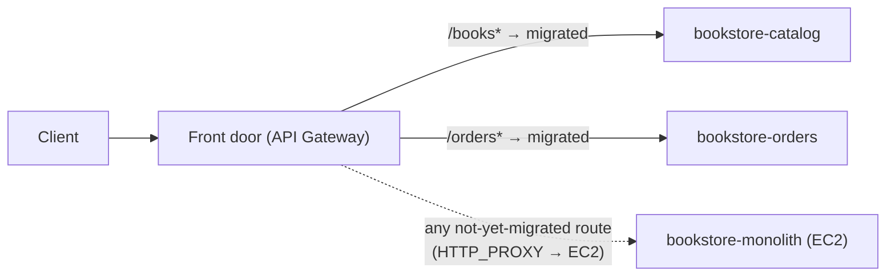

# Step 6 — HTTP API Front Door + Strangler Cutover

This is the heart of the migration. You'll put **one front door** in front of both worlds and
move traffic **route by route** from the monolith to the serverless slices — the **Strangler
Fig pattern**. Nobody flips a single switch that swaps the whole app; you migrate `/books*`
first, watch it, then `/orders*`, and the monolith quietly stops mattering.

---

## 6.1 The Strangler Fig idea

A strangler fig grows around a host tree, takes over its structure, and eventually the host
rots away leaving the fig standing. In software: build the new system **around** the old one,
redirect functionality piece by piece, and retire the old system only when it serves nothing.



The front door here is **API Gateway HTTP API**. For routes you've migrated, it integrates
with a **Lambda**. For routes still on the monolith, it can use an **HTTP_PROXY** integration
that forwards to the EC2 instance — so the *client* sees one stable URL the whole time.

---

## 6.2 Create the HTTP API

1. **API Gateway → Create API → HTTP API → Build.**
2. **API name:** `bookstore-api`. **Next** through to **Create** (no integrations yet).

### Add the migrated Lambda routes

3. **Develop → Routes → Create**, add:
   | Method | Path |
   |--------|------|
   | GET | `/books` |
   | GET | `/books/{id}` |
   | POST | `/orders` |
   | GET | `/orders/{id}` |
4. **Develop → Integrations**, attach:
   - `GET /books`, `GET /books/{id}` → **Lambda** → `bookstore-catalog`
   - `POST /orders`, `GET /orders/{id}` → **Lambda** → `bookstore-orders`
5. The console auto-adds invoke permission for each function. Note the **Invoke URL**
   (`https://<api-id>.execute-api.us-east-1.amazonaws.com`).

> **Why HTTP API (not REST)?** Cheaper ($1.00 vs $3.50 / M), lower latency, and the payload
> v2.0 shape your handlers already expect. The [HTTP-API CRUD project](../../../../intermediate/aws/aws-api-gateway-dynamodb-crud/README.md)
> covers it in depth.

### CLI alternative (one route shown; repeat per route)

```bash
API_ID=$(aws apigatewayv2 create-api --name bookstore-api \
  --protocol-type HTTP --query ApiId --output text)
ACCOUNT_ID=$(aws sts get-caller-identity --query Account --output text)

CAT_ARN=arn:aws:lambda:us-east-1:${ACCOUNT_ID}:function:bookstore-catalog
INT_ID=$(aws apigatewayv2 create-integration --api-id $API_ID \
  --integration-type AWS_PROXY --integration-uri $CAT_ARN \
  --payload-format-version 2.0 --query IntegrationId --output text)
aws apigatewayv2 create-route --api-id $API_ID \
  --route-key 'GET /books' --target "integrations/$INT_ID"

aws lambda add-permission --function-name bookstore-catalog \
  --statement-id apigw-books --action lambda:InvokeFunction \
  --principal apigateway.amazonaws.com \
  --source-arn "arn:aws:execute-api:us-east-1:${ACCOUNT_ID}:${API_ID}/*/*/books"
```

(HTTP APIs auto-deploy to the `$default` stage, so there's no separate deploy step.)

---

## 6.3 Cut over route-by-route (the migration)

Do this **deliberately**, one domain at a time, verifying between moves. That discipline is
the whole point — it's how you'd do it in production where a bad route means real lost orders.

**Vine 1 — migrate `/books*`:**

```bash
BASE=https://<api-id>.execute-api.us-east-1.amazonaws.com
curl $BASE/books          # served by bookstore-catalog now
```

Watch `bookstore-catalog`'s CloudWatch metrics (Invocations, Errors) for a few minutes. Happy?
`/books*` is migrated. The monolith still serves nothing-but-orders.

**Vine 2 — migrate `/orders*`:**

```bash
curl -X POST $BASE/orders -H 'content-type: application/json' \
  -d '{"book_id":"<real-id>","qty":1}'
curl $BASE/orders/<order-id>
```

Now both domains are served by serverless. The EC2 monolith is receiving **zero** traffic
through the front door.

> **Optional — keep the monolith reachable during the window:** add an `$default` catch-all
> route with an **HTTP_PROXY** integration pointing at `http://<ec2-ip>:5000/{proxy}`. Then any
> route you *haven't* migrated still works through the same URL, and you delete the catch-all
> once everything's moved. This is what makes a real, gradual strangler possible.

---

## 6.4 Verify parity

Run the same three requests against the **old** monolith URL and the **new** API URL and
confirm the responses match (same books, orders behave the same). Parity is your signal that
it's safe to retire the host tree.

| Check | Monolith `http://<ip>:5000` | API `https://<api-id>...` |
|-------|------------------------------|----------------------------|
| `GET /books` | 3 books | same 3 books |
| `POST /orders` (valid) | 201 + id | 201 + id |
| `POST /orders` (bad id) | 400 | 400 |

---

## Checkpoint

- [ ] `bookstore-api` routes all four endpoints to the right Lambda
- [ ] `/books*` and `/orders*` both work through the API URL
- [ ] Responses match the monolith's (parity confirmed)
- [ ] The monolith is receiving no traffic via the front door
- [ ] You can explain the strangler fig pattern in one sentence

---

**Next:** [Step 7 — Decommission the Monolith](./07-decommission-monolith.md)
