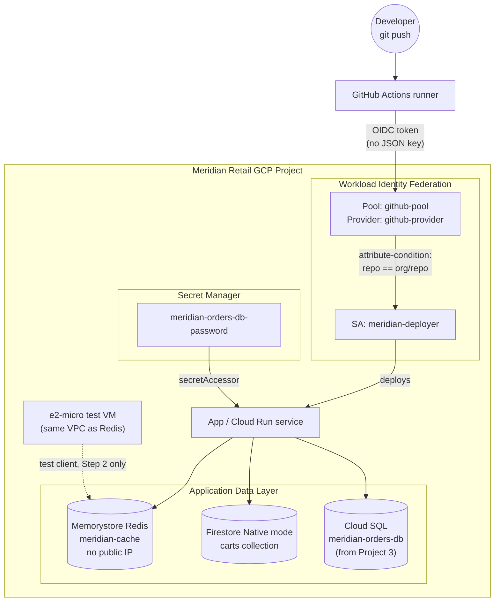

# GCP Databases & Workload Identity — Real-Time Cart Store, Cache, and Keyless CI/CD

```yaml
level: advanced
cloud: gcp
domain: databases
technology:
  - firestore
  - memorystore
  - workload-identity-federation
  - secret-manager
  - iam
estimated_time: 2-2.5 hours
estimated_cost: hourly
deployment_type: console + gcloud + github-actions
cleanup_required: true
status: ready
```

## What You'll Build

Meridian Retail's storefront now needs three things Cloud SQL was never meant to do well: a
**real-time shopping cart** that can take a write on every click, a **cache** in front of hot reads,
and a **deploy pipeline** that never touches a downloaded service-account key. You'll add all three,
and then step back and lock down *how the whole series has been getting its permissions* — moving the
Cloud SQL app password from Project 3 into **Secret Manager**, and standing up **Workload Identity
Federation** so GitHub Actions can deploy to this project without a single stored credential.

By the end you'll understand:

- Why a **document database** (Firestore) fits carts/sessions better than a relational table, and
  what "Native mode" commits you to permanently
- **Memorystore for Redis** as a cache-aside layer in front of a database — and why it has no public
  IP
- **Secret Manager** as the correct home for credentials that used to live in an env var
- **Workload Identity Federation (WIF)**: how GitHub Actions authenticates to GCP with **zero JSON
  keys**, and why this is the *same architecture* as the AWS OIDC deploy pattern used elsewhere in
  this repo
- **Service account impersonation** and the **org policy** guardrails that make key-based access
  structurally hard to reintroduce
- A **decision matrix** for Cloud SQL vs. Firestore vs. Bigtable vs. Spanner vs. Memorystore — so the
  next "which database?" call is a reasoned one, not a guess

This is the **4th and final project** in the GCP IAM, Storage & Databases series. **Builds on:**
[gcp-cloud-sql-managed-database](../../../intermediate/gcp/gcp-cloud-sql-managed-database/README.md)
(Project 3) — you'll pick up exactly where it left off, moving the `orders_app` password out of a
plain environment variable. If you haven't done Project 3, a placeholder password works fine; the
Secret Manager mechanics are identical either way.

This completes the GCP IAM, Storage & Databases series. If you haven't done the GCP **networking**
track yet, it's a good related track to pick up next:
[gcp-vpc-firewall-basics](../../../beginner/gcp/gcp-vpc-firewall-basics/README.md).

---

## Architecture



---

## Services Used

| Service | Role in this Project |
|---------|---------------------|
| **Firestore (Native mode)** | Document store for real-time `carts` — one document per cart |
| **Memorystore for Redis** | Cache-aside layer (`meridian-cache`) in front of the "database" |
| **Secret Manager** | Holds `meridian-orders-db-password`, replacing the Project 3 env var |
| **Workload Identity Federation** | Lets GitHub Actions assume a GCP identity with no downloaded key |
| **IAM** | Deploy service account (`meridian-deployer`), impersonation, org policy constraints |
| **Compute Engine** | One `e2-micro` VM used only as a Redis test client (no public IP reaches Memorystore) |

---

## Key Concepts

| Concept | What it means |
|---------|---------------|
| **Native mode vs. Datastore mode** | A **one-time, irreversible** per-project choice for Firestore; Native mode is the modern default and what this project uses |
| **Cache-aside** | App checks cache first; on a miss it reads the source of truth, then populates the cache with a TTL |
| **No public IP (Memorystore)** | Redis is only reachable from inside the VPC — there is no "connect from your laptop" for it |
| **Secret version** | Secret Manager stores **versions** of a secret's value; you grant access to "latest" or a pinned version |
| **Workload Identity Pool / Provider** | A trust relationship that lets an external identity (GitHub's OIDC token) map to a GCP identity — no key file involved |
| **Attribute condition** | The filter on a WIF provider that restricts *which* external tokens are trusted (e.g., only one repo) |
| **Service account impersonation** | Acting as a service account's identity temporarily via `iam.serviceAccounts.getAccessToken`, without ever holding its key |
| **Org policy constraint** | An organization-level guardrail (e.g., "no one may create SA keys") that structurally prevents a whole class of mistake |

---

## Project Structure

```
gcp-databases-workload-identity/
├── README.md                                    ← You are here
├── src/
│   ├── firestore_demo.py                        ← Create/read/query sample cart documents
│   ├── cache_demo.py                            ← Cache-aside demo against Memorystore
│   ├── workflow-example.yml                     ← Template GitHub Actions workflow using WIF
│   └── requirements.txt                         ← google-cloud-firestore, redis
├── steps/
│   ├── 01-firestore-setup-and-data-model.md      ← Native-mode Firestore; carts collection + demo script
│   ├── 02-memorystore-cache-aside.md             ← Smallest Redis instance; cache-aside pattern
│   ├── 03-secret-manager-for-db-credentials.md   ← Move the Project 3 password into Secret Manager
│   ├── 04-workload-identity-federation-cicd.md   ← WIF pool/provider/SA; keyless GitHub Actions deploy
│   ├── 05-impersonation-and-org-policy-guardrails.md ← Impersonation recap + org policy constraints
│   ├── 06-database-decision-matrix.md            ← Cloud SQL vs Firestore vs Bigtable vs Spanner vs Memorystore
│   └── 07-cleanup.md                             ← Tear down every resource this project created
├── costs.md
├── troubleshooting.md
└── challenges.md
```

---

## Prerequisites

| Requirement | Details |
|-------------|---------|
| gcloud CLI | Installed & authenticated — see [SETUP.md](../../../../SETUP.md) |
| A GCP project | With billing linked; Firestore, Memorystore, Secret Manager, IAM, and Compute Engine APIs enabled |
| Project 3 (recommended) | [gcp-cloud-sql-managed-database](../../../intermediate/gcp/gcp-cloud-sql-managed-database/README.md) — gives you the real `meridian-orders-db` password to migrate. A standalone placeholder password works too. |
| IAM permissions | `roles/owner`, or the narrower set: `roles/datastore.owner`, `roles/redis.admin`, `roles/secretmanager.admin`, `roles/iam.workloadIdentityPoolAdmin`, `roles/resourcemanager.projectIamAdmin` |
| A GitHub repository you control | Needed for the live WIF demo in Step 4. **Optional** — if you don't have one, Step 4 still walks through every `gcloud` command and explains the concept; you just won't trigger a real Actions run |
| Python | 3.12+, with `google-cloud-firestore` and `redis` installed (`pip install -r src/requirements.txt`) |
| Region | **`us-east1`** throughout (Firestore uses the `nam5` multi-region option — explained in Step 1) |

---

## What You'll Learn Step by Step

| Step | File | Goal |
|------|------|------|
| 1 | `01-firestore-setup-and-data-model.md` | Create Firestore (Native mode); model and write `carts` documents |
| 2 | `02-memorystore-cache-aside.md` | Stand up Memorystore Redis; implement cache-aside from a test VM |
| 3 | `03-secret-manager-for-db-credentials.md` | Move the Cloud SQL app password into Secret Manager |
| 4 | `04-workload-identity-federation-cicd.md` | Build WIF pool/provider/SA; deploy via GitHub Actions with no key |
| 5 | `05-impersonation-and-org-policy-guardrails.md` | Recap impersonation; apply org policy / IAM Condition guardrails |
| 6 | `06-database-decision-matrix.md` | Compare Cloud SQL, Firestore, Bigtable, Spanner, Memorystore |
| 7 | `07-cleanup.md` | Delete every resource this project created, in the right order |

Start with **Step 1 →** [`01-firestore-setup-and-data-model.md`](steps/01-firestore-setup-and-data-model.md)

---

## Estimated Time

2 – 2.5 hours, including the ~10-15 minutes Memorystore takes to provision and the setup for a GitHub
Actions test run in Step 4.

## Estimated Cost

| Resource | Configuration | Cost | Notes |
|----------|--------------|------|-------|
| **Firestore** | Native mode, this lab's read/write volume | **~$0** | Generous free tier (50K reads, 20K writes, 1 GiB storage/day) easily covers this project |
| **Memorystore for Redis** | Basic tier, 1 GB, `us-east1` | **~$0.049/hr (~$1.18/day)** | **No free tier — this is the one resource here that genuinely bills** |
| **`e2-micro` test VM** | 1 instance, ~30 min use | **~$0 – $0.01** | Free-tier eligible in many regions; delete promptly regardless |
| **Secret Manager** | 1 secret, a few versions/accesses | **~$0** | First 6 active secret versions/month are free |
| **Workload Identity Federation** | 1 pool, 1 provider | **$0** | WIF itself has no charge |
| **IAM (roles, SA, impersonation)** | | **$0** | Free |

> ⚠️ **Memorystore is the cost-critical resource in this project — it has no free tier and bills
> every hour it exists, idle or not.** Don't leave it running "to come back to later." **[Step 7 —
> Cleanup](steps/07-cleanup.md) is mandatory.**

For the full breakdown → see **[costs.md](costs.md)**.

---

## What's Next

- Try the **[challenges](challenges.md)** — Firestore Security Rules, Datastore mode comparison, TTL
  policies, a real (and quickly deleted) Bigtable and Spanner instance, extending the workflow to
  deploy Cloud Run, and applying an actual Organization Policy if you have org-level access.

This project's territory maps closely onto the **Associate Cloud Engineer**, **Professional Cloud
Architect**, and **Professional Cloud Security Engineer** certification domains — specifically
Workload Identity, IAM federation, and NoSQL database selection are exam-relevant topics you've now
built hands-on, not just read about.

This closes out the 4-project GCP IAM, Storage & Databases series. Across all four, Meridian Retail
went from IAM fundamentals and a document bucket (Project 1), to secured and lifecycle-managed
storage (Project 2), to a managed relational database (Project 3), to real-time NoSQL storage, a
cache, and a keyless CI/CD pipeline (this project) — the same progression a real application team
walks through as it matures.
