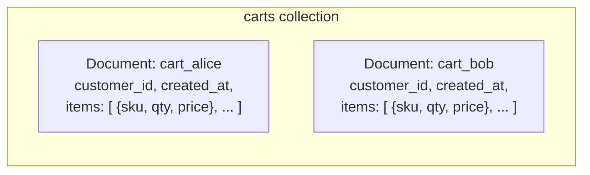

# Step 1 — Firestore Setup & Data Model

Meridian Retail's shopping cart needs to survive a page refresh, update the instant an item is added
or removed, and handle bursts of concurrent writes during a sale — none of which is what a relational
table on Cloud SQL is built for. **Firestore** is a fully-managed **document database**: no schema to
migrate, horizontal scale built in, and a data model that maps naturally onto "one cart, a list of
items." This step creates the database and gets a `carts` collection into it.

---

## 1.1 What Firestore Is, and the One Choice You Can't Undo

| How it works | Detail |
|---------------|--------|
| **Document** | A JSON-like record (fields + values, including nested objects/arrays) — like one row, but schema-free |
| **Collection** | A named group of documents — like a table, but every document can have different fields |
| **Subcollection** | A collection nested inside a specific document — useful when a document's children can grow unbounded |
| **Native mode** | The modern Firestore API: real-time listeners, strong consistency, mobile/web SDKs. **This project uses Native mode.** |
| **Datastore mode** | The older Datastore-compatible API — no real-time listeners, different consistency defaults. Kept for legacy App Engine apps. |

> ⚠️ **The Native-vs-Datastore mode choice is made once per GCP project, at the moment you create
> your first Firestore database, and it is permanent.** You cannot switch a project between modes
> later — the only way out is a new project. If your project already has a Datastore-mode database
> from unrelated experimentation, you cannot add a Native-mode database alongside it. Check first:
> ```bash
> gcloud firestore databases list
> ```
> If nothing exists yet, you're free to choose. This project always chooses **Native mode**.

---

## 1.2 The Cart Data Model



For this lab, cart items live as an **array field** directly on the cart document, not a
subcollection. A cart realistically has a handful of line items — reading the whole cart in one
document fetch (instead of a separate query per item) is simpler and cheaper. If a cart could grow to
hundreds of items, or items needed independent security rules, a subcollection would be the better
call — that trade-off is a good one to sit with.

| Field | Type | Example |
|-------|------|---------|
| `customer_id` | string | `"alice@meridianretail.example"` |
| `created_at` | timestamp | server-generated |
| `updated_at` | timestamp | server-generated, refreshed on every write |
| `items` | array of maps | `[{"sku": "SKU-1001", "qty": 2, "price": 19.99}]` |
| `status` | string | `"active"` / `"checked_out"` / `"abandoned"` |

---

## 1.3 Console — Create the Firestore Database

1. **☰ → Firestore → Create Database** (or **Select Native Mode** if prompted to pick a mode).
2. Fill in:

   | Field | Value |
   |-------|-------|
   | Mode | **Native mode** |
   | Database ID | `(default)` |
   | Location type | **Region** |
   | Region | `us-east1` (or `nam5` multi-region if you want built-in multi-region durability — see note below) |

3. Click **Create Database**.

> **Region vs. multi-region:** A single region (`us-east1`) keeps this consistent with every other
> project in this series and is cheaper. `nam5` (a multi-region covering the US) survives a whole
> region outage but costs more per operation and adds latency. Pick `us-east1` unless you specifically
> want to practice the multi-region option.

---

## 1.4 gcloud CLI (Alternative)

```bash
# One-time, permanent choice — creates the default Firestore database in Native mode
gcloud firestore databases create \
  --location=us-east1 \
  --type=firestore-native

# Confirm it landed in Native mode, not Datastore mode
gcloud firestore databases describe --database='(default)' \
  --format='value(name,type,locationId)'
```

Expected output ends with `FIRESTORE_NATIVE` and `us-east1`.

---

## 1.5 Write and Read Sample Carts

Install dependencies and run the demo script:

```bash
pip install -r ../src/requirements.txt
export GOOGLE_CLOUD_PROJECT=$(gcloud config get-value project)
python ../src/firestore_demo.py
```

`src/firestore_demo.py` does three things against the `carts` collection:

1. **Writes** two sample cart documents (`cart_alice`, `cart_bob`) with an `items` array each.
2. **Reads** `cart_alice` back by document ID and prints its fields.
3. **Queries** the collection for carts with `status == "active"` and prints the matches.

You should see both carts print on the query, since the demo script sets `status="active"` on both.

---

## 1.6 A Word on Firestore Security Rules

This lab accesses Firestore entirely through the **server-side** `google-cloud-firestore` client
library, authenticated as your own gcloud identity or a service account — the same IAM model as every
other GCP resource in this series. That's the right model for a backend service.

If Meridian's app ever calls Firestore **directly from a browser or mobile client** (skipping a
backend), a different layer applies: **Firestore Security Rules** — a declarative rules language
evaluated per-request that decides which documents a given signed-in user may read or write (e.g.,
"a customer may only read/write their own cart"). Rules are not IAM; they're evaluated *inside*
Firestore for client SDK requests. This project doesn't implement them (there's no browser client
here), but **Challenge 1** in [challenges.md](../challenges.md) has you add a basic rule set and test
it in the Firestore Rules simulator.

---

## Checkpoint

- [ ] `gcloud firestore databases describe` shows type `FIRESTORE_NATIVE`, location `us-east1`
- [ ] You can explain why the Native/Datastore mode choice is permanent
- [ ] `carts` collection exists with `cart_alice` and `cart_bob` documents
- [ ] `firestore_demo.py` ran cleanly: write → read → query all succeeded
- [ ] You can explain the array-field vs. subcollection trade-off for cart items

---

**Next:** [Step 2 — Memorystore Cache-Aside](./02-memorystore-cache-aside.md)
