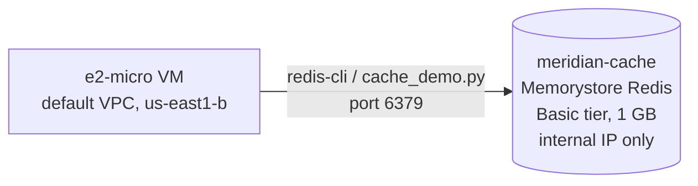

# Step 2 — Memorystore Cache-Aside

Firestore is fast, but not free-per-call-fast. Meridian's product page reads the same catalog rows
over and over during a sale. **Memorystore for Redis** — a managed, in-memory key-value store — sits
in front of the "database" (we'll fake the database with a Python dict, to keep this step focused on
the caching pattern itself) and absorbs the repeat reads.

> ⚠️ **Real-cost step.** Unlike Firestore and Secret Manager, Memorystore has **no free tier**. The
> smallest instance still bills **~$0.049/hr the entire time it exists**, whether or not you're using
> it. Finish this step in one sitting and delete the instance in [Step 7](./07-cleanup.md) — don't
> leave it running between sessions.

---

## 2.1 Why Memorystore Has No Public IP

| How it works | Detail |
|---------------|--------|
| **VPC-native only** | A Memorystore instance is provisioned with an internal IP **inside your VPC** — there is no external IP option, ever |
| **Reachable from** | Compute Engine VMs, GKE pods, or Cloud Run/Cloud Functions **with a Serverless VPC Access connector**, all in the *same VPC and region* |
| **Not reachable from** | Your laptop, Cloud Shell, or anything outside the VPC — directly |
| **Why this is deliberate** | Redis has no built-in strong auth by default in Basic tier — network isolation *is* the access control. Exposing it publicly would be a critical mistake, so Google doesn't offer the footgun |

For this lab, the simplest test client is a small **`e2-micro` GCE VM** in the **default VPC**,
because Memorystore in the default VPC is reachable from anything else in that same default VPC
without extra networking setup. In a real deployment you'd run the cache-consuming service (Cloud Run,
GKE, etc.) with a **Serverless VPC Access connector** into the same VPC instead of a dedicated VM —
worth trying as an extension, but out of scope here.

---

## 2.2 What You'll Create



| Field | Value |
|-------|-------|
| Instance ID | `meridian-cache` |
| Tier | **Basic** (no replica — cheapest, fine for a lab; Standard tier adds HA replication) |
| Capacity | 1 GB (smallest supported) |
| Region / Zone | `us-east1` / `us-east1-b` |
| Network | `default` |
| Redis version | latest supported |

---

## 2.3 Console — Create the Memorystore Instance

1. **☰ → Memorystore → Redis → Instances → Create instance.**
2. Fill in:

   | Field | Value |
   |-------|-------|
   | Instance ID | `meridian-cache` |
   | Tier | **Basic** |
   | Capacity | **1 GB** |
   | Region | `us-east1` |
   | Zone | `us-east1-b` |
   | Network | `default` |

3. Click **Create**. Provisioning takes several minutes.
4. Once ready, note the **internal IP** shown on the instance detail page — you'll need it in 2.5.

---

## 2.4 gcloud CLI (Alternative)

```bash
gcloud redis instances create meridian-cache \
  --size=1 \
  --region=us-east1 \
  --zone=us-east1-b \
  --network=default \
  --tier=basic \
  --redis-version=redis_7_0

# Wait for it to finish provisioning, then grab the internal IP
gcloud redis instances describe meridian-cache --region=us-east1 \
  --format='value(host,port)'
```

Keep the printed `host` and `port` (default `6379`) — you'll export them as env vars in 2.6.

---

## 2.5 Create the Test VM

The VM must be in the **same VPC and region** as Memorystore to reach it over the internal IP.

### Console

1. **☰ → Compute Engine → VM instances → Create instance.**

   | Field | Value |
   |-------|-------|
   | Name | `redis-test-vm` |
   | Region / Zone | `us-east1` / `us-east1-b` |
   | Machine type | `e2-micro` |
   | Network | `default` |
   | Firewall | Allow SSH via IAP if prompted (or use `gcloud compute ssh`, which uses OS Login/IAP by default) |

2. Click **Create**.

### gcloud CLI (Alternative)

```bash
gcloud compute instances create redis-test-vm \
  --zone=us-east1-b \
  --machine-type=e2-micro \
  --network=default \
  --no-address
```

`--no-address` keeps it consistent with the rest of this series' "backends don't need public IPs"
principle — you'll reach it via `gcloud compute ssh ... --tunnel-through-iap`.

---

## 2.6 Run the Cache-Aside Demo

SSH into the VM, install Python and Redis client dependencies, and copy over `cache_demo.py`:

```bash
gcloud compute ssh redis-test-vm --zone=us-east1-b --tunnel-through-iap

# --- inside the VM ---
sudo apt-get update && sudo apt-get install -y python3-pip
pip3 install redis

export REDIS_HOST=<the internal IP from Step 2.4>
export REDIS_PORT=6379
python3 cache_demo.py   # copy the file in first, e.g. via gcloud compute scp
```

To copy the script in from your local machine (run this from your own terminal, not inside the VM):

```bash
gcloud compute scp ../src/cache_demo.py redis-test-vm:~/cache_demo.py \
  --zone=us-east1-b --tunnel-through-iap
```

**What `cache_demo.py` demonstrates:**

1. **First read** of `product:SKU-1001` → cache **miss** → "fetches" from a fake in-memory database
   (simulated with a fixed dict + a sleep to mimic latency) → writes the result into Redis with a
   **60-second TTL**.
2. **Second read**, immediately after → cache **hit** → returns instantly from Redis, no fake-DB
   fetch.
3. **Read again after the TTL expires** (or `EXPIRE` it manually) → cache **miss** again → proves the
   TTL actually evicts the key.

---

## 2.7 Why This Matters

- **Cache-aside is the default pattern** for a reason: the app stays in control of what's cached and
  for how long, and a cold cache (or a cache outage) degrades to "just slower," not "broken" — reads
  fall through to the source of truth.
- **TTLs prevent silent staleness.** Without one, a cached price or inventory count could be wrong
  forever. Pick a TTL short enough that staleness is tolerable for the data in question.
- **No public IP is a feature, not a limitation.** It forces every consumer of the cache to be
  something that's already inside your trusted network boundary — the same "private backend" idea
  from the GCP networking series' [HTTP LB & Autoscaling project](../../../../intermediate/gcp/gcp-http-lb-autoscaling/README.md).

---

## Checkpoint

- [ ] `meridian-cache` Memorystore instance is `READY` in `us-east1`
- [ ] `redis-test-vm` can reach it on port `6379` over the internal IP
- [ ] `cache_demo.py` shows a miss → hit → (post-TTL) miss sequence
- [ ] You can explain why Memorystore has no public IP option
- [ ] You've noted the ongoing hourly cost and the plan to delete it in Step 7

---

**Next:** [Step 3 — Secret Manager for DB Credentials](./03-secret-manager-for-db-credentials.md)
