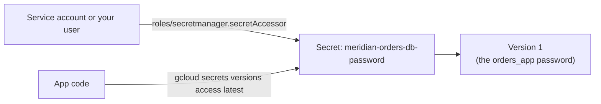

# Step 3 — Secret Manager for DB Credentials

Project 3 ([gcp-cloud-sql-managed-database](../../../../intermediate/gcp/gcp-cloud-sql-managed-database/README.md))
stood up `meridian-orders-db` and its app user `orders_app`, with the password sitting in a plain
environment variable — fine for getting the database working, wrong for anything that goes near
production. This step moves that password into **Secret Manager**, GCP's managed store for exactly
this kind of value.

---

## 3.1 What Secret Manager Solves

| How it works | Detail |
|---------------|--------|
| **Secret** | A named container (e.g. `meridian-orders-db-password`) — holds metadata, not the value itself |
| **Version** | The actual secret value lives in a **version** under the secret; each update to the value creates a new version |
| **`latest` alias** | A moving pointer to the newest **enabled** version — most apps reference `latest` rather than a pinned number |
| **Access via IAM** | Reading a secret's value requires the `secretmanager.versions.access` permission — granted via the `roles/secretmanager.secretAccessor` role, scoped to a specific secret if you want |
| **Audit trail** | Every access is logged — unlike an env var, you can answer "who/what read this password, and when" |

Compare this to the Project 3 approach: an env var is invisible to IAM, isn't versioned, isn't
audited, and is one `echo $ORDERS_APP_PASSWORD` away from ending up in a log or a shell history file.

---

## 3.2 What You'll Create



| Field | Value |
|-------|-------|
| Secret ID | `meridian-orders-db-password` |
| Version 1 value | The real `orders_app` password from Project 3 — or a placeholder if you're running this project standalone |
| Access granted to | Your own gcloud identity (for this lab), or a service account in a real deployment |

---

## 3.3 Console — Create the Secret

1. **☰ → Security → Secret Manager → Create Secret.**
2. Fill in:

   | Field | Value |
   |-------|-------|
   | Name | `meridian-orders-db-password` |
   | Secret value | The `orders_app` password from Project 3 (or a placeholder, e.g. `changeme-placeholder-123`) |
   | Regions | Automatic (Google-managed replication) |

3. Click **Create Secret**.

---

## 3.4 gcloud CLI (Alternative)

```bash
# Create the secret and its first version in one step
echo -n "<orders_app password, or a placeholder>" | \
  gcloud secrets create meridian-orders-db-password \
    --data-file=- \
    --replication-policy=automatic

# Grant a specific identity read access to this secret only — not all secrets
gcloud secrets add-iam-policy-binding meridian-orders-db-password \
  --member="user:$(gcloud config get-value account)" \
  --role="roles/secretmanager.secretAccessor"
```

`echo -n` avoids a trailing newline sneaking into the password. `--data-file=-` reads the value from
stdin instead of writing it to a file on disk, which would leave a copy sitting in your filesystem.

---

## 3.5 Access the Secret

```bash
gcloud secrets versions access latest --secret=meridian-orders-db-password
```

This is what an app or a deploy script does at runtime — fetch the value on demand instead of baking
it into config. In Python, the same call is:

```python
from google.cloud import secretmanager

client = secretmanager.SecretManagerServiceClient()
name = "projects/<PROJECT_ID>/secrets/meridian-orders-db-password/versions/latest"
response = client.access_secret_version(request={"name": name})
password = response.payload.data.decode("UTF-8")
```

---

## 3.6 Verify

```bash
gcloud secrets versions list meridian-orders-db-password \
  --format='table(name,state,createTime)'
```

Expect exactly one version, `ENABLED`.

```bash
gcloud secrets get-iam-policy meridian-orders-db-password
```

Confirm only the identities you intended have `roles/secretmanager.secretAccessor` — this policy is
scoped to **this one secret**, not project-wide.

---

## 3.7 Why This Matters

- **This replaces the Project 3 env var**, not supplements it. Going forward, `meridian-orders-db`'s
  password should be fetched from Secret Manager at app startup, never hardcoded or passed as a plain
  environment variable in a deploy config.
- **Least privilege at the secret level.** Granting `secretAccessor` on *this one secret* (not a
  project-wide Secret Manager role) means a compromised identity that only needed this one credential
  can't read every other secret in the project.
- **Rotation becomes possible.** Because the value is versioned, rotating the password later is
  "create a new version, update the app to point at `latest`" — no redeploy required to pick up a
  hardcoded value.

---

## Checkpoint

- [ ] `meridian-orders-db-password` secret exists with exactly one `ENABLED` version
- [ ] IAM policy on the secret grants access only to the identities you intended
- [ ] `gcloud secrets versions access latest` returns the expected value
- [ ] You can explain why this is a strictly better home for the password than the Project 3 env var

---

**Next:** [Step 4 — Workload Identity Federation for CI/CD](./04-workload-identity-federation-cicd.md)
