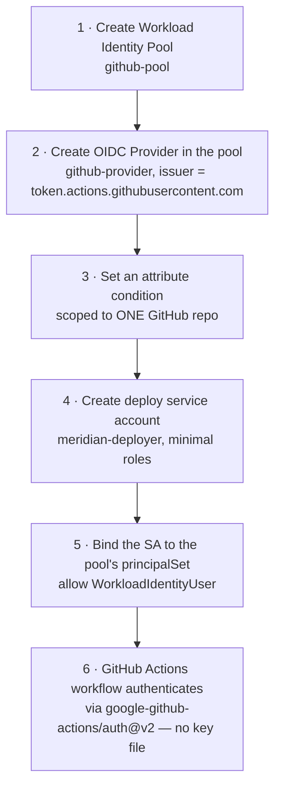

# Step 4 — Workload Identity Federation for CI/CD

This is the centerpiece of the project. Every other AWS project in this repo that deploys from
GitHub Actions (see
[aws-serverless-monitored-webapp Step 7](../../../../intermediate/aws/aws-serverless-monitored-webapp/steps/07-github-actions-deploy.md)
and
[aws-ec2-vpc-monitored-webapp Step 3](../../../../advanced/aws/aws-ec2-vpc-monitored-webapp/steps/03-iam-roles.md))
uses **GitHub OIDC** so the workflow never stores a long-lived AWS access key. **Workload Identity
Federation (WIF)** is Google Cloud's name for the exact same architecture. If you've done those AWS
steps, almost everything here will feel familiar — only the vocabulary changes.

---

## 4.1 The AWS ↔ GCP Parity

| Concept | AWS | GCP |
|---------|-----|-----|
| Trust anchor | IAM **OIDC identity provider** (`token.actions.githubusercontent.com`) | **Workload Identity Pool** + **Provider** |
| What GitHub presents | A signed OIDC token from `token.actions.githubusercontent.com` | The same signed OIDC token — same issuer |
| The condition that scopes trust | Trust policy `Condition` on `:sub` (e.g. `repo:ORG/REPO:ref:refs/heads/main`) | Provider **attribute condition** (e.g. `assertion.repository == 'ORG/REPO'`) |
| The identity the workflow becomes | An IAM **role** (`GitHubLambdaDeployRole` in this repo's AWS projects) | A GCP **service account** (`meridian-deployer` here), reached via the pool |
| GitHub Actions step | `aws-actions/configure-aws-credentials@v4` with `role-to-assume` | `google-github-actions/auth@v2` with `workload_identity_provider` |
| What's stored in GitHub | **Nothing** — no access key | **Nothing** — no JSON key file |

The mechanism is identical: GitHub mints a short-lived, cryptographically signed token describing
*which repo, which branch, which workflow* triggered this run. The cloud provider verifies that
signature against a public trust relationship you configured once, checks a condition against the
token's claims, and — only if both pass — hands back **temporary credentials**. No secret ever
crosses the wire, and there is nothing sitting in GitHub for an attacker to steal.

> **If you skip this project's live GitHub demo:** everything below still stands up the pool,
> provider, and service account, and every `gcloud` command works without a real repo. You'll just
> stop short of actually triggering a workflow run in 4.6. The concept and the IAM wiring are
> identical either way.

---

## 4.2 What You'll Create



**Why this order:** the pool and provider must exist before you can write a condition against them;
the service account must exist before you can bind anything to it; the binding is what actually lets
a matching GitHub token "become" the service account. The workflow comes last because it depends on
every piece above.

---

## 4.3 Console — Create the Pool and Provider

1. **☰ → IAM & Admin → Workload Identity Federation → Create Pool.**

   | Field | Value |
   |-------|-------|
   | Pool name | `github-pool` |
   | Pool ID | `github-pool` |
   | Description | "GitHub Actions OIDC pool for Meridian Retail deploys" |

2. **Add a provider to the pool:**

   | Field | Value |
   |-------|-------|
   | Provider type | **OpenID Connect (OIDC)** |
   | Provider name / ID | `github-provider` |
   | Issuer (URL) | `https://token.actions.githubusercontent.com` |
   | Audiences | Default audience |

3. **Attribute mapping** — map the token's claims to GCP attributes:

   | GCP attribute | OIDC claim |
   |----------------|------------|
   | `google.subject` | `assertion.sub` |
   | `attribute.repository` | `assertion.repository` |
   | `attribute.ref` | `assertion.ref` |

4. **Attribute condition** (critical — see 4.4 before filling this in):
   ```
   assertion.repository == 'YOUR_GITHUB_ORG/YOUR_REPO'
   ```

5. Click **Save**.

---

## 4.4 Why the Attribute Condition Is Not Optional

> ⚠️ **If you leave the attribute condition blank, or scope it too broadly, *any* repository on
> GitHub — yours or anyone else's — could present a token that satisfies this provider's issuer check
> and potentially impersonate your service account.** The provider only verifies the token is
> genuinely signed by GitHub; it says nothing on its own about *which* repo should be trusted. The
> attribute condition (and, in 4.5, the principal binding) is what narrows "some GitHub repo" down to
> "specifically `YOUR_GITHUB_ORG/YOUR_REPO`."

This is the exact same job the `:sub` condition does in this repo's AWS OIDC trust policies — see how
[aws-serverless-monitored-webapp's trust policy](../../../../intermediate/aws/aws-serverless-monitored-webapp/steps/07-github-actions-deploy.md#73-create-the-deploy-role)
pins `repo:ORG/REPO:ref:refs/heads/main`. Same risk, same fix, different syntax.

You can scope further to a specific branch or environment, e.g.:
```
assertion.repository == 'YOUR_GITHUB_ORG/YOUR_REPO' && assertion.ref == 'refs/heads/main'
```

---

## 4.5 gcloud CLI (Alternative) — Full Setup

```bash
PROJECT_ID=$(gcloud config get-value project)
PROJECT_NUMBER=$(gcloud projects describe "$PROJECT_ID" --format='value(projectNumber)')
GH_REPO="YOUR_GITHUB_ORG/YOUR_REPO"   # replace with the repo you'll actually deploy from

# 1. Create the pool
gcloud iam workload-identity-pools create github-pool \
  --location="global" \
  --display-name="GitHub Actions pool"

# 2. Create the OIDC provider inside it, with the attribute condition applied at creation
gcloud iam workload-identity-pools providers create-oidc github-provider \
  --location="global" \
  --workload-identity-pool="github-pool" \
  --issuer-uri="https://token.actions.githubusercontent.com" \
  --attribute-mapping="google.subject=assertion.sub,attribute.repository=assertion.repository,attribute.ref=assertion.ref" \
  --attribute-condition="assertion.repository == '${GH_REPO}'"

# 3. Create the deploy service account — minimal roles, added only as needed later
gcloud iam service-accounts create meridian-deployer \
  --display-name="Meridian Retail GitHub Actions deployer"

# 4. Allow the pool's matching principals to impersonate the deploy SA
#    (this is the binding that actually connects "a GitHub token from this repo" to "this SA")
gcloud iam service-accounts add-iam-policy-binding \
  "meridian-deployer@${PROJECT_ID}.iam.gserviceaccount.com" \
  --role="roles/iam.workloadIdentityUser" \
  --member="principalSet://iam.googleapis.com/projects/${PROJECT_NUMBER}/locations/global/workloadIdentityPools/github-pool/attribute.repository/${GH_REPO}"
```

`principalSet://.../attribute.repository/${GH_REPO}` says "every principal whose `attribute.repository`
equals this exact repo" — this is the binding-level enforcement of the same scoping the provider's
attribute condition already applies. Belt and suspenders: even if the condition were ever loosened,
this binding alone still limits who can assume `meridian-deployer`.

**Verify:**

```bash
gcloud iam workload-identity-pools providers describe github-provider \
  --location="global" --workload-identity-pool="github-pool" \
  --format='value(attributeCondition)'
```

Expect your exact repo string back.

---

## 4.6 Wire Up the GitHub Actions Workflow

`src/workflow-example.yml` is a **template** — copy it into `.github/workflows/deploy.yml` of a repo
you actually control (GitHub only runs workflows that live in a repo's own `.github/workflows/`
folder; this file won't run by sitting in `cloud-projects`).

The key step is `google-github-actions/auth@v2`:

```yaml
- name: Authenticate to Google Cloud (Workload Identity Federation)
  uses: google-github-actions/auth@v2
  with:
    workload_identity_provider: projects/<PROJECT_NUMBER>/locations/global/workloadIdentityPools/github-pool/providers/github-provider
    service_account: meridian-deployer@<PROJECT_ID>.iam.gserviceaccount.com
```

Notice what's **not** there: no `credentials_json`, no downloaded key file, nothing checked into a
GitHub secret except plain identifiers (project number, pool/provider/SA names — none of which are
themselves credentials). Compare this to the AWS workflow's
[`aws-actions/configure-aws-credentials@v4` step](../../../../intermediate/aws/aws-serverless-monitored-webapp/steps/07-github-actions-deploy.md) —
same shape, same absence of a stored secret.

Required workflow permissions (also mirrors the AWS pattern):

```yaml
permissions:
  id-token: write   # lets GitHub mint the OIDC token this whole flow depends on
  contents: read
```

Push to `main` and watch the Actions run authenticate — `gcloud auth list` inside the job will show
`meridian-deployer@...` as the active account, reached with **zero** stored credentials.

---

## 4.7 Why This Matters

- **A leaked GitHub secret can't leak a GCP key — there isn't one.** The worst a compromised workflow
  run can do is act as `meridian-deployer` for the duration of that one run, with exactly the roles
  you granted it.
- **This is the same trust model as the AWS OIDC deploy pattern already established in this repo** —
  learning it twice, on two different clouds, is what makes it obvious this is a general pattern
  (federated workload identity) and not a GitHub-specific or AWS-specific trick.
- **The attribute condition is the entire security boundary.** Everything else (the provider, the
  binding) is plumbing; the condition is the one line that says "only this repo."

---

## Checkpoint

- [ ] `github-pool` and `github-provider` exist, provider issuer is `token.actions.githubusercontent.com`
- [ ] The provider's attribute condition names your exact `org/repo` (not blank, not a wildcard)
- [ ] `meridian-deployer` service account exists with minimal roles
- [ ] The `workloadIdentityUser` binding scopes to a `principalSet` for your repo only
- [ ] You can explain, in one sentence, why AWS's `:sub` condition and GCP's attribute condition solve the same problem
- [ ] (If you ran the live demo) the GitHub Actions run authenticated with no stored key, visible in the job logs

---

**Next:** [Step 5 — Impersonation & Org Policy Guardrails](./05-impersonation-and-org-policy-guardrails.md)
