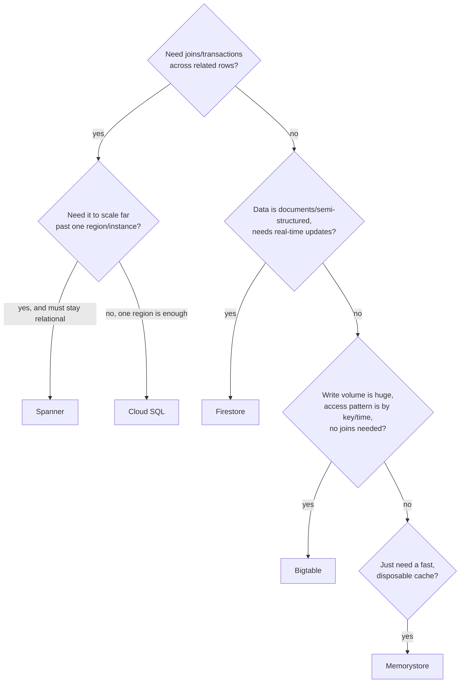

# Step 6 — Database Decision Matrix

No new resources in this step — just the conversation every one of these earlier steps was setting up
for: **which managed database do you reach for, and why?** Meridian Retail has now used four of
Google Cloud's storage/database options across this series for four genuinely different jobs. This
step names the other two you haven't touched (Bigtable, Spanner) and gives you a framework for
picking between all five.

---

## 6.1 What Meridian Actually Used, and Why

| Data | Service | Why this one |
|------|---------|---------------|
| Product documents / static assets | **Cloud Storage** (Project 1) | Unstructured blobs, served by URL, versioned — not a database problem at all |
| Orders (`meridian_orders`) | **Cloud SQL** (Project 3) | Relational: orders reference customers and line items; needs joins, transactions, and strong consistency for money |
| Carts (`carts`) | **Firestore** (Step 1) | Semi-structured, high write rate, needs to feel instant to the user, no complex joins |
| Session/cache data | **Memorystore** (Step 2) | Not durable by design — pure speed, sub-millisecond reads, disposable if lost |

That progression — object storage → relational → document → cache — mirrors how a real team's data
needs actually diverge as an app grows. The mistake to avoid is forcing all of it into one shape
because "we already have a database."

---

## 6.2 The Five-Way Comparison

| | **Cloud SQL** | **Firestore** | **Bigtable** | **Spanner** | **Memorystore (Redis)** |
|---|---|---|---|---|---|
| **Consistency model** | Strong (ACID, single-region unless configured otherwise) | Strong, per-document; real-time listeners | Eventually consistent by default (single-cluster is strongly consistent, multi-cluster is eventual) | Strong, **globally** — external consistency across regions | Strong within the instance; no cross-instance consistency (it's a cache, not a system of record) |
| **Scale ceiling** | Vertical, plus read replicas — tens of thousands of QPS before it's a stretch | Scales horizontally, near-automatic; built for millions of documents | Petabyte-scale, millions of ops/sec — built for this | Effectively unlimited, horizontally scalable relational — the whole point of Spanner | Bound by instance memory size; not meant to scale to "big data" |
| **Query pattern** | **SQL** — joins, transactions, aggregate queries | **Document** queries — filter/sort on fields, no joins across collections | **Wide-column** — fast on row-key lookups and range scans, no joins, no ad-hoc query language | **SQL** — full relational semantics at global scale | **Key-value** — get/set, plus data structures (lists, sets, sorted sets); no query language |
| **Typical cost shape** | Pay for instance size/uptime + storage; predictable | Pay per read/write/delete op + storage; generous free tier | Pay for node count (provisioned throughput) + storage; **not** cheap at small scale | Pay for node count + storage; the most expensive option here at small scale | Pay per hour for provisioned memory, **regardless of traffic**; no free tier |
| **Pick this when...** | You need joins/transactions and your data is naturally relational | You need real-time updates and flexible, semi-structured documents at app scale | You have time-series or IoT-scale write volume and know your access pattern by row key | You need relational guarantees **and** global horizontal scale (multi-region strong consistency) | You need sub-millisecond reads for hot, disposable data in front of a slower source of truth |

---

## 6.3 Bigtable and Spanner — When Meridian Would Actually Reach for Them

Neither shows up in this series' build, on purpose — they solve problems Meridian doesn't have yet at
this scale. But it's worth knowing exactly what would trigger each:

- **Bigtable** becomes the right call once Meridian is ingesting **time-series or event-stream data**
  at real volume — e.g., every product-page view, every cart-item add/remove event, click-stream data
  for a recommendation engine. That's write-heavy, append-mostly, keyed-by-time-or-entity data with no
  need for joins — exactly Bigtable's shape. Cloud SQL or Firestore would either fall over under that
  write rate or cost far more per operation.

- **Spanner** becomes the right call if Meridian's `orders` outgrows a single Cloud SQL instance's
  ceiling **and** the relational guarantees (joins, multi-row transactions, foreign keys) still
  matter — e.g., Meridian expands globally and needs order data strongly consistent across regions,
  not just replicated. Spanner is what you reach for when you need "relational database" and
  "horizontally scalable across the planet" to both be true at once — a combination nothing else on
  this list offers.

Both are real infrastructure with real hourly bills the moment they exist — **[challenges.md](../challenges.md)**
has you provision the smallest possible instance of each, confirm it works, and tear it down
immediately, specifically so you feel that cost before ever reaching for either in a real design.

---

## 6.4 A Simple Decision Flow

This is a starting heuristic, not a certification-exam answer key — real decisions also weigh team
familiarity, existing tooling, and migration cost. But it gets you to the right *shortlist* fast.

---

## Checkpoint

- [ ] You can name which service Meridian used for each of: documents, orders, carts, sessions/cache
- [ ] You can explain, in one sentence each, why Bigtable and why Spanner weren't the right fit for this series
- [ ] You can walk the decision flow out loud for a new, hypothetical Meridian dataset

---

**Next:** [Step 7 — Cleanup](./07-cleanup.md)
