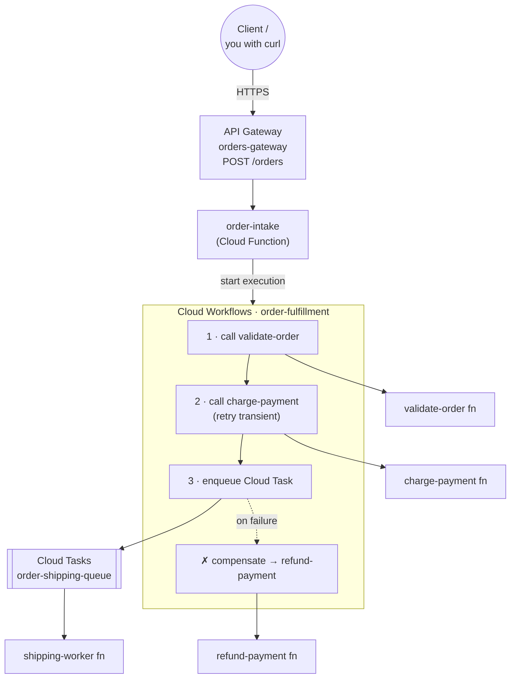
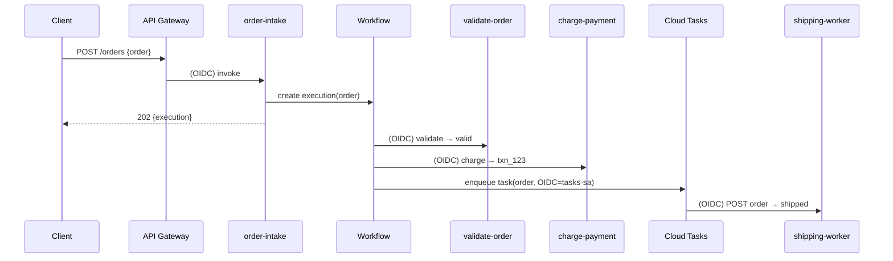

# GCP Serverless Orchestration — Workflows, Cloud Tasks & API Gateway

```yaml
level: advanced
cloud: gcp
domain: serverless
technology:
  - cloud-workflows
  - cloud-functions
  - cloud-tasks
  - api-gateway
estimated_time: 120 min
estimated_cost: low
deployment_type: console + gcloud
cleanup_required: true
status: ready
```

> **One-line pitch:** Coordinate a fleet of tiny Cloud Functions into one reliable, multi-step
> **order-fulfillment** process with **Cloud Workflows** — complete with retries, a **saga**
> compensation (auto-refund), asynchronous shipping via **Cloud Tasks**, and a public **API Gateway**
> front door.

## What You'll Build

The event pipeline in the [intermediate project](../../../intermediate/gcp/gcp-event-driven-functions-pubsub/README.md)
was *choreography* — services reacting to events with no central brain. Real business processes often
need **orchestration**: a defined sequence, with branching, retries, and rollback. That's what
**Cloud Workflows** is for.

You'll build Meridian Retail's order-fulfillment process as a workflow that calls independent
functions in order:

1. **validate-order** — is the item real, in stock, and the total sane?
2. **charge-payment** — take the money (with **retry** on transient failures, and a hard stop on a
   decline)
3. **enqueue shipping** — hand off to **Cloud Tasks** so the slow shipping work runs asynchronously
   (the customer isn't kept waiting)
4. **compensate** — if shipping can't be scheduled *after* a successful charge, the workflow
   **auto-refunds** — the **saga pattern** that keeps a distributed transaction consistent

Then you'll put a public **API Gateway** in front so a client can `POST /orders` over HTTPS, which
starts a workflow execution and returns immediately.

By the end you'll understand:

- **Orchestration vs. choreography** — when to centralize control flow, and when to react to events
- **Cloud Workflows** syntax: steps, `switch`, `try/retry/except`, connectors, expressions
- The **saga pattern** — compensating a partial failure instead of a distributed rollback
- **Cloud Tasks** — durable, rate-limited, retryable async work handoff
- **API Gateway** — a managed HTTPS front door that authenticates to a serverless backend for you
- The **identity chain** that lets one service securely invoke the next (OIDC everywhere)

This is the **advanced** capstone of the GCP **Serverless** track. It draws together the HTTP
functions from the [beginner project](../../../beginner/gcp/gcp-cloud-functions-basics/README.md) and
the decoupling ideas from the [intermediate project](../../../intermediate/gcp/gcp-event-driven-functions-pubsub/README.md).

## Learning Objectives

By the end you will be able to:

- Author and deploy a multi-step **Cloud Workflow** with branching, retries, and error handling
- Implement the **saga / compensation** pattern for a partially-failed transaction
- Hand off async work to **Cloud Tasks** with an OIDC-authenticated HTTP target
- Front a serverless backend with **API Gateway** and wire the invoker identity chain
- Explain, for each hop, *which service account* is acting and *why it's allowed*

## Real-World Use Case

Order fulfillment, loan approval, employee onboarding, media transcoding pipelines — anything that is
a **defined sequence of steps that must each succeed, retry sensibly, and roll back cleanly** is a
workflow. Doing this with hand-rolled queues and glue code is where reliability bugs live: a charge
succeeds but the ship step throws, and now you've taken money for an order that never ships. A
workflow engine makes the control flow, retries, and compensation **explicit and observable** instead
of scattered across services.

## Architecture



### Happy-path sequence



See [architecture.md](architecture.md) for the **saga/compensation** flow and the full **identity
chain** diagram (every service account and grant).

## Services Used

| Service | Role in this Project |
|---------|---------------------|
| **Cloud Workflows** | The orchestrator: sequences steps, retries, branches, compensates |
| **Cloud Functions (2nd gen)** | Five single-purpose steps: validate, charge, refund, shipping-worker, order-intake |
| **Cloud Tasks** | Durable async handoff for the slow shipping step, with its own retries |
| **API Gateway** | Public HTTPS front door that authenticates to the `order-intake` backend |
| **IAM / OIDC** | The identity chain that lets each hop securely invoke the next |

## Key Concepts

| Concept | What it means |
|---------|---------------|
| **Orchestration** | A central definition drives the sequence (Workflows) — vs. **choreography** (events) |
| **Workflow step** | A named unit: `call` a function/connector, `assign`, `switch`, `return`, `raise` |
| **`try/retry/except`** | Per-step retry policy + a catch block — the core of resilient orchestration |
| **Retry predicate** | `http.default_retry_predicate` retries 429/502/503/504; a 402 decline is *not* retried |
| **Saga / compensation** | Undo prior successful steps (refund) when a later step fails — no distributed 2PC |
| **Cloud Tasks** | A queue of HTTP calls with rate limits + retries; decouples slow work from the caller |
| **Connector** | Built-in Workflows integration (e.g. `googleapis.cloudtasks.v2…`) that calls a Google API for you |
| **API Gateway** | Managed gateway; `x-google-backend` routes to a function and signs the call for you |

## Project Structure

```
gcp-serverless-workflows-orchestration/
├── README.md                       ← You are here
├── architecture.md                 ← Saga flow + full identity-chain diagram
├── prerequisites.md
├── src/
│   ├── validate_order/             ← catalog + stock check (pure, retryable)
│   ├── charge_payment/             ← the fallible money step (transient/decline sim)
│   ├── refund_payment/             ← compensation step (idempotent)
│   ├── shipping_worker/            ← Cloud Tasks target (async shipping)
│   ├── order_intake/              ← API backend: starts a workflow execution
│   └── sample-orders/              ← good / invalid / decline / transient JSON
├── workflow/
│   └── order-fulfillment.yaml      ← the Workflows definition (with __TOKEN__ placeholders)
├── api/
│   └── openapi.yaml                ← API Gateway config (Swagger 2.0)
├── steps/
│   ├── 01-setup.md                 ← APIs + all service accounts
│   ├── 02-deploy-step-functions.md ← Deploy the 4 step functions (private)
│   ├── 03-cloud-tasks-queue.md     ← Create the shipping queue + invoker chain
│   ├── 04-deploy-workflow.md       ← Fill in URLs, deploy the workflow, grant its SA
│   ├── 05-run-workflow.md          ← Execute directly; watch all four paths + compensation
│   ├── 06-api-gateway.md           ← order-intake + API Gateway public endpoint
│   ├── 07-observability.md         ← Execution history, step logs, queue depth
│   └── 08-cleanup.md               ← Tear everything down
├── costs.md
├── troubleshooting.md
├── challenges.md
└── references.md
```

## Prerequisites

Summarized here; full list in [prerequisites.md](prerequisites.md).

| Requirement | Details |
|-------------|---------|
| Prior projects | Do the [beginner](../../../beginner/gcp/gcp-cloud-functions-basics/README.md) and [intermediate](../../../intermediate/gcp/gcp-event-driven-functions-pubsub/README.md) serverless projects first |
| gcloud CLI | Installed & authenticated; billing linked |
| Region | All resources in **`us-east1`** |
| Comfort with IAM | This project has the repo's most involved service-account chain — the intermediate project's Eventarc chain is good prep |

## Steps

| # | Step | What you do |
|---|------|-------------|
| 1 | [Setup](steps/01-setup.md) | Enable APIs; create the workflow, tasks, intake, and gateway service accounts |
| 2 | [Step functions](steps/02-deploy-step-functions.md) | Deploy validate / charge / refund / shipping-worker (all private) |
| 3 | [Cloud Tasks queue](steps/03-cloud-tasks-queue.md) | Create `order-shipping-queue` and wire the tasks→worker invoker |
| 4 | [Deploy the workflow](steps/04-deploy-workflow.md) | Substitute URLs, deploy `order-fulfillment`, grant the workflow SA |
| 5 | [Run it](steps/05-run-workflow.md) | Execute directly; watch valid, invalid, decline, and transient→compensation |
| 6 | [API Gateway](steps/06-api-gateway.md) | Deploy `order-intake`, publish the gateway, `curl` the public API |
| 7 | [Observability](steps/07-observability.md) | Execution history, step-level logs, queue depth |
| 8 | [Cleanup](steps/08-cleanup.md) | Delete gateway, workflow, tasks, and functions |

Start with **Step 1 →** [`steps/01-setup.md`](steps/01-setup.md)

## Validation Checklist

- [ ] A valid order execution `SUCCEEDED` and enqueued a shipping task that `shipping-worker` ran
- [ ] The invalid order (`Cashmere Scarf`, out of stock) failed at validation with a clear reason
- [ ] The decline order failed at charge with a **402** and was **not** retried
- [ ] The transient order retried 3× then triggered **compensation** (refund logged)
- [ ] `POST /orders` through API Gateway returns **202** with an execution name

## 💰 Cost

| Resource | Cost | Free tier? |
|----------|------|-----------|
| **Cloud Workflows** | ~$0 | 5,000 internal steps/month free |
| **Cloud Functions (2nd gen)** | ~$0 | 2M invocations/month free |
| **Cloud Tasks** | ~$0 | 1M operations/month free |
| **API Gateway** | **small, not free** | ~$3 / million calls; **no free tier** — a few test calls are pennies |
| **Cloud Build** | ~$0 | 120 build-min/day free |

**Estimated total for this lab: under $0.50** if you clean up the same day. **⚠️ Left running:** API
Gateway and its managed service, five deployed functions, a workflow, and a queue all persist until
deleted. See [costs.md](costs.md).

## 🧹 Cleanup

> **⚠️ Do the cleanup step.** API Gateway is the one component here with no free tier — don't leave it.

Cleanup is [Step 8](steps/08-cleanup.md): delete the gateway → API config → API, the workflow, the
Cloud Tasks queue, all five functions, and the service accounts.

## Troubleshooting

See [troubleshooting.md](troubleshooting.md) — `Error → Cause → Fix`.

## Challenges

See [challenges.md](challenges.md) — add a parallel step, a callback/human-approval gate, an
Eventarc-triggered start, and more.

## What to Try Next

- Compare orchestration approaches with the AWS side of this repo:
  [`aws-api-gateway-dynamodb-crud`](../../../intermediate/aws/aws-api-gateway-dynamodb-crud/README.md)
  (API Gateway + Lambda) and the
  [`aws-monolith-to-serverless-migration`](../../../advanced/aws/aws-monolith-to-serverless-migration/README.md)
  (domain Lambdas behind an HTTP API).
- Revisit the [event-driven intermediate project](../../../intermediate/gcp/gcp-event-driven-functions-pubsub/README.md)
  and articulate, in one paragraph, when you'd choose choreography over this orchestration.

## References

See [references.md](references.md) for official docs.
