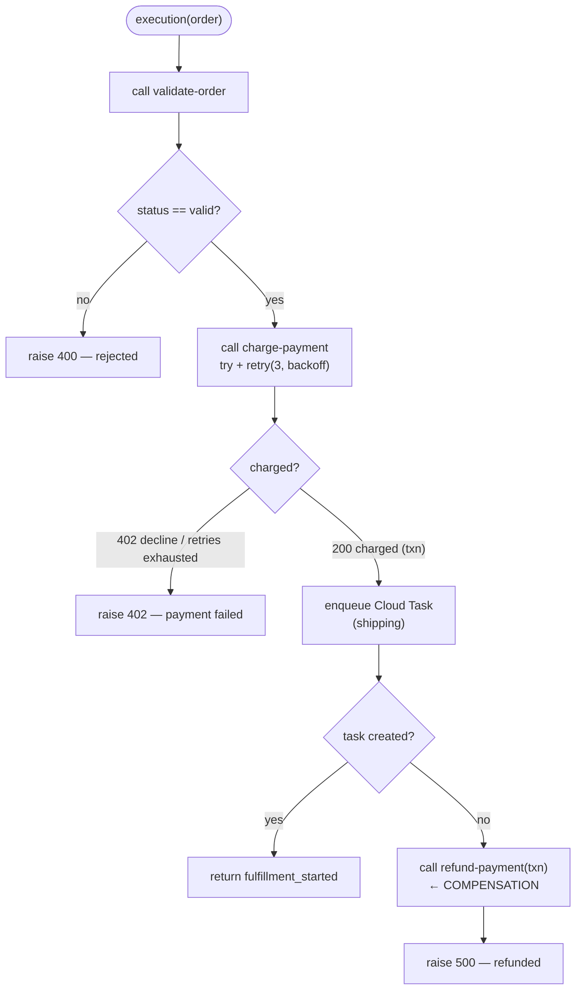
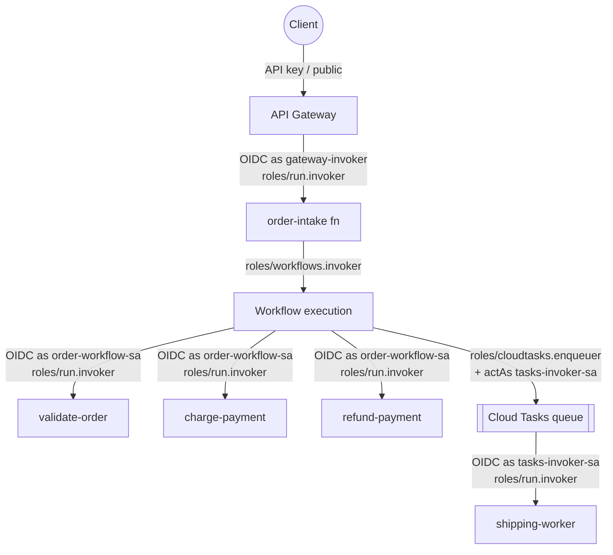
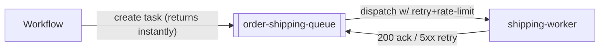

# Architecture — GCP Serverless Orchestration

The diagrams too detailed for the README: the **saga/compensation** control flow and the full
**identity chain** (every service account and the grant that authorizes each hop).

---

## 1. Control flow (the saga)

**Why compensation, not rollback?** There is no distributed transaction across `charge-payment` and
Cloud Tasks — you can't "un-commit" a charge with a database rollback. The saga pattern instead runs a
**compensating action** (`refund-payment`) that semantically undoes the completed step. The workflow
makes this explicit and observable: the `except` block on `enqueueShipping` calls refund before it
re-raises.

**Retry vs. terminal failure:**

| Failure | Handling | Why |
|---------|----------|-----|
| `charge-payment` returns **503** (transient) | Retried up to 3× with exponential backoff | Processor blips are worth retrying |
| `charge-payment` returns **402** (decline) | **Not** retried — fails immediately | A declined card won't succeed on retry |
| `validate-order` says invalid | No charge attempted — fail fast | Never take money for an unfulfillable order |
| Shipping enqueue fails after charge | **Compensate** (refund) then fail | Keep the transaction consistent |

> The sample `order-transient.json` charges **always** 503, so you can watch the retries exhaust and
> the saga compensate — a deterministic way to see the failure path.

---

## 2. The identity chain (who is allowed to call whom)

Every arrow crossing a service boundary is authenticated with an **OIDC token** and authorized by an
IAM grant. This is the part that trips people up, so here's every hop.

### The service accounts

| Service account | Used by | Needs |
|-----------------|---------|-------|
| **order-workflow-sa** | the workflow itself | `run.invoker` on validate/charge/refund; `cloudtasks.enqueuer` on the queue; `iam.serviceAccountUser` on **tasks-invoker-sa** (to set it as the task's OIDC identity) |
| **tasks-invoker-sa** | Cloud Tasks, to call the worker | `run.invoker` on **shipping-worker** |
| **order-intake-sa** | the order-intake function | `workflows.invoker` (to create executions) |
| **gateway-invoker-sa** | API Gateway | `run.invoker` on **order-intake** |

### Why `iam.serviceAccountUser` on tasks-invoker-sa?

When the workflow creates a task, it specifies `oidcToken.serviceAccountEmail = tasks-invoker-sa` so
Cloud Tasks will later call `shipping-worker` *as that SA*. To hand out another identity like that,
the creator (**order-workflow-sa**) must be allowed to **act as** tasks-invoker-sa — that's
`roles/iam.serviceAccountUser`. Miss this and task creation fails with a permission error.

> **The rule of thumb:** whenever service A tells service B "call C as identity X", A needs
> `serviceAccountUser` on X. This is the single most common orchestration IAM gotcha.

---

## 3. Why Cloud Tasks for shipping (and not another workflow step)?

Shipping is **slow, external, and independently retryable**. Putting it inline would:

- keep the workflow execution (and any synchronous caller) open for the whole shipping time, and
- couple shipping's retry needs to the workflow's.

Handing it to **Cloud Tasks** means the workflow finishes in milliseconds after *scheduling* the
work, and Cloud Tasks owns delivery: rate limiting, retries with backoff, and a max-attempts cap —
all configured on the queue, not in code.

