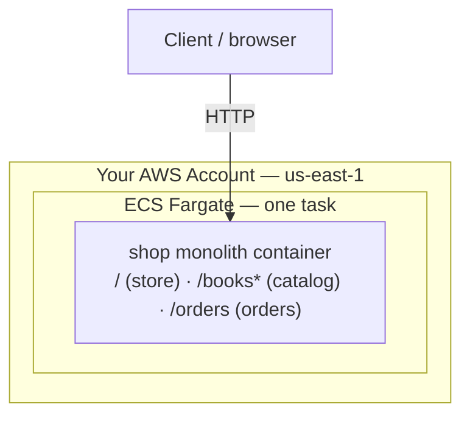
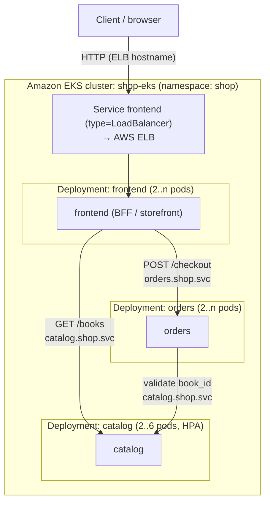
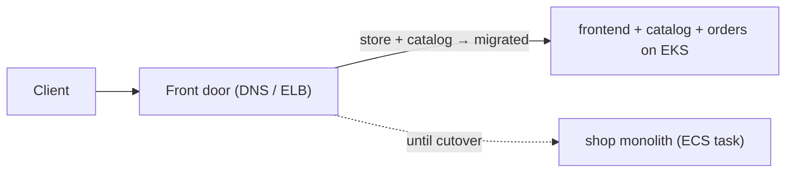

# Monolith → Microservices on Kubernetes (ECS Fargate monolith → Amazon EKS)

```yaml
level: advanced
cloud: kubernetes
domain: migration
technology:
  - eks
  - ecr
  - elb
  - ec2
  - iam
estimated_time: 3-4 hours
estimated_cost: hourly
deployment_type: eksctl + kubectl
cleanup_required: true
status: ready
```

## What You'll Build

You start with the **shop monolith**: one Flask container that serves catalog, orders, *and*
the storefront from a single image — the kind of app you'd run as one **ECS/Fargate** task
(see [ecs-fargate-basics](../../../intermediate/aws/aws-ecs-fargate-basics/README.md)). Then you decompose it into **three
microservices** — `catalog`, `orders`, `frontend` — and run them on **Amazon EKS** (managed
Kubernetes), each in its own Deployment, scaling and deploying independently.

As in the [serverless migration](../../aws/aws-monolith-to-serverless-migration/README.md), you don't do a
big-bang rewrite. You apply the **Strangler Fig pattern**: stand the microservices up beside
the monolith and shift the storefront's traffic to them, then retire the monolith.

By the end you will understand:

- How to split a monolith along **domain boundaries** into independently deployable services
- How services find and call each other with **Kubernetes Service DNS** (`catalog.shop.svc...`)
- Deployments, Services, ConfigMaps, probes, **HPA**, and rolling updates on **EKS**
- Why a network call between services is *not* free (timeouts, retries, partial failure)
- Which **6 R's** migration strategy this is and which **microservices principles** apply

> ⚠️ **This project runs a real EKS cluster — it is NOT free.** The EKS control plane costs
> **$0.10/hour (~$2.40/day)** plus EC2 worker nodes and an ELB. Budget **$1–3** if you finish
> in an afternoon and **delete the cluster the same day** (Step 8). A **$0 local alternative**
> using `kind`/`minikube` is in [Appendix A](#appendix-a--run-it-locally-for-0). If you want
> the pure-Kubernetes learning without AWS cost, do the local lab on
> [k8s-optimization-and-recovery](../../../intermediate/kubernetes/k8s-optimization-and-recovery/README.md) first.

> **Intermediate → Advanced.** Helpful first: [ecs-fargate-basics](../../../intermediate/aws/aws-ecs-fargate-basics/README.md)
> (containers/ECR) and [k8s-optimization-and-recovery](../../../intermediate/kubernetes/k8s-optimization-and-recovery/README.md)
> (kubectl, Deployments, HPA, probes).

---

## Architecture

### Before — the monolith (one task)



**Read it:** One image, one deploy, one scaling knob. The storefront, catalog, and orders code
all ship together; you can't scale or release one without the others.

### After — three microservices on EKS



**Read it:** The `frontend` is the only thing exposed (via a `LoadBalancer` Service → ELB).
Inside the cluster, services call each other by **DNS name**. Each Deployment scales and
deploys on its own; `catalog` even has its own **HPA**. The blast radius of a bad `orders`
release is `orders` only.

### The migration itself — Strangler Fig



**Read it:** Run both in parallel, point the storefront DNS at the EKS `frontend`, verify
parity, then scale the monolith task to zero and delete it. No big-bang.

---

## Why microservices on Kubernetes is better here

| Dimension | Monolith (one ECS task) | Microservices on EKS |
|-----------|--------------------------|----------------------|
| **Independent scaling** | Scale the whole app | `catalog` scales (HPA) without `orders`/`frontend` |
| **Independent deploys** | Redeploy everything | Roll out one service; others untouched |
| **Blast radius** | One crash = whole store down | One pod/service fails; others serve on |
| **Team ownership** | One codebase, coordinated releases | One service per team, release on their own cadence |
| **Tech flexibility** | One runtime for all | Each service could use a different language/image |
| **Self-healing** | Task dies → manual/ECS restart | k8s reschedules pods, respects probes + PDBs |
| **Resource efficiency** | Sized for the busiest path | Each service requests only what it needs |

Again — not "microservices always win." They add a network, service discovery, and operational
complexity. They pay off *here* because the domains scale differently and you want independent
releases. See the [concepts notes](../../../../docs/basic-concepts-draft/concepts.md) on scalability and fault tolerance.

---

## What type of migration is this?

In AWS's **6 R's**, this is a **Refactor / Re-architect** — you change the application's
*shape* (one process → many services) and its *runtime model* (one task → Kubernetes), not just
its hosting. (A Rehost would be the same container on a bigger node; a Replatform would keep the
monolith but move it to EKS as one Deployment.) Decomposition + new orchestration runtime = a
clear Refactor.

> Same family as [Project 1 (serverless)](../../aws/aws-monolith-to-serverless-migration/README.md) — both
> Refactors — but the target differs: **functions** there, **containers on Kubernetes** here.
> [Project 3 (DMS)](../../aws/aws-database-migration-dms/README.md) is a **Replatform** instead.

---

## Principles applied

| Principle | Where you see it |
|-----------|------------------|
| **Strangler Fig pattern** | Shift storefront traffic to EKS, retire the monolith (Steps 5, 7) |
| **Single Responsibility / bounded contexts** | One service per domain: catalog, orders, frontend |
| **Decentralized data ownership** | Each service owns its data; no shared DB writes |
| **Service discovery** | Services call each other by Kubernetes DNS, not hardcoded IPs |
| **Twelve-Factor (config in env)** | `CATALOG_URL`/`ORDERS_URL` via ConfigMap + env vars |
| **Design for failure** | `orders` handles a catalog timeout (503), probes gate traffic |
| **Independent scalability (elasticity)** | Per-service HPA; only the hot service scales |
| **Self-healing** | Liveness/readiness probes + ReplicaSets reschedule bad pods |

---

## Application

| Path | `src/` | In the cluster |
|------|--------|----------------|
| The monolith (before) | `monolith/app.py` | one container/task |
| catalog (after) | `catalog/` | `catalog` Deployment + Service |
| orders (after) | `orders/` | `orders` Deployment + Service (calls catalog) |
| frontend (after) | `frontend/` | `frontend` Deployment + LoadBalancer Service |

Run the whole microservice mesh on your laptop with Docker before touching AWS:

```bash
# three terminals, or use the docker network in Step 1
cd src/catalog  && pip install -r requirements.txt && python app.py   # :8080
cd src/orders   && CATALOG_URL=http://localhost:8080 python app.py     # set ports per terminal
```

(Step 1 shows a clean local run with a Docker network so the DNS names resolve.)

---

## Project Structure

```
monolith-to-microservices-eks/
├── README.md                          ← You are here
├── src/
│   ├── monolith/  (app.py, Dockerfile)        ← the "before"
│   ├── catalog/   (app.py, Dockerfile, reqs)  ← microservice
│   ├── orders/    (app.py, Dockerfile, reqs)  ← microservice (calls catalog)
│   └── frontend/  (app.py, Dockerfile, reqs)  ← microservice (BFF, public)
├── k8s/
│   ├── 00-namespace.yaml
│   ├── 01-catalog.yaml                ← Deployment + ClusterIP Service
│   ├── 02-orders.yaml                 ← ConfigMap + Deployment + Service
│   ├── 03-frontend.yaml               ← Deployment + LoadBalancer Service
│   └── 04-hpa.yaml                    ← HPA for catalog
├── steps/
│   ├── 01-run-the-monolith.md         ← Containerize + run the monolith
│   ├── 02-build-push-images.md        ← Build 3 images, push to ECR
│   ├── 03-provision-eks.md            ← Create the EKS cluster (eksctl)
│   ├── 04-deploy-catalog-orders.md    ← Deploy backends; service-to-service DNS
│   ├── 05-frontend-and-cutover.md     ← Expose frontend; strangler cutover
│   ├── 06-scale-and-resilience.md     ← HPA, rolling update, self-healing
│   ├── 07-decommission-monolith.md    ← Retire the monolith task
│   └── 08-cleanup.md                  ← DELETE THE CLUSTER (cost-critical)
├── costs.md
├── troubleshooting.md
└── challenges.md
```

---

## Prerequisites

| Requirement | Details |
|-------------|---------|
| AWS account | EKS, EC2, ECR, ELB, IAM, CloudWatch |
| AWS CLI | 2.x, configured for **us-east-1** |
| `eksctl` | Creates/manages the cluster ([install](https://eksctl.io/installation/)) |
| `kubectl` | Talks to the cluster |
| Docker | Build the images |
| Region | **us-east-1** |
| Recommended first | [ecs-fargate-basics](../../../intermediate/aws/aws-ecs-fargate-basics/README.md), [k8s-optimization-and-recovery](../../../intermediate/kubernetes/k8s-optimization-and-recovery/README.md) |

---

## What You'll Learn Step by Step

| Step | File | Goal |
|------|------|------|
| 1 | `01-run-the-monolith.md` | Build + run the monolith container; feel its limits |
| 2 | `02-build-push-images.md` | Build catalog/orders/frontend images; push to ECR |
| 3 | `03-provision-eks.md` | Create `shop-eks` with `eksctl`; wire up `kubectl` |
| 4 | `04-deploy-catalog-orders.md` | Deploy backends; prove service-to-service DNS calls |
| 5 | `05-frontend-and-cutover.md` | Expose `frontend` via ELB; strangler cutover from the monolith |
| 6 | `06-scale-and-resilience.md` | metrics-server + HPA; rolling update; kill a pod, watch it heal |
| 7 | `07-decommission-monolith.md` | Verify parity, scale the monolith task to zero, delete it |
| 8 | `08-cleanup.md` | **Delete the EKS cluster**, ECR repos, ELB, roles |

Start with **Step 1 →** [`steps/01-run-the-monolith.md`](steps/01-run-the-monolith.md)

---

## Estimated Time

3 – 5 hours. Cluster creation (Step 3) alone takes ~15–20 min while `eksctl` builds the control
plane and node group.

## Estimated Cost

| Service | Configuration | Cost |
|---------|--------------|------|
| **EKS control plane** | per cluster | **$0.10/hr (~$2.40/day)** — no free tier |
| **EC2 worker nodes** | 2× `t3.small` | ~$0.04/hr total |
| **ELB** (frontend Service) | 1 classic/NLB | ~$0.02/hr + data |
| **ECR** | 3 small images | ~$0 (500 MB free/mo) |

**An afternoon ≈ $1–3.** The control plane bills **per hour whether or not you use it** — the
single most important reason to run **Step 8 (delete the cluster) the same day.** See
**[costs.md](costs.md)**.

---

## Appendix A — Run it locally for $0

Everything except the EKS control plane works identically on a local cluster:

```bash
kind create cluster --name shop          # or: minikube start
# build images and load them into kind instead of pushing to ECR:
for s in catalog orders frontend; do
  docker build -t shop-$s:1 src/$s
  kind load docker-image shop-$s:1 --name shop
done
# edit k8s/*.yaml image: lines to "shop-<svc>:1" (no ECR prefix), then:
kubectl apply -f k8s/
kubectl -n shop port-forward svc/frontend 8080:80   # instead of an ELB
```

This gives you the full microservices + HPA + self-healing experience with **zero AWS cost** —
the same trade-off [k8s-optimization-and-recovery](../../../intermediate/kubernetes/k8s-optimization-and-recovery/README.md)
makes. Use EKS only when you specifically want the managed-AWS experience.

---

## What's Next

- Add an **Ingress** + AWS Load Balancer Controller (one ALB, path routing) instead of an ELB
- Give each service a **real datastore** (RDS/DynamoDB) to make data ownership concrete
- Add **service mesh** (App Mesh / Istio) for mTLS, retries, and traffic shifting
- Wire **GitHub Actions → ECR → `kubectl set image`** for per-service CI/CD
