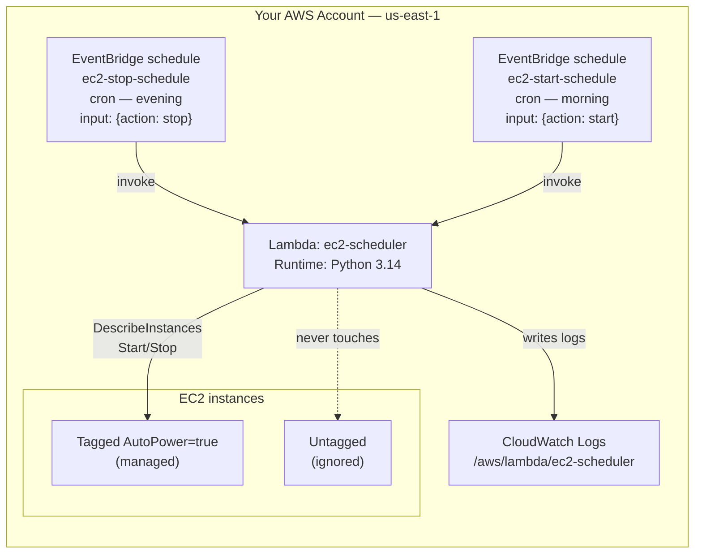

# Scheduled EC2 Start/Stop — Save Money on Idle Instances

```yaml
level: beginner
cloud: aws
domain: cost-optimization
technology:
  - lambda
  - eventbridge
  - ec2
  - iam
  - cloudwatch
estimated_time: 60 min
estimated_cost: low
deployment_type: console + cli
cleanup_required: true
status: ready
```

**Lambda Automation Series — Project 2 of 3**

## What You'll Build

A real, money-saving automation: a Lambda function that **stops your EC2 instances at night
and starts them in the morning**, driven by two EventBridge schedules. Dev/test instances
that nobody uses overnight or on weekends are pure waste — an instance powered off ~12 hours a
day costs roughly **half** as much.

The function is **tag-driven**: it only touches instances tagged `AutoPower=true`, so it can
never accidentally stop production. One function handles both directions — the schedule tells
it whether to `start` or `stop` via a constant input.

By the end you will understand:

- A **least-privilege** EC2 control role (`Start`/`Stop`/`Describe` only — no `Terminate`)
- **Tag-based targeting** so automation is opt-in and safe
- Passing **constant input** from an EventBridge schedule to choose behavior
- A **`DRY_RUN`** safety switch to preview actions before they're real
- Why stopped instances stop compute charges but **EBS volumes still cost a little**

This reuses the schedule pattern from
[Project 1](../aws-lambda-eventbridge-scheduled/README.md) — if you haven't done it, start there.

---

## Architecture



---

## Key Concepts

| Concept | What it means |
|---------|--------------|
| **Tag-based targeting** | The function filters on `tag:AutoPower = true` — opt-in, so it can't hit prod |
| **Constant input** | Each schedule passes static JSON (`{"action":"stop"}`) as the `event` |
| **Idempotent control** | Stopping an already-stopped instance is a no-op; we filter by current state anyway |
| **DRY_RUN** | An env-var switch that logs intended actions without calling Start/Stop |
| **Stopped ≠ free** | Stopped instances incur **$0 compute**, but attached EBS volumes still bill |

---

## Project Structure

```
lambda-ec2-start-stop-scheduler/
├── README.md                       ← You are here
├── steps/
│   ├── 01-iam-role.md              ← Least-privilege EC2 control role
│   ├── 02-launch-test-ec2.md       ← A throwaway tagged instance to act on
│   ├── 03-create-function.md       ← Deploy ec2-scheduler (start/stop)
│   ├── 04-schedule-start-stop.md   ← Two schedules with constant input
│   ├── 05-test-and-verify.md       ← Watch it stop/start; check savings
│   └── 06-cleanup.md               ← Delete everything (incl. the instance!)
├── src/
│   ├── ec2_scheduler.py            ← Handler code
│   └── test_invoke.py             ← Manual invoke (Boto3)
├── costs.md
├── troubleshooting.md
└── challenges.md
```

---

## Prerequisites

| Requirement | Details |
|-------------|---------|
| AWS account | Permissions for Lambda, IAM, EventBridge, EC2, CloudWatch |
| AWS CLI | `aws --version` returns 2.x |
| Python | 3.9+ locally |
| Boto3 | `pip install boto3` |
| Region | All steps use **us-east-1** |
| Recommended first | [Project 1 — Lambda on a Schedule](../aws-lambda-eventbridge-scheduled/README.md) |

> ⚠️ **This project launches a real EC2 instance.** It's a free-tier `t2.micro`, but you
> **must** terminate it in [Step 6](steps/06-cleanup.md) or it bills hourly.

---

## What You'll Learn Step by Step

| Step | File | Goal |
|------|------|------|
| 1 | `01-iam-role.md` | Create a Start/Stop/Describe-only role |
| 2 | `02-launch-test-ec2.md` | Launch a tagged `t2.micro` to manage |
| 3 | `03-create-function.md` | Deploy the start/stop function |
| 4 | `04-schedule-start-stop.md` | Two schedules with constant input |
| 5 | `05-test-and-verify.md` | Prove it stops and starts the instance |
| 6 | `06-cleanup.md` | Remove everything, including the instance |

Start with **Step 1 →** [`steps/01-iam-role.md`](steps/01-iam-role.md)

---

## Estimated Time

60 – 75 minutes.

## Estimated Cost

**~$0.00–$0.01.** A `t2.micro` is free-tier eligible (750 hours/month for 12 months); the only
real charge is a few cents of EBS storage if the instance lives for a day. Lambda + EventBridge
are effectively free. See [costs.md](costs.md). **Terminate the instance in cleanup.**

---

## What's Next

- **Project 3 → [Scheduled S3 Housekeeping](../aws-lambda-s3-housekeeping/README.md)** — apply the
  same schedule pattern to archive and delete old S3 objects automatically.
