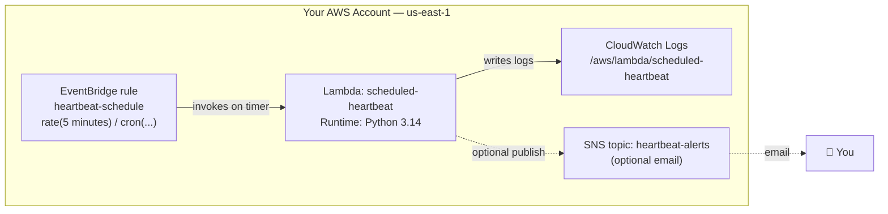

# Lambda on a Schedule with EventBridge

**Lambda Automation Series — Project 1 of 3**

## What You'll Build

A Lambda function that runs **on a schedule** — no one clicks "invoke", no HTTP
request arrives. **Amazon EventBridge** wakes it up on a timer (every 5 minutes, or
every day at 09:00 UTC, or any cron expression you like). This is the foundation of
*serverless automation*: cron jobs without a server to keep running.

The function is a simple **heartbeat** — it logs that it ran and, optionally, emails
you through SNS so you can prove the schedule is firing.

By the end you will understand:

- How **EventBridge rules** trigger Lambda on a `rate(...)` or `cron(...)` schedule
- The **resource-based permission** that lets EventBridge invoke your function
- How a scheduled `event` payload differs from a manual test payload
- How to confirm a schedule is firing using **CloudWatch Logs and metrics**
- How to (optionally) push a notification to **SNS** from inside a Lambda

This pattern powers the next two projects: stopping idle EC2 instances overnight
(Project 2) and cleaning up old S3 objects (Project 3).

---

## Architecture



---

## Key Concepts

| Concept | What it means |
|---------|--------------|
| **EventBridge rule** | A rule that matches events *or* fires on a schedule and routes to a target (here, Lambda) |
| **Schedule expression** | `rate(5 minutes)` or `cron(0 9 * * ? *)` — when the rule fires |
| **Target** | What the rule invokes when it fires (your Lambda) |
| **Resource-based policy** | A permission *on the Lambda* that allows `events.amazonaws.com` to invoke it |
| **Constant input** | Static JSON the rule passes to the target as the `event` |
| **At-least-once delivery** | EventBridge may, rarely, invoke twice — schedules are not exactly-once |

---

## Project Structure

```
lambda-eventbridge-scheduled/
├── README.md                       ← You are here
├── steps/
│   ├── 01-iam-role.md              ← Execution role (logs + optional SNS)
│   ├── 02-create-function.md       ← Deploy the heartbeat function
│   ├── 03-schedule-with-eventbridge.md ← Fire it on a timer
│   ├── 04-add-sns-notifications.md ← (Optional) email each run
│   ├── 05-monitor-and-verify.md    ← Prove the schedule fires
│   └── 06-cleanup.md               ← Delete everything
├── src/
│   ├── heartbeat.py                ← Handler code
│   └── test_invoke.py             ← Manual invoke (Boto3)
├── costs.md
├── troubleshooting.md
└── challenges.md
```

---

## Prerequisites

| Requirement | Details |
|-------------|---------|
| AWS account | Permissions for Lambda, IAM, EventBridge, CloudWatch, SNS |
| AWS CLI | `aws --version` returns 2.x |
| Python | 3.9+ locally (to run the test script) |
| Boto3 | `pip install boto3` |
| Region | All steps use **us-east-1** |
| Recommended first | [Lambda Basics](../aws-lambda-basics/README.md) — handlers, roles, logs |

---

## What You'll Learn Step by Step

| Step | File | Goal |
|------|------|------|
| 1 | `01-iam-role.md` | Create a least-privilege execution role |
| 2 | `02-create-function.md` | Deploy the heartbeat function |
| 3 | `03-schedule-with-eventbridge.md` | Trigger it on a `rate`/`cron` schedule |
| 4 | `04-add-sns-notifications.md` | (Optional) email yourself on each run |
| 5 | `05-monitor-and-verify.md` | Confirm it fires via Logs + metrics |
| 6 | `06-cleanup.md` | Remove all resources |

Start with **Step 1 →** [`steps/01-iam-role.md`](steps/01-iam-role.md)

---

## Estimated Time

40 – 60 minutes.

## Estimated Cost

**~$0.00** — comfortably inside the Free Tier. EventBridge scheduled rules are free,
and a heartbeat firing every few minutes is a tiny number of Lambda invocations.
See [costs.md](costs.md). Remember to disable the schedule in
[Step 6 — Cleanup](steps/06-cleanup.md) so it doesn't keep firing forever.

---

## What's Next

- **Project 2 → [Scheduled EC2 Start/Stop](../aws-lambda-ec2-start-stop-scheduler/README.md)** —
  use the same schedule pattern to power EC2 instances off overnight and save money.
- **Project 3 → [Scheduled S3 Housekeeping](../aws-lambda-s3-housekeeping/README.md)** —
  archive and delete old objects on a timer.
