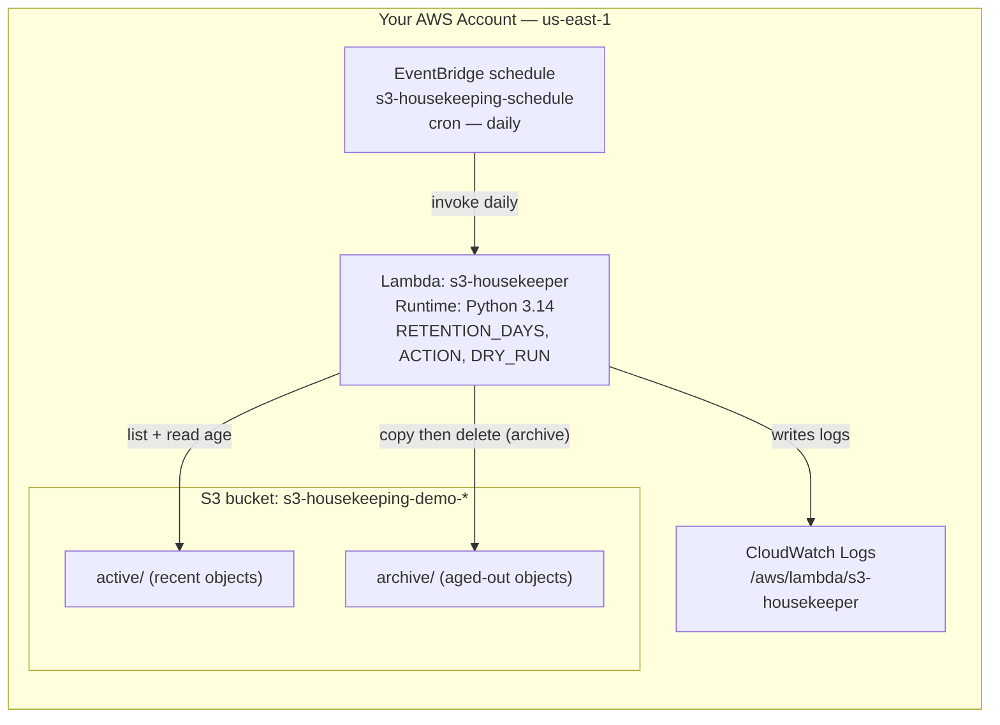

# Scheduled S3 Housekeeping — Archive & Delete Old Objects

**Lambda Automation Series — Project 3 of 3**

## What You'll Build

A scheduled Lambda that keeps an S3 bucket tidy: every day it scans a folder, finds objects
older than a retention window, and **moves them to an `archive/` prefix** (or deletes them
outright). It's a cron-driven janitor for your storage.

You'll also meet the safety habits that matter when code can *delete data*: a **`DRY_RUN`**
preview, a scoped **bucket-only** IAM policy, and a deliberate `archive` default so nothing is
destroyed until you choose `delete`.

By the end you will understand:

- Listing large buckets safely with a **paginator** (not a single `list` call)
- Comparing object **`LastModified`** against a retention cutoff
- **Archiving** = copy to a new prefix + delete original (S3 has no native "move")
- A `DRY_RUN` switch and an **`archive`-before-`delete`** safety posture
- When to reach for **S3 Lifecycle rules** instead of a Lambda (and when not to)

This completes the schedule-driven automation pattern from
[Project 1](../aws-lambda-eventbridge-scheduled/README.md) and
[Project 2](../aws-lambda-ec2-start-stop-scheduler/README.md).

---

## Architecture



---

## Key Concepts

| Concept | What it means |
|---------|--------------|
| **Paginator** | `list_objects_v2` returns ≤1000 keys/page; a paginator walks every page |
| **LastModified** | The timestamp S3 stores per object; compared to a retention cutoff |
| **Archive (move)** | S3 has no move op — you `copy_object` then `delete_object` |
| **DRY_RUN** | Logs what *would* be acted on without touching anything |
| **ACTION** | `archive` (safe default) vs `delete` (irreversible) |
| **Lifecycle vs Lambda** | Native S3 Lifecycle is free but rule-based; Lambda is for custom logic |

---

## Project Structure

```
lambda-s3-housekeeping/
├── README.md                       ← You are here
├── steps/
│   ├── 01-iam-role.md              ← Bucket-scoped S3 role
│   ├── 02-create-bucket-and-seed.md ← Bucket + sample objects
│   ├── 03-create-function.md       ← Deploy s3-housekeeper (dry-run first)
│   ├── 04-schedule-with-eventbridge.md ← Run it daily
│   ├── 05-test-and-verify.md       ← Confirm archive/delete behavior
│   └── 06-cleanup.md               ← Empty + delete everything
├── src/
│   ├── s3_housekeeper.py           ← Handler code
│   ├── seed_objects.py             ← Upload sample objects
│   └── test_invoke.py             ← Manual invoke (Boto3)
├── costs.md
├── troubleshooting.md
└── challenges.md
```

---

## Prerequisites

| Requirement | Details |
|-------------|---------|
| AWS account | Permissions for Lambda, IAM, EventBridge, S3, CloudWatch |
| AWS CLI | `aws --version` returns 2.x |
| Python | 3.9+ locally |
| Boto3 | `pip install boto3` |
| Region | All steps use **us-east-1** |
| Recommended first | [Project 1 — Lambda on a Schedule](../aws-lambda-eventbridge-scheduled/README.md) |

---

## What You'll Learn Step by Step

| Step | File | Goal |
|------|------|------|
| 1 | `01-iam-role.md` | Bucket-scoped list/get/put/delete role |
| 2 | `02-create-bucket-and-seed.md` | Create the bucket and seed sample objects |
| 3 | `03-create-function.md` | Deploy the housekeeper, dry-run it |
| 4 | `04-schedule-with-eventbridge.md` | Run it on a daily schedule |
| 5 | `05-test-and-verify.md` | Watch archive, then delete |
| 6 | `06-cleanup.md` | Empty and delete everything |

Start with **Step 1 →** [`steps/01-iam-role.md`](steps/01-iam-role.md)

---

## Estimated Time

50 – 70 minutes.

## Estimated Cost

**~$0.00** — a handful of tiny objects and a few API calls sit well inside the Free Tier;
EventBridge scheduled rules are free. See [costs.md](costs.md). Empty and delete the bucket in
[Step 6](steps/06-cleanup.md).

---

## What's Next

You've now built three schedule-driven automations — a heartbeat, an EC2 cost-saver, and an S3
janitor — all on the same EventBridge + Lambda foundation. Natural follow-ons in this repo:

- [Lambda with S3 Event Processing](../aws-lambda-s3-event-processing/README.md) — *event*-driven
  (on upload) instead of *schedule*-driven
- [Lambda Troubleshooting & Boto3 Automation](../../../intermediate/aws/aws-lambda-troubleshooting-monitoring/README.md) —
  go deeper on debugging and DLQs
