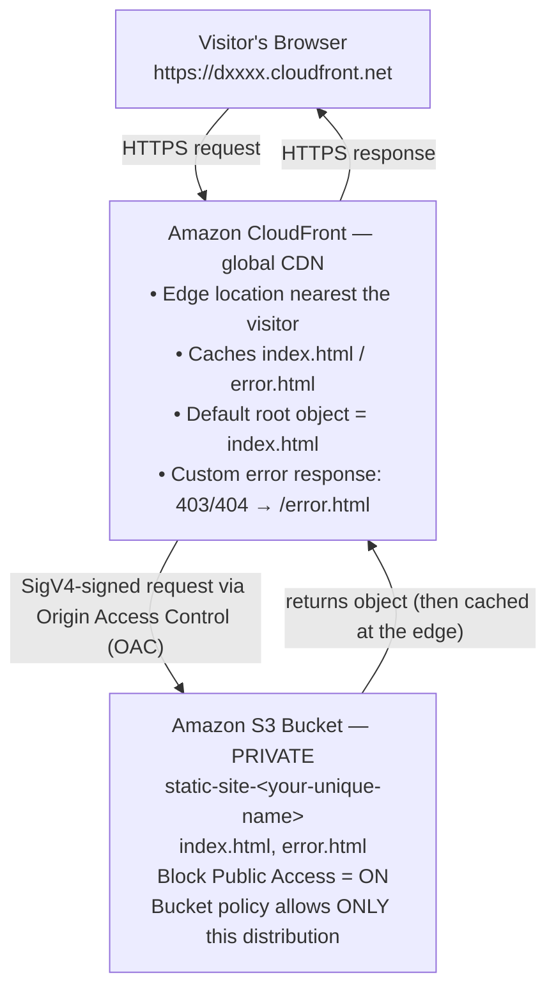

# S3 + CloudFront — Host a Static Website on a Global CDN

```yaml
level: beginner
cloud: aws
domain: storage
technology:
  - s3
  - cloudfront
  - oac
  - iam
estimated_time: 60 min
estimated_cost: free-tier
deployment_type: console + cli
cleanup_required: true
status: ready
```

## What You'll Build

You will host a simple HTML website in a **private Amazon S3 bucket** and serve it
to the world through the **Amazon CloudFront** content delivery network (CDN). The
bucket stays completely private — only CloudFront can read from it, using
**Origin Access Control (OAC)**. By the end of this project you will understand:

- How to create an S3 bucket to hold static website files
- Why the modern pattern keeps the bucket **private** and puts CloudFront in front of it
- How to create a CloudFront distribution and point it at your S3 bucket
- How to set the **default root object** (`index.html`) so `/` serves your home page
- How to configure a **custom error page** (`error.html`) for 403/404 responses
- What **caching**, **cache invalidation**, **error behavior**, **origin access**, and
  **Origin Access Control** actually mean — and when each matters

This project uses the minimum number of AWS services to make the concepts clear.

---

## Architecture



The visitor never talks to S3 directly. They only ever see the CloudFront URL.
S3 has **all public access blocked** — CloudFront is the only thing allowed to read
the files, and it proves who it is with a signed request created by OAC.

---

## Services Used

| Service | Role in this Project |
|---------|---------------------|
| **Amazon S3** | Stores your static files (`index.html`, `error.html`). The "origin". |
| **Amazon CloudFront** | Global CDN that caches and serves your files over HTTPS from edge locations. |
| **Origin Access Control (OAC)** | The mechanism that lets CloudFront — and only CloudFront — read your private bucket. |
| **AWS IAM / Bucket Policy** | A resource policy on the bucket that grants read access to your specific distribution. |

---

## Key Concepts

| Concept | What it Means |
|---------|--------------|
| **Origin** | The source CloudFront fetches content from. Here, your S3 bucket is the origin. |
| **Edge location** | One of CloudFront's globally distributed caches. Visitors are served from the nearest one for low latency. |
| **Distribution** | A CloudFront configuration. It gets a domain like `d111abc.cloudfront.net`. |
| **Default root object** | The file CloudFront returns when someone requests `/` (the root). You'll set this to `index.html`. |
| **Caching / TTL** | CloudFront keeps a copy of each file at the edge for a Time To Live (TTL). Repeat visitors are served from cache, not from S3. |
| **Cache invalidation** | A command that forces CloudFront to drop its cached copy so the next request fetches the fresh file from S3. Needed after you update a file. |
| **Error behavior** | A rule mapping an HTTP error code (e.g. 403, 404) from the origin to a custom page and response code you choose. |
| **Origin access** | The general question of *how* CloudFront is allowed to read the origin. |
| **Origin Access Control (OAC)** | The current, recommended way to give CloudFront private read access to S3 using SigV4-signed requests. Replaces the older "Origin Access Identity (OAI)". |

> **Origin access, explained simply:** there are three ways to let CloudFront read an S3 bucket:
> 1. **Public bucket + S3 website endpoint** — simplest, but the bucket is open to the entire internet. Not recommended.
> 2. **Origin Access Identity (OAI)** — older private method. Still works, but legacy.
> 3. **Origin Access Control (OAC)** — the modern method. Bucket stays private, supports all regions and SSE-KMS encryption. **This is what we use.**

---

## Project Structure

```
s3-cloudfront-static-website/
├── README.md                          ← You are here
├── src/
│   ├── index.html                     ← Home page (the default root object)
│   └── error.html                     ← Custom 404/403 error page
├── steps/
│   ├── 01-create-s3-bucket.md         ← Create a private S3 bucket
│   ├── 02-upload-website-files.md     ← Upload index.html and error.html
│   ├── 03-create-cloudfront.md        ← Create the distribution + OAC + bucket policy
│   ├── 04-error-pages-and-caching.md  ← Custom error page, default root, invalidation
│   └── 05-cleanup.md                  ← Delete all resources
├── costs.md                           ← Service-by-service cost breakdown
├── troubleshooting.md
└── challenges.md
```

---

## Prerequisites

| Requirement | Details |
|-------------|---------|
| AWS account | Console access; permissions for S3, CloudFront, IAM |
| AWS CLI | `aws --version` → 2.x (optional — every step has a Console walkthrough) |
| Region | S3 bucket created in **us-east-1**. CloudFront is global. |
| A unique bucket name | S3 bucket names are globally unique. Pick `static-site-<yourname>-<number>`. |

---

## What You'll Learn Step by Step

| Step | File | Goal |
|------|------|------|
| 1 | `01-create-s3-bucket.md` | Create a private S3 bucket with all public access blocked |
| 2 | `02-upload-website-files.md` | Upload `index.html` and `error.html` to the bucket |
| 3 | `03-create-cloudfront.md` | Create a CloudFront distribution, set up OAC, and update the bucket policy |
| 4 | `04-error-pages-and-caching.md` | Set the default root object, custom error page, and run a cache invalidation |
| 5 | `05-cleanup.md` | Disable and delete the distribution, empty and delete the bucket |

Start with **Step 1 →** [`steps/01-create-s3-bucket.md`](steps/01-create-s3-bucket.md)

---

## Estimated Time

45 – 60 minutes for a first-time learner. (Note: CloudFront distributions take
5–15 minutes to deploy each time you create or change them — plan for some waiting.)

## Estimated Cost

| Service | Configuration | Cost | Notes |
|---------|--------------|------|-------|
| **Amazon S3** | 2 tiny HTML files (~few KB) | **~$0.00** | Storage + requests far below the free tier |
| **Amazon CloudFront** | A handful of test requests | **~$0.00** | 1 TB data transfer + 10M requests/month always free |
| **Cache invalidations** | 1–2 invalidations | **Free** | First 1,000 invalidation paths per month are free |

**Typical project cost: $0.00** — this entire project fits inside the AWS Free Tier.

> ⚠️ There is no per-hour charge for an idle CloudFront distribution or for files
> sitting in S3, so the "left running" risk is tiny. Still, complete
> [Step 5 — Cleanup](steps/05-cleanup.md) so you don't accumulate stray resources.

For a full service-by-service breakdown and free tier details → see **[costs.md](costs.md)**.

---

## What's Next

After completing this project, try the extension ideas in **[challenges.md](challenges.md)** —
add a custom domain with HTTPS (ACM + Route 53), enable access logging, or restrict
access by geography.
