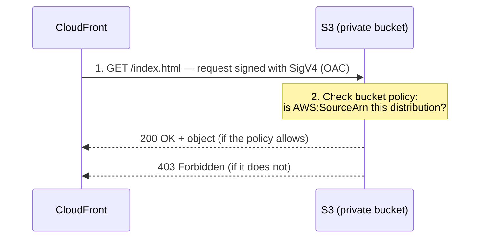

# Step 3 — CloudFront: Create the Distribution with Origin Access Control

This is the heart of the project. You'll create a **CloudFront distribution** that uses
your S3 bucket as its **origin**, and connect them with **Origin Access Control (OAC)**
so that CloudFront — and nothing else — can read your private bucket.

---

## 3.1 Concept — What is Origin Access Control (OAC)?

CloudFront needs permission to read files from your private S3 bucket. **Origin Access
Control** is how it proves its identity:



1. You create an **OAC** and attach it to the origin in your distribution.
2. CloudFront then **signs every request** it sends to S3 (AWS Signature Version 4).
3. You add a **bucket policy** that says: *"Allow `s3:GetObject` only when the request
   comes from this specific CloudFront distribution."*

The result: the bucket stays private, but CloudFront can read it.

> **OAC vs OAI:** You may see older guides use **Origin Access Identity (OAI)**. OAC is
> the newer replacement — it supports all AWS regions, SSE-KMS encryption, and all S3
> operations. **Always choose OAC for new projects.**

---

## 3.2 Console — Create the Distribution

1. Open the AWS Console and search for **CloudFront**.
2. Click **Create distribution**.
3. Under **Origin**:

   | Field | Value |
   |-------|-------|
   | Origin domain | Click the box and pick your bucket from the dropdown (`static-site-<your-unique-name>.s3.amazonaws.com`) |
   | Origin path | *(leave blank)* |
   | Name | *(auto-filled — leave it)* |

   > **Pick the bucket from the dropdown — do NOT type the S3 *website* endpoint.**
   > Using the bucket's REST endpoint (`...s3.amazonaws.com`) is what allows OAC to work.

4. Under **Origin access**, choose **Origin access control settings (recommended)**.
   - Click **Create new OAC**.
   - In the dialog, leave the defaults (Signing behavior: **Sign requests (recommended)**)
     and click **Create**.
   - The new OAC is now selected.

   > After you create the distribution, CloudFront shows a **yellow banner** with the
   > exact bucket policy you must paste into S3. You'll do that in step 3.4.

5. Under **Web Application Firewall (WAF)**, choose **Do not enable security protections**
   (keeps this project free and simple).

6. Under **Default cache behavior**:

   | Field | Value |
   |-------|-------|
   | Viewer protocol policy | **Redirect HTTP to HTTPS** |
   | Allowed HTTP methods | **GET, HEAD** |
   | Cache policy | **CachingOptimized** (AWS managed) |

7. Under **Settings**:

   | Field | Value |
   |-------|-------|
   | Price class | **Use all edge locations (best performance)** — or a cheaper class; both are free at this scale |
   | Default root object | `index.html` |

   > **Default root object = `index.html`** is what makes `https://dxxxx.cloudfront.net/`
   > (with no file name) serve your home page. Without it, the root URL returns an error.

8. Click **Create distribution**.

---

## 3.3 Console — Wait for Deployment

1. You're taken to the distribution's detail page.
2. The **Last modified** column shows **Deploying...** — this takes **5–15 minutes**
   as the config propagates to edge locations worldwide.
3. Copy the **Distribution domain name** — it looks like `d111abc123xyz.cloudfront.net`.
   This is your website's URL.

---

## 3.4 Console — Attach the Bucket Policy (grant CloudFront read access)

Right now CloudFront still gets **Access Denied** from S3, because the bucket policy
doesn't trust it yet. CloudFront generated the exact policy for you:

1. On the distribution page, look for the banner / the **Origins** tab.
2. Select your origin and click **Copy policy** (CloudFront builds it with the correct
   distribution ARN). It looks like this:

   ```json
   {
     "Version": "2012-10-17",
     "Statement": [
       {
         "Sid": "AllowCloudFrontServicePrincipalReadOnly",
         "Effect": "Allow",
         "Principal": {
           "Service": "cloudfront.amazonaws.com"
         },
         "Action": "s3:GetObject",
         "Resource": "arn:aws:s3:::static-site-<your-unique-name>/*",
         "Condition": {
           "StringEquals": {
             "AWS:SourceArn": "arn:aws:cloudfront::ACCOUNT_ID:distribution/DISTRIBUTION_ID"
           }
         }
       }
     ]
   }
   ```

3. Click **Go to S3 bucket permissions** (or open S3 → your bucket → **Permissions** tab).
4. Under **Bucket policy**, click **Edit**, paste the policy, and click **Save changes**.

**Read the policy:** it allows the `cloudfront.amazonaws.com` service to perform
`s3:GetObject` on your files — **but only** when the `AWS:SourceArn` matches *your*
distribution. No other distribution, account, or person can read the bucket.

---

## 3.5 AWS CLI (Alternative)

The Console is much easier for OAC because it generates the policy for you. If you prefer
the CLI, the high-level flow is:

```bash
# 1. Create the Origin Access Control
aws cloudfront create-origin-access-control \
  --origin-access-control-config \
  'Name=static-site-oac,SigningProtocol=sigv4,SigningBehavior=always,OriginAccessControlOriginType=s3'
# → note the OAC Id from the output

# 2. Create the distribution from a JSON config file that references:
#      - the S3 REST domain  (static-site-<your-unique-name>.s3.us-east-1.amazonaws.com)
#      - the OAC Id from step 1
#      - DefaultRootObject = index.html
# (Build the config with: aws cloudfront create-distribution --generate-cli-skeleton)
aws cloudfront create-distribution --distribution-config file://distribution-config.json
# → note the distribution Id and ARN from the output

# 3. Attach a bucket policy granting that distribution read access
aws s3api put-bucket-policy --bucket "$BUCKET" --policy '{
  "Version": "2012-10-17",
  "Statement": [{
    "Sid": "AllowCloudFrontServicePrincipalReadOnly",
    "Effect": "Allow",
    "Principal": { "Service": "cloudfront.amazonaws.com" },
    "Action": "s3:GetObject",
    "Resource": "arn:aws:s3:::'"$BUCKET"'/*",
    "Condition": { "StringEquals": {
      "AWS:SourceArn": "arn:aws:cloudfront::ACCOUNT_ID:distribution/DISTRIBUTION_ID"
    }}
  }]
}'
```

> For first-time learners, the **Console flow (3.2–3.4) is strongly recommended** — it
> wires up the OAC and generates the exact bucket policy automatically.

---

## 3.6 Test It

Once the distribution status is **Deployed** (not "Deploying"):

```bash
# Replace with your distribution domain
curl https://d111abc123xyz.cloudfront.net/
```

Or just open `https://d111abc123xyz.cloudfront.net/` in a browser. You should see the
**"It works! 🚀"** page — served from S3, through CloudFront, over HTTPS.

---

## Checkpoint

- [ ] Distribution created with the S3 bucket as origin (REST endpoint, **not** website endpoint)
- [ ] **Origin access** is set to **Origin access control (OAC)**
- [ ] **Default root object** is set to `index.html`
- [ ] Bucket policy granting the distribution `s3:GetObject` is saved on the bucket
- [ ] Distribution status is **Deployed**
- [ ] Opening the CloudFront domain shows `index.html`

---

**Next:** [Step 4 — Custom Error Pages, Caching, and Invalidation](./04-error-pages-and-caching.md)
