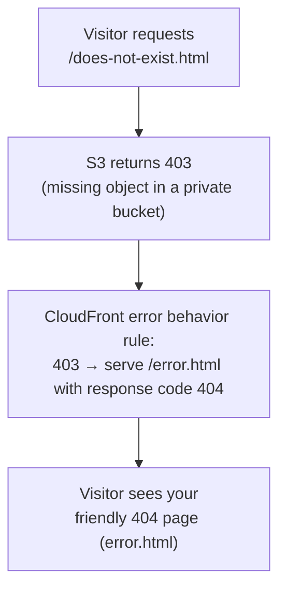
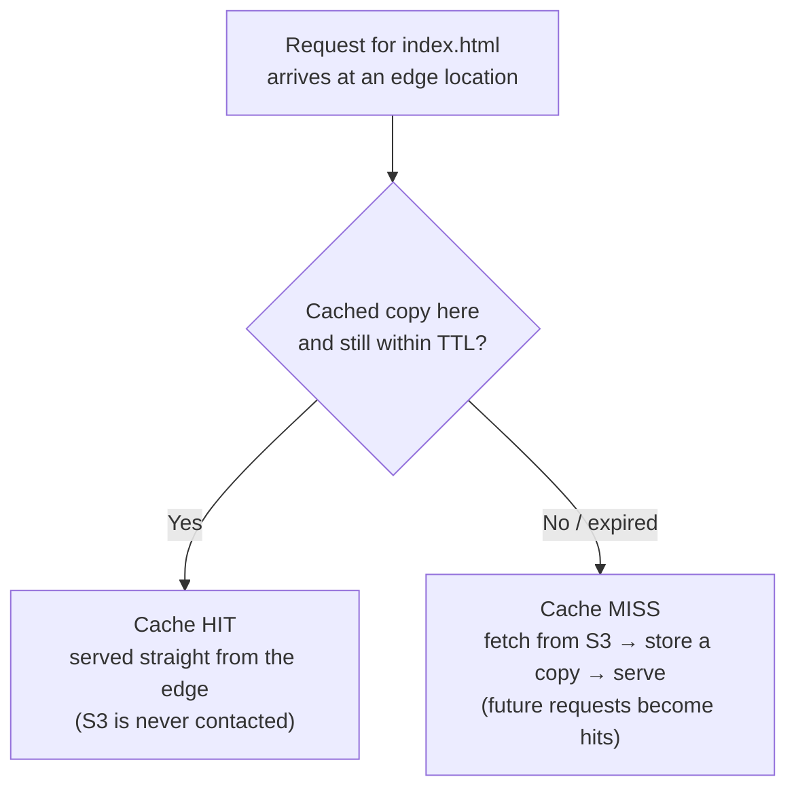
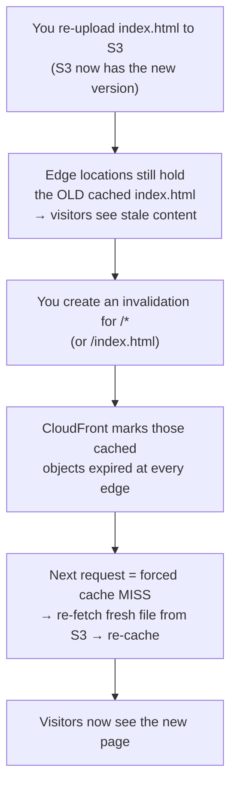

# Step 4 — Error Pages, Caching, and Cache Invalidation

Your site works. Now you'll make it behave like a real website: show a friendly page when
something is missing, and understand how CloudFront caches your files (and how to push
updates).

---

## 4.1 Concept — Error Behavior (Custom Error Responses)

When a visitor requests a file that doesn't exist, S3 returns an error. Because your bucket
is **private with OAC**, S3 returns **403 Forbidden** for a missing object (not the 404
you might expect — S3 won't reveal whether the object exists to an unauthorized-looking
request). By default CloudFront passes that raw error straight to the visitor.

A **custom error response** lets you intercept that error code and instead return your own
page with a chosen status code:



---

## 4.2 Console — Add Custom Error Responses

1. Open **CloudFront** → click your distribution → **Error pages** tab.
2. Click **Create custom error response**.
3. Fill in for **403**:

   | Field | Value |
   |-------|-------|
   | HTTP error code | **403: Forbidden** |
   | Customize error response | **Yes** |
   | Response page path | `/error.html` |
   | HTTP Response code | **404: Not Found** |

4. Click **Create custom error response**.
5. Click **Create custom error response** again and repeat for **404**:

   | Field | Value |
   |-------|-------|
   | HTTP error code | **404: Not Found** |
   | Customize error response | **Yes** |
   | Response page path | `/error.html` |
   | HTTP Response code | **404: Not Found** |

> We map **both 403 and 404** to `/error.html`. The 403 mapping is the important one for a
> private-bucket setup; the 404 mapping covers any case where S3 does return a true 404.

6. Wait for the distribution to redeploy (a few minutes), then test:

   ```bash
   curl -i https://d111abc123xyz.cloudfront.net/nope.html
   ```

   You should get your `error.html` content with `HTTP/2 404`.

---

## 4.3 Concept — Caching and TTL

CloudFront's whole job is to **cache** your files at edge locations so visitors are served
quickly and S3 isn't hit on every request.

- The first request for `index.html` is a **cache miss**: CloudFront fetches it from S3,
  returns it, and stores a copy at that edge location.
- Later requests are **cache hits**: served straight from the edge, never touching S3.
- How long a copy is kept is the **TTL** (Time To Live), set by the cache policy
  (`CachingOptimized` defaults to about 24 hours).



You can confirm a hit vs miss from the response header:

```bash
curl -I https://d111abc123xyz.cloudfront.net/ | grep -i x-cache
# x-cache: Miss from cloudfront   ← first request
# x-cache: Hit from cloudfront    ← subsequent requests
```

---

## 4.4 Concept — Cache Invalidation

### The problem invalidation solves

Caching is what makes CloudFront fast, but it creates one predictable headache: **stale
content**. Once an edge location has cached `index.html`, it keeps serving that exact copy
until the TTL expires — which, with `CachingOptimized`, can be up to **24 hours**. The edge
has no idea you changed the file in S3. From its point of view, the cached copy is still
"fresh enough."

So this very normal sequence breaks:

1. You edit `index.html` and re-upload it to S3.
2. You refresh the CloudFront URL.
3. You **still see the old page** — and so does every visitor — for up to a full day.

S3 has the new file. The edge is serving the old one. Nothing is broken; CloudFront is
doing exactly what you told it to do. You just have no way to see your update until the TTL
runs out.

### What an invalidation actually does

A **cache invalidation** is an explicit command to CloudFront: *"drop your cached copies of
these paths, across all edge locations, right now."* It does **not** delete anything from
S3 and it does **not** push the new file anywhere. It simply marks the cached objects as
expired so that the **next** request for each path is forced to be a cache miss — CloudFront
re-fetches the current file from S3 and caches that.



### Why it matters

- **You control when updates go live.** Without invalidation your only options are to wait
  out the TTL or to set very short TTLs everywhere — and short TTLs throw away most of the
  performance benefit of a CDN (every edge keeps going back to S3). Invalidation lets you
  keep long TTLs (fast, cheap, low origin load) *and* still ship an update the moment you
  need to.
- **It's how you fix mistakes fast.** Pushed a typo, a broken link, or wrong pricing to your
  homepage? A 24-hour wait is not acceptable. An invalidation makes the correction visible
  in seconds-to-a-minute.
- **It keeps the bucket as the source of truth.** Your deploy process only ever uploads to
  S3. Invalidation is the one extra step that makes "what's in S3" and "what visitors see"
  line up again — without it, those two can silently drift apart.

### How it behaves (things worth knowing)

- **Paths, not files.** You invalidate **paths** like `/index.html`, `/css/site.css`, or a
  wildcard like `/*` (everything) or `/images/*` (a subtree). The path is matched against
  the request URL, not the S3 key.
- **It's global and asynchronous.** One invalidation request fans out to every edge
  location. CloudFront reports it as `InProgress`, then `Completed`. For a small site it
  usually finishes in a few seconds up to a minute.
- **It only affects already-cached copies.** Objects not currently cached are unaffected
  (there's nothing to drop). Requests in flight may still get the old copy until the
  invalidation completes.
- **It doesn't warm the cache.** The new file isn't fetched until the *next* request. The
  first visitor after an invalidation pays the cache-miss cost; everyone after them gets the
  cached fresh copy.

### When to invalidate vs. when not to

| Situation | Best approach |
|-----------|---------------|
| Small HTML site, occasional edits (this project) | Invalidate `/*` after each upload — simple and free at this scale. |
| Frequent deploys, many assets (CSS/JS/images) | **Versioned file names** (`app.a1b2c3.js`) so each new build has a brand-new URL → no invalidation needed, infinite cache. |
| One file changed | Invalidate just that path (`/index.html`) instead of `/*` — more precise, and keeps the rest of your cache warm. |
| Content that must always be current | Set a short/zero TTL on that specific path via a cache policy, rather than invalidating constantly. |

> **Why versioning is the production favourite:** an invalidation tells every edge to throw
> away good cache; a new file name means the old URL is still validly cached and the new URL
> is simply a fresh miss. No cache is wasted, and you never race against propagation time.
> For a simple site, though, `/*` invalidation is perfectly fine and easier to reason about.

---

## 4.5 Action — Run a Cache Invalidation

**Try it:**

1. Edit `src/index.html` (change the heading text), then re-upload it to S3
   (Step 2 again, or `aws s3 cp`).
2. Refresh the CloudFront URL — you still see the old text (cached).
3. In **CloudFront** → your distribution → **Invalidations** tab → **Create invalidation**.
4. Under **Add object paths**, enter:
   ```
   /*
   ```
   (`/*` invalidates everything. You could also invalidate just `/index.html`.)
5. Click **Create invalidation**. It completes in a few seconds to a minute.
6. Refresh the CloudFront URL — your updated page now appears.

> **Cost note:** the first **1,000 invalidation paths per month are free**. `/*` counts as
> a single path. After that, it's $0.005 per path. For learning, you'll never hit the limit.
> (See the *When to invalidate vs. when not to* table above for why production sites often
> avoid invalidations altogether by versioning file names.)

### AWS CLI (Alternative)

```bash
aws cloudfront create-invalidation \
  --distribution-id DISTRIBUTION_ID \
  --paths "/*"
```

---

## Checkpoint

- [ ] Custom error responses map **403 → /error.html (404)** and **404 → /error.html (404)**
- [ ] Requesting a non-existent path shows your `error.html`
- [ ] You understand cache **Hit** vs **Miss** from the `x-cache` header
- [ ] You can explain **why** invalidation is needed (stale edge cache vs. updated S3 file)
- [ ] You know an invalidation drops cached copies (it does **not** push or delete S3 files)
- [ ] You edited a file, re-uploaded it, and used an **invalidation** to make the change live
- [ ] You know when to invalidate `/*` vs. a single path vs. versioned file names

---

**Next:** [Step 5 — Clean Up All Resources](./05-cleanup.md)
