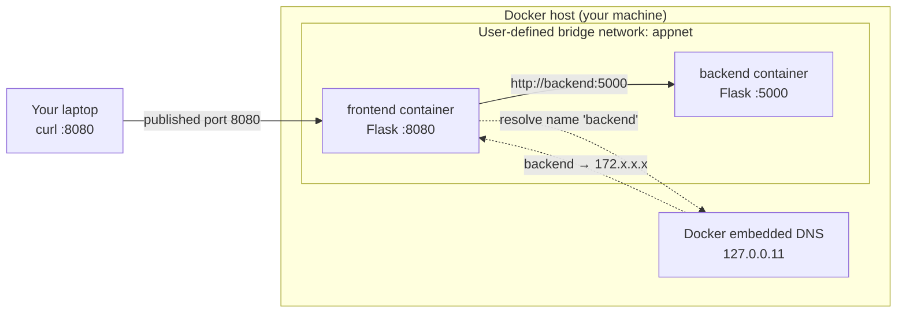
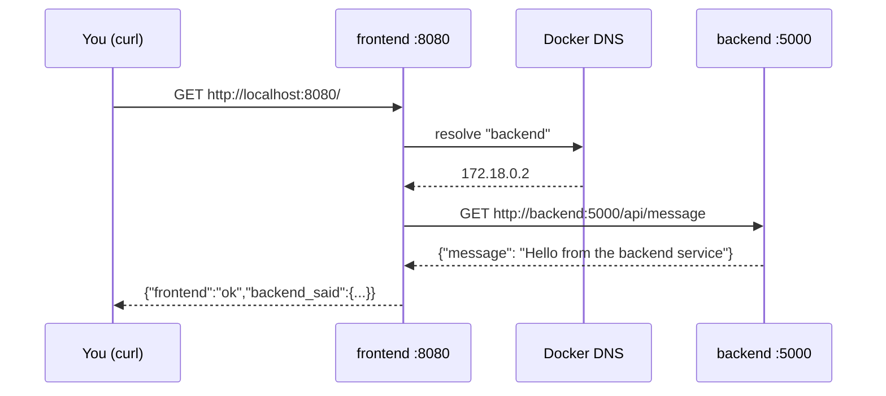

# Docker Networking Basics — Two Flask Containers That Talk

```yaml
level: beginner
cloud: docker
domain: networking
technology:
  - docker
  - docker-compose
  - flask
  - bridge-network
estimated_time: 45-60 minutes
estimated_cost: free-tier
deployment_type: cli
cleanup_required: true
status: ready
```

> **One-line pitch:** Run two Flask containers — a `frontend` that calls a `backend` by name —
> and learn how Docker container networking actually enables that connectivity, first with raw
> `docker` commands, then with Docker Compose.

## Learning objectives

By the end you will be able to:

- Explain the difference between Docker's **default bridge** and a **user-defined bridge network**
- Understand **why container-name DNS works on a user-defined network but not the default bridge**
- Create a network with `docker network create` and attach containers to it (`--network`)
- Prove connectivity between containers by hostname, and inspect a network with `docker network inspect`
- Reproduce the exact same setup with a single `docker compose up` and understand what Compose did for you
- Tear it all down cleanly (containers, network, images)

## Real-world use case

Almost every containerized app is more than one container: a web tier talking to an API, an API
talking to a database, a worker talking to a queue. In production those pieces find each other by
**name**, not by IP address — because IPs change every time a container restarts. Docker's
user-defined networks give each container a stable DNS name (its container/service name), which is
the foundation that Docker Compose, Docker Swarm, and even Kubernetes Services all build on. This
lab is the smallest possible version of that pattern.

## What you'll build

- Two tiny Flask images: `flask-net-backend` (a JSON API) and `flask-net-frontend` (calls the backend)
- A user-defined bridge network named **`appnet`**
- Two running containers, `backend` and `frontend`, that talk to each other **by name** over `appnet`
- The **same** system a second way, with a 20-line `docker-compose.yml`

## Architecture



### Request flow



## Prerequisites

Summarized here; see [prerequisites.md](prerequisites.md) for the full list.

- **Docker Engine 20.10+** with the **Compose v2 plugin** (`docker compose`, not `docker-compose`)
- A terminal; no cloud account and no paid resources — everything runs locally
- Basic comfort running commands and reading JSON output

## Project structure

```
docker-network-flask-basics/
├── README.md                       ← You are here
├── prerequisites.md
├── docker-compose.yml              ← The Compose version of Steps 3–4
├── src/
│   ├── backend/                    ← JSON API (owns the data)
│   │   ├── app.py
│   │   ├── requirements.txt
│   │   └── Dockerfile
│   └── frontend/                   ← Calls the backend by name
│       ├── app.py
│       ├── requirements.txt
│       └── Dockerfile
├── steps/
│   ├── 01-introduction.md          ← Docker networking concepts + the plan
│   ├── 02-build-images.md          ← Build both images with docker build
│   ├── 03-default-bridge.md        ← Watch name resolution FAIL on the default bridge
│   ├── 04-user-defined-network.md  ← Create a network → connectivity works by name
│   ├── 05-docker-compose.md        ← The same thing in one command
│   └── 06-cleanup.md               ← Remove containers, network, images
├── troubleshooting.md
├── challenges.md
└── references.md
```

## Steps

| # | Step | What you do |
|---|------|-------------|
| 1 | [Introduction](steps/01-introduction.md) | Learn bridge vs. user-defined networks and Docker DNS |
| 2 | [Build images](steps/02-build-images.md) | `docker build` the backend and frontend images |
| 3 | [Default bridge limitation](steps/03-default-bridge.md) | Run both on the default bridge and watch name resolution fail |
| 4 | [User-defined network](steps/04-user-defined-network.md) | `docker network create appnet`, attach both, connectivity works |
| 5 | [Docker Compose](steps/05-docker-compose.md) | Reproduce it all with one `docker compose up` |
| 6 | [Cleanup](steps/06-cleanup.md) | Remove containers, the network, and the images |

Start with **Step 1 →** [`steps/01-introduction.md`](steps/01-introduction.md)

## Validation checklist

- [ ] `docker images` lists `flask-net-backend:1.0` and `flask-net-frontend:1.0`
- [ ] On the **default bridge**, the frontend returns a `503` with a DNS resolution error for `backend`
- [ ] On **`appnet`**, `curl localhost:8080` returns the backend's JSON message
- [ ] `docker network inspect appnet` shows both containers attached
- [ ] `docker compose up` produces the same working result
- [ ] After cleanup, `docker ps -a`, `docker network ls`, and `docker images` show none of the lab resources

## 💰 Cost

| Resource | Cost | Free tier? |
|----------|------|-----------|
| Docker Engine (local) | **$0** | N/A — runs on your machine |
| Images / containers / network | **$0** | N/A — no cloud resources created |

**Estimated total for this lab:** **$0.00** — nothing here touches a cloud provider.
**⚠️ Left running:** only local CPU/RAM; still do the cleanup step to reclaim disk used by the images.

## 🧹 Cleanup

> **⚠️ Do the cleanup step.** It doesn't cost money, but it frees the disk the images use and removes
> the network and containers so they don't clutter later labs.

Cleanup is [Step 6](steps/06-cleanup.md). It stops and removes both containers, deletes the `appnet`
network, brings down the Compose stack, and removes the two images.

## Troubleshooting

See [troubleshooting.md](troubleshooting.md) — `Error → Cause → Fix`.

## Challenges

See [challenges.md](challenges.md) for extension tasks (add a database container, custom DNS aliases,
network isolation between two networks, and more).

## What to try next

- Related project: [ECS on Fargate Basics](../../../intermediate/aws/aws-ecs-fargate-basics/README.md) — run the same kind of container in the cloud
- Related project: [Monolith → Microservices on EKS](../../../advanced/kubernetes/eks-monolith-to-microservices/README.md) — the Kubernetes version of service-to-service DNS

## References

See [references.md](references.md) for official Docker networking docs.
