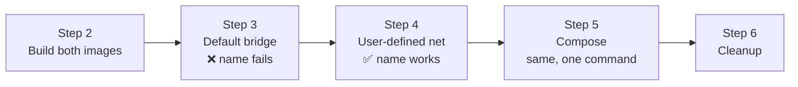

# Step 1 — Introduction: How Docker Containers Find Each Other

Before we touch a command, let's build the mental model. This whole lab exists to answer one
question: **when the `frontend` container wants to call the `backend` container, how does it find
it?**

---

## 1.1 The problem: containers have changing IPs

Every container gets its own IP address on a Docker network. But those IPs are **not stable** — stop
and restart a container and it may come back with a different IP. So you can't hardcode
`http://172.18.0.2:5000` in your code. You need to reach the backend by a **name** that stays the
same. That name is the **container name** (or, with Compose, the **service name**).

The catch: *whether a name resolves depends on which kind of network the containers are on.*

---

## 1.2 The two bridge networks

When you install Docker you get a few networks out of the box. Run `docker network ls` and you'll see
at least these:

| Network | Driver | What it is |
|---------|--------|-----------|
| `bridge` | bridge | The **default bridge** — every container joins this unless you say otherwise |
| `host` | host | The container shares the host's network stack directly (no isolation) |
| `none` | null | No networking at all |

There are two kinds of **bridge** networks, and the difference between them is the key lesson:

| | **Default bridge** (`bridge`) | **User-defined bridge** (you create it) |
|---|---|---|
| DNS by container name | ❌ **No** — names don't resolve | ✅ **Yes** — Docker runs an embedded DNS server |
| How containers reach each other | IP address only (or the legacy `--link` flag) | By **container name**, automatically |
| Isolation | All default containers share one network | Each network is its own isolated segment |
| Recommended? | No (legacy behavior) | **Yes** — this is the modern way |

> **The single most important fact in this project:** container-name DNS works on **user-defined**
> networks, but **not** on the default bridge. We'll prove both halves of that with our own eyes.

---

## 1.3 Docker's embedded DNS

On a user-defined network, Docker runs a tiny DNS server at `127.0.0.11` inside every container. When
the frontend looks up `backend`, that DNS server answers with the backend's current IP — whatever it
happens to be right now. Your code says `http://backend:5000` and never has to care about IPs. This
is exactly the mechanism Docker Compose, Swarm, and (conceptually) Kubernetes Services all rely on.

---

## 1.4 The app we'll run

Two dead-simple Flask services (full code in [`src/`](../src)):

- **backend** ([`src/backend/app.py`](../src/backend/app.py)) — a JSON API. `GET /api/message`
  returns a greeting and the container's hostname. Listens on port **5000**. It never gets published
  to your host — it's reachable only *inside* the Docker network.
- **frontend** ([`src/frontend/app.py`](../src/frontend/app.py)) — calls
  `http://backend:5000/api/message` and returns the result. Listens on port **8080**, which we
  **publish** to your host so you can `curl localhost:8080`.

The frontend's target is controlled by the `BACKEND_URL` env var, defaulting to `http://backend:5000`.
That hostname `backend` is the thing that will fail to resolve in Step 3 and succeed in Step 4.

---

## 1.5 The plan

We deliberately do it the **hard way first** (Steps 3–4, raw `docker` commands) so that when Compose
does it all in one line (Step 5), you understand exactly what it created for you.

---

## Checkpoint

- [ ] You can state the difference between the default bridge and a user-defined bridge
- [ ] You know that container-name DNS works only on user-defined networks
- [ ] You understand why we reach the backend by **name**, not IP
- [ ] Docker is running (`docker run --rm hello-world` works)

---

**Next:** [Step 2 — Build the Images](02-build-images.md)
