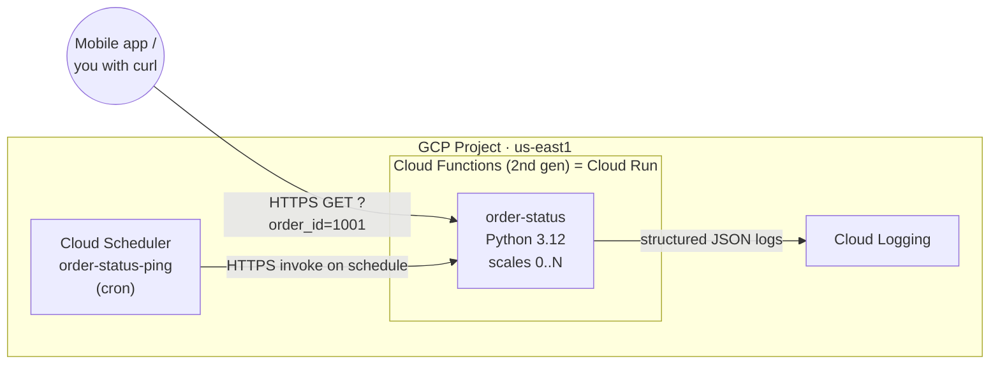
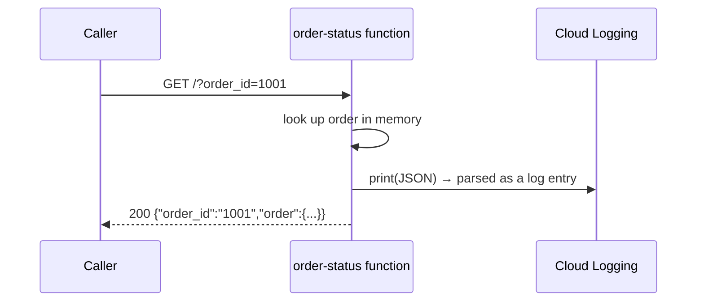

# GCP Cloud Functions Basics — Your First Serverless Function

```yaml
level: beginner
cloud: gcp
domain: serverless
technology:
  - cloud-functions
  - cloud-run-functions
  - cloud-scheduler
  - cloud-logging
estimated_time: 60 min
estimated_cost: free-tier
deployment_type: console + gcloud
cleanup_required: true
status: ready
```

> **One-line pitch:** Deploy a Python HTTP function to **Cloud Functions (2nd gen)**, call it over
> HTTPS, read its logs, and put it on a **schedule** with Cloud Scheduler — no servers, no containers
> to manage.

## What You'll Build

You'll write a tiny Python function that answers *"what's the status of order N?"* and deploy it to
**Cloud Functions (2nd gen)** — Google Cloud's event-driven, **scale-to-zero** function platform
(now branded **Cloud Run functions**, because 2nd-gen functions run on the Cloud Run infrastructure).
You'll invoke it over HTTPS, change its behaviour with **environment variables** (no rebuild), read
its output in **Cloud Logging**, and finally have **Cloud Scheduler** call it on a cron schedule.

By the end you'll understand:

- What a **Cloud Function** is and how 2nd gen differs from 1st gen (it *is* a Cloud Run service)
- The **Functions Framework** — how `functions_framework.http` turns a plain Python function into a
  web handler, and why that means **no Flask boilerplate, no `Dockerfile`**
- How Google builds your source into a container for you with **Cloud Build + buildpacks**
- **Structured logging** — emit one JSON line and Cloud Logging gives you real severities + fields
- **Cloud Scheduler** — a managed cron that invokes your function (or any HTTP target) on a schedule

This is the **beginner** project in the GCP **Serverless** track. It's the GCP counterpart to this
repo's [`aws-lambda-basics`](../../../beginner/aws/aws-lambda-basics/README.md). The
[intermediate project](../../../intermediate/gcp/gcp-event-driven-functions-pubsub/README.md) makes
functions fire from **events** (a file upload) instead of HTTP.

## Learning Objectives

By the end you will be able to:

- Deploy a Python HTTP function with a single `gcloud functions deploy` command
- Explain the Functions Framework signature and why 2nd-gen functions run on Cloud Run
- Inject runtime config with `--set-env-vars` and read it back in the response
- Find and query your function's logs in Cloud Logging (Console + `gcloud`)
- Schedule recurring invocations with Cloud Scheduler and understand the auth model

## Real-World Use Case

Meridian Retail wants a lightweight **order-status endpoint** their mobile app can call, plus a
nightly job that "pings" the service to confirm it's healthy. There's no need for an always-on server
for a function that runs for a few hundred milliseconds per request — a serverless function that
scales to zero when idle is the cheapest, simplest fit. This is the exact shape of thousands of small
production endpoints: webhooks, form handlers, glue APIs, scheduled maintenance jobs.

## Architecture



### Request flow



## Services Used

| Service | Role in this Project |
|---------|---------------------|
| **Cloud Functions (2nd gen)** | Runs your Python function as a scale-to-zero HTTPS endpoint |
| **Cloud Build + buildpacks** | Turns your source into a container image automatically (you write no `Dockerfile`) |
| **Cloud Run** | The under-the-hood runtime for 2nd-gen functions (you'll see the service appear) |
| **Cloud Scheduler** | Managed cron that invokes the function on a recurring schedule |
| **Cloud Logging** | Collects `stdout`/`stderr`; structured JSON becomes queryable log fields |

## Key Concepts

| Concept | What it means |
|---------|---------------|
| **Cloud Function** | A single-purpose function GCP runs for you in response to a trigger (HTTP or event) |
| **1st vs 2nd gen** | 2nd gen (Cloud Run functions) runs on Cloud Run + Eventarc — more triggers, concurrency, longer timeouts. Use 2nd gen. |
| **Functions Framework** | The library that adapts your `def fn(request)` into a web server; the `@functions_framework.http` decorator marks the HTTP entry point |
| **Buildpacks** | Google detects Python, installs `requirements.txt`, and containerizes your code — no `Dockerfile` |
| **Entry point** | The name of the function to invoke (`--entry-point order_status`) — must match your Python function name |
| **Scale to zero** | With no traffic, **0** instances run and you pay nothing for idle |
| **Structured logging** | Printing a JSON object with a `severity` key gives Cloud Logging a real level + searchable fields |

## Project Structure

```
gcp-cloud-functions-basics/
├── README.md                       ← You are here
├── prerequisites.md
├── src/
│   ├── main.py                     ← order_status(request) — the whole app
│   ├── requirements.txt            ← functions-framework
│   └── .gcloudignore               ← keep the uploaded source tiny
├── steps/
│   ├── 01-setup.md                 ← Project, enable APIs, set region, run it locally
│   ├── 02-deploy-http-function.md  ← Deploy with gcloud, get the HTTPS URL
│   ├── 03-invoke-and-config.md     ← Call it, change env vars, redeploy
│   ├── 04-logging.md               ← Read + query structured logs
│   ├── 05-schedule.md              ← Cloud Scheduler cron invocation
│   └── 06-cleanup.md               ← Delete the function, schedule, and Cloud Run service
├── troubleshooting.md
├── challenges.md
└── references.md
```

## Prerequisites

Summarized here; full list in [prerequisites.md](prerequisites.md).

| Requirement | Details |
|-------------|---------|
| gcloud CLI | Installed & authenticated — see [`gcp-vpc-firewall-basics` Step 1](../../../beginner/gcp/gcp-vpc-firewall-basics/steps/01-install-gcloud.md) |
| A GCP project | With billing linked (2nd-gen functions build on Cloud Build/Run and need billing) |
| Region | All steps use **`us-east1`** |
| Python 3.12 | Only needed for the optional *run it locally* step; deployment builds server-side |

## Steps

| # | Step | What you do |
|---|------|-------------|
| 1 | [Setup](steps/01-setup.md) | Select a project, enable the Functions/Build/Run/Scheduler APIs, set region, run the function locally |
| 2 | [Deploy the HTTP function](steps/02-deploy-http-function.md) | `gcloud functions deploy` (2nd gen), get the HTTPS URL |
| 3 | [Invoke & configure](steps/03-invoke-and-config.md) | Call it with `order_id`, change env vars, redeploy |
| 4 | [Logging](steps/04-logging.md) | Read and query structured logs in Cloud Logging |
| 5 | [Schedule it](steps/05-schedule.md) | Create a Cloud Scheduler job that pings the function on a cron |
| 6 | [Cleanup](steps/06-cleanup.md) | Delete the schedule, function, and the underlying Cloud Run service |

Start with **Step 1 →** [`steps/01-setup.md`](steps/01-setup.md)

## Validation Checklist

- [ ] `gcloud functions deploy` succeeds and prints an HTTPS **url**
- [ ] `curl "$URL?order_id=1001"` returns the order JSON
- [ ] Changing `STORE_NAME` and redeploying changes the response — no code change
- [ ] Your structured logs appear in Cloud Logging with `severity` and custom fields
- [ ] The Cloud Scheduler job runs and you see heartbeat pings in the logs

## 💰 Cost

| Resource | Configuration | Cost | Free tier? |
|----------|--------------|------|-----------|
| **Cloud Functions (2nd gen)** | a handful of sub-second invocations | **~$0** | 2M invocations + 400k GB-sec/month free |
| **Cloud Build** | 2–3 tiny buildpack builds | **~$0** | 120 build-minutes/day free |
| **Cloud Run** | scale-to-zero runtime | **~$0** | idle = $0; well inside the free grant |
| **Cloud Scheduler** | 1 job | **~$0** | first **3 jobs/month are free** |
| **Cloud Logging** | a few KB of logs | **~$0** | 50 GiB/month free |

**Estimated total for this lab: $0.00** if you clean up the same day — everything stays inside the
free tiers. **⚠️ Left running:** a deployed function + its Cloud Run service and a Scheduler job still
*exist* even at $0 traffic; delete them in Step 6.

## 🧹 Cleanup

> **⚠️ Do the cleanup step.** Even scale-to-zero resources linger until deleted.

Cleanup is [Step 6](steps/06-cleanup.md): delete the Scheduler job, delete the function (which
removes the backing Cloud Run service), and optionally disable the APIs.

## Troubleshooting

See [troubleshooting.md](troubleshooting.md) — `Error → Cause → Fix`.

## Challenges

See [challenges.md](challenges.md) for extension tasks (require auth, add a second route, wire an
event trigger, and more).

## What to Try Next

- [GCP Event-Driven Functions with Pub/Sub](../../../intermediate/gcp/gcp-event-driven-functions-pubsub/README.md)
  — the **intermediate** project: fire functions from a **file upload** via Eventarc, write to
  Firestore, and fan out with Pub/Sub.
- Compare with the AWS path: [`aws-lambda-basics`](../../../beginner/aws/aws-lambda-basics/README.md)
  and [`aws-lambda-eventbridge-scheduled`](../../../beginner/aws/aws-lambda-eventbridge-scheduled/README.md).

## References

See [references.md](references.md) for official docs.
