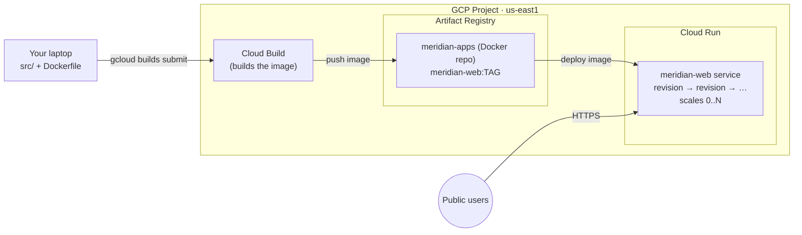

# GCP Cloud Run & Artifact Registry — Build, Push, Deploy a Container

```yaml
level: beginner
cloud: gcp
domain: serverless
technology:
  - cloud-run
  - artifact-registry
  - cloud-build
  - containers
estimated_time: 60 min
estimated_cost: free-tier
deployment_type: console + gcloud
cleanup_required: true
status: ready
```

## What You'll Build

You'll take a small Flask app, **build it into a container image with Cloud Build**, store that
image in a private **Artifact Registry** repository, and **deploy it to Cloud Run** — Google Cloud's
fully-managed, scale-to-zero container platform. Then you'll change the app, rebuild, and roll the
new version out (and back) using Cloud Run **revisions**. By the end you'll understand:

- What a **container registry** is and why **Artifact Registry** replaced Container Registry
- How **Cloud Build** turns your source + `Dockerfile` into a pushed image with one command
- What **Cloud Run** is: request-driven, **scale-to-zero**, pay-per-use container hosting
- How a Cloud Run **revision** works, and how **traffic splitting** lets you roll back instantly
- The image-naming scheme (`REGION-docker.pkg.dev/PROJECT/REPO/IMAGE:TAG`) you'll use everywhere

This is the **beginner** project in the GCP **App Delivery** track. The
[intermediate project](../../../intermediate/gcp/gcp-cloud-deploy-pipeline/README.md) takes the
same image and promotes it through **staging → prod** with **Cloud Deploy**.

---

## Architecture



---

## Services Used

| Service | Role in this Project |
|---------|---------------------|
| **Cloud Build** | Builds your `Dockerfile` into an image and pushes it — no local Docker needed |
| **Artifact Registry** | Private, regional Docker repository that stores your image |
| **Cloud Run** | Runs the container as a serverless HTTPS service that scales to zero |
| **Cloud IAM / gcloud** | Authentication and the project boundary |

---

## Key Concepts

| Concept | What it means |
|---------|---------------|
| **Container image** | A packaged, runnable snapshot of your app + its dependencies |
| **Artifact Registry** | GCP's managed registry; repos are **regional** and format-typed (Docker here) |
| **Image path** | `REGION-docker.pkg.dev/PROJECT/REPO/IMAGE:TAG` — how every tool names the image |
| **Cloud Build** | Server-side builder; `gcloud builds submit` uploads source and returns a pushed image |
| **Cloud Run service** | A URL-addressable app; you deploy an **image**, it manages instances for you |
| **Revision** | An immutable snapshot of a service (image + config); each deploy creates a new one |
| **Scale to zero** | With no traffic, Cloud Run runs **0** instances — you pay nothing for idle |
| **Traffic split** | Route % of requests across revisions — the basis for rollback and canary |

---

## Project Structure

```
gcp-cloud-run-artifact-registry/
├── README.md                       ← You are here
├── src/
│   ├── app.py                      ← Flask app: / (JSON greeting) + /healthz
│   ├── requirements.txt            ← flask==3.1.0 + gunicorn
│   ├── Dockerfile                  ← python:3.12-slim + gunicorn on $PORT
│   └── cloudbuild.yaml             ← Cloud Build config (build + push) alternative
├── steps/
│   ├── 01-setup.md                 ← Project, enable APIs (run/build/artifacts), set region
│   ├── 02-artifact-registry.md     ← Create the Docker repo + configure auth
│   ├── 03-build-with-cloud-build.md← Build & push the image (one-liner + cloudbuild.yaml)
│   ├── 04-deploy-cloud-run.md      ← Deploy the image, get an HTTPS URL, set env vars
│   ├── 05-update-and-revisions.md  ← Rebuild v2, split traffic, roll back
│   └── 06-cleanup.md               ← Delete the service, repo, and images
├── costs.md
├── troubleshooting.md
└── challenges.md
```

---

## Prerequisites

| Requirement | Details |
|-------------|---------|
| gcloud CLI | Installed & authenticated — see the [networking project's Step 1](../../../beginner/gcp/gcp-vpc-firewall-basics/steps/01-install-gcloud.md) |
| A GCP project | With billing linked (Cloud Run requires billing even on free tier) |
| Region | All steps use **`us-east1`** |
| Local Docker | **Not required** — Cloud Build does the building server-side |

---

## What You'll Learn Step by Step

| Step | File | Goal |
|------|------|------|
| 1 | `01-setup.md` | Select a project, enable the Run/Build/Artifact Registry APIs, set the region |
| 2 | `02-artifact-registry.md` | Create a Docker repository and configure Docker auth |
| 3 | `03-build-with-cloud-build.md` | Build the image with Cloud Build and see it land in the repo |
| 4 | `04-deploy-cloud-run.md` | Deploy the image to Cloud Run and call the public URL |
| 5 | `05-update-and-revisions.md` | Ship v2, split traffic across revisions, roll back |
| 6 | `06-cleanup.md` | Delete the service, images, and repository |

Start with **Step 1 →** [`steps/01-setup.md`](steps/01-setup.md)

---

## Estimated Time

45 – 75 minutes for a first-time learner.

## Estimated Cost

| Resource | Configuration | Cost | Notes |
|----------|--------------|------|-------|
| **Cloud Run** | scale-to-zero, a few requests | **~$0** | 2M requests + 180k vCPU-sec/month free; idle = $0 |
| **Cloud Build** | 2–3 small builds | **~$0** | First **120 build-minutes/day** are free |
| **Artifact Registry** | 1 small image (~150 MB) | **~$0** | First **0.5 GB storage** is free |
| **Egress** | A few responses | **~$0** | Well within free egress |

**Typical session cost: $0.00** if you clean up the same day — this project stays inside the free
tiers. See [costs.md](costs.md) for the details and where charges *would* appear if you left it up.

> ⚠️ Cloud Run scales to zero, but a **deployed service and stored images still exist**. Finish
> [Step 6 — Cleanup](steps/06-cleanup.md) so nothing lingers on your bill.

---

## What's Next

- [GCP Cloud Deploy Pipeline](../../../intermediate/gcp/gcp-cloud-deploy-pipeline/README.md) — the
  **intermediate** project: wrap this same image in a **Cloud Deploy** delivery pipeline that
  promotes it through **staging → prod** with an approval gate and one-command rollback.
- Compare with the AWS container path in this repo:
  [ECS Fargate Basics](../../../intermediate/aws/aws-ecs-fargate-basics/README.md) (ECR + Fargate).
