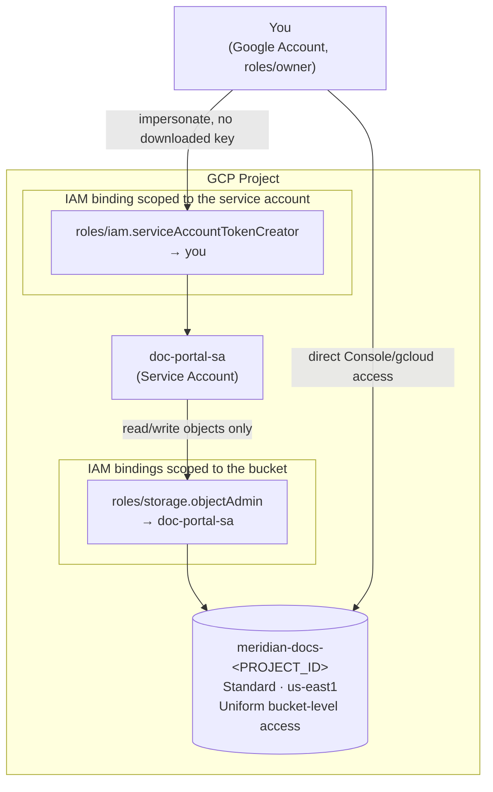

# GCP IAM & Storage Fundamentals — Principals, Roles, and a Least-Privilege Bucket

```yaml
level: beginner
cloud: gcp
domain: security-iam
technology:
  - iam
  - service-accounts
  - cloud-storage
estimated_time: 60-75 min
estimated_cost: free-tier
deployment_type: console + gcloud
cleanup_required: true
status: ready
```

## What You'll Build

**Meridian Retail** is moving its internal documents off a shared network drive and onto Google
Cloud. Before a single file moves, someone has to answer: *who* gets to read these documents, *who*
gets to manage the bucket they live in, and how does an automated "document portal" service touch
the bucket without a human handing it a password? This project builds that access model from
scratch: a **service account** for the portal, a **Cloud Storage bucket** for the documents, and a
set of **narrowly-scoped IAM roles** connecting the two — no broad grants, no downloaded keys.

By the end you'll understand:

- What an IAM **principal** is (user, group, service account, domain) and which ones you can
  actually provision solo vs. which need a Workspace admin
- The anatomy of a GCP IAM **policy**: a list of **bindings**, each a `role` + `members[]` + optional
  `condition` — and how this differs from AWS's trust-policy/permission-policy split
- Why **basic roles** (Owner/Editor/Viewer) violate least privilege, and how **predefined roles**
  fix that
- How to create and scope a **service account**, and why **key-less impersonation** beats
  downloading a long-lived JSON key
- **Uniform bucket-level access**, storage classes, and bucket location trade-offs
- The basics of **Cloud Audit Logs** and where to look when a permission is denied

This is the **first project in a new 4-part GCP IAM, Storage & Databases series** — it lays the
identity and storage foundation the later projects build on. It assumes the gcloud CLI is already
installed and authenticated (see [Prerequisites](#prerequisites) below).

Next in this series → [GCP Storage Security & Lifecycle](../../../intermediate/gcp/gcp-storage-security-lifecycle/README.md)

---

## Architecture



---

## Services Used

| Service | Role in this Project |
|---------|---------------------|
| **Cloud IAM** | Grants and evaluates every access decision in this project |
| **Service Accounts** | The non-human identity (`doc-portal-sa`) representing the document portal app |
| **Cloud Storage** | Hosts the documents bucket (`meridian-docs-<PROJECT_ID>`) |
| **Cloud Audit Logs** | Records who granted/used which permission, and when |
| **gcloud / Console** | The two ways you'll perform every step |

---

## Key Concepts

| Concept | What it means |
|---------|---------------|
| **Principal** | Who is being granted access — a Google Account, group, service account, or domain |
| **IAM policy** | The full set of access grants on a resource: `{ "bindings": [...] }` |
| **Binding** | One `role` + the `members[]` who hold it + an optional `condition` |
| **Basic role** | Coarse, project-wide role (Owner/Editor/Viewer) — avoid for anything but your own operator account |
| **Predefined role** | A curated, service-scoped role (e.g. `roles/storage.objectAdmin`) — the least-privilege default |
| **Service account** | An identity for software, not a person; no password, authenticates via tokens |
| **Impersonation** | Minting a short-lived token to act *as* a service account, without ever downloading a key |
| **Uniform bucket-level access** | All access to a bucket is governed by IAM only — no legacy per-object ACLs |

---

## Project Structure

```
gcp-iam-storage-fundamentals/
├── README.md                                     ← You are here
├── steps/
│   ├── 01-iam-concepts-and-project-setup.md      ← Principals, policy anatomy, enable APIs
│   ├── 02-service-accounts-and-roles.md          ← Create doc-portal-sa, basic vs predefined roles
│   ├── 03-create-storage-bucket.md               ← meridian-docs bucket, storage class, uniform access
│   ├── 04-object-permissions-and-impersonation.md ← Bucket-level roles + key-less impersonation
│   ├── 05-audit-and-least-privilege-review.md    ← Audit logs, trigger + fix a 403, tighten grants
│   └── 06-cleanup.md                             ← Delete bucket, SA, and every binding
├── costs.md                                      ← Cost breakdown & free tier
├── troubleshooting.md
└── challenges.md
```

---

## Prerequisites

| Requirement | Details |
|-------------|---------|
| gcloud CLI | Installed and authenticated — see [SETUP.md](../../../../SETUP.md) or [gcp-vpc-firewall-basics Step 1](../gcp-vpc-firewall-basics/steps/01-install-gcloud.md) if you haven't done this yet |
| A GCP project | Active, with billing linked |
| Your IAM permissions | `roles/owner` **or** (`roles/resourcemanager.projectIamAdmin` + `roles/storage.admin`) on that project — needed to grant IAM roles and create buckets |
| Region | Bucket location uses **`us-east1`**, matching the rest of this repo's GCP projects |

---

## What You'll Learn Step by Step

| Step | File | Goal |
|------|------|------|
| 1 | `01-iam-concepts-and-project-setup.md` | Learn principals and policy anatomy; enable the Storage + IAM APIs |
| 2 | `02-service-accounts-and-roles.md` | Create `doc-portal-sa`; understand basic vs. predefined roles |
| 3 | `03-create-storage-bucket.md` | Create the `meridian-docs` bucket with uniform bucket-level access |
| 4 | `04-object-permissions-and-impersonation.md` | Grant bucket-scoped roles; access the bucket via key-less impersonation |
| 5 | `05-audit-and-least-privilege-review.md` | Read audit logs, trigger and fix a 403, tighten an over-broad grant |
| 6 | `06-cleanup.md` | Delete every resource and binding, front-to-back |

Start with **Step 1 →** [`steps/01-iam-concepts-and-project-setup.md`](steps/01-iam-concepts-and-project-setup.md)

---

## Estimated Time

60 – 75 minutes. There's no infrastructure to wait on here — the time goes into reading IAM policy
concepts carefully and verifying each grant before moving on.

## Estimated Cost

| Resource | Configuration | Cost | Notes |
|----------|--------------|------|-------|
| **Cloud Storage bucket** | Standard class, us-east1, a few KB of text files | **~$0** | Well under the 5 GB-month Always Free allowance |
| **Service account** | 1 (`doc-portal-sa`) | **Free** | Service accounts are never billed |
| **IAM roles / bindings** | Any number | **Free** | IAM itself has no charge |
| **Cloud Audit Logs (Admin Activity)** | Always on | **Free** | Data Access logs (off in this lab) are the ones that cost extra |

**Typical session cost: $0.00** if you clean up the same day.

> ⚠️ The only way this project costs anything is leaving large files sitting in the bucket for
> months. Finish [Step 6 — Cleanup](steps/06-cleanup.md) and you're at $0.00.

For the full breakdown → see **[costs.md](costs.md)**.

---

## What's Next

- Try the **[challenges](challenges.md)** — a real Google Group, the IAM Policy Simulator, deny
  policies, custom roles, and IAM Recommender.
- Continue the series with
  [GCP Storage Security & Lifecycle](../../../intermediate/gcp/gcp-storage-security-lifecycle/README.md) —
  encryption, signed URLs, versioning, and lifecycle rules on top of the bucket you built here.

This project's content maps to the **IAM: principals, roles, and policies** and **Managing billing
and enabling APIs** domains of the Associate Cloud Engineer exam, and touches the security domain of
Professional Cloud Architect (least-privilege design, service account usage). It's a solid hands-on
complement to either certification's IAM section.
